# Technical Specifications

## 1. INTRODUCTION

### EXECUTIVE SUMMARY

Revolucare is a next-generation care management platform designed to transform how care services are delivered, matched, and managed for individuals with disabilities. The platform leverages artificial intelligence to connect clients with appropriate care providers, generate personalized care and service plans, and streamline the entire care management process.

| Business Problem | Solution Approach | Value Proposition |
| --- | --- | --- |
| Fragmented care systems with manual matching processes | AI-driven matching and personalized care planning | Improved care outcomes and operational efficiency |
| Lack of real-time availability information | Real-time tracking of provider availability | Reduced wait times and better resource utilization |
| Inefficient care plan creation | Automated care plan generation with AI assistance | Time savings and more personalized care |
| Limited visibility into care outcomes | Comprehensive analytics and reporting | Data-driven decision making and quality improvement |

**Key Stakeholders:** Individuals with disabilities, family members/caregivers, care providers, case managers, and healthcare administrators.

### SYSTEM OVERVIEW

#### Project Context

Revolucare positions itself as an innovative solution in the care management market, addressing significant gaps in current offerings. The platform aims to create a comprehensive ecosystem that connects all stakeholders in the care delivery process.

| Business Context | Current Limitations | Enterprise Integration |
| --- | --- | --- |
| Growing demand for personalized care services | Manual matching processes | Integration with existing healthcare systems |
| Shift toward client-centered care models | Fragmented communication channels | Compliance with healthcare data standards |
| Increasing focus on measurable outcomes | Limited data analytics capabilities | Secure data exchange with partner organizations |

#### High-Level Description

Revolucare is a cloud-based platform built on a modern tech stack with Next.js frontend, RESTful API backend, PostgreSQL database, and AI-powered services. The system employs a user-centric design approach with role-based access control.

| Core Capabilities | Key Components | Technical Approach |
| --- | --- | --- |
| AI-powered care plan generation | User management system | Cloud-native architecture |
| Provider matching and recommendations | Care plan generator | Microservices for key functions |
| Real-time availability tracking | Services plan generator | AI integration for intelligent features |
| Comprehensive analytics | Provider directory | Mobile-responsive design |

#### Success Criteria

| Objective | Success Factors | Key Performance Indicators |
| --- | --- | --- |
| Improve care matching efficiency | User adoption across all stakeholder groups | 50% reduction in time to match clients with providers |
| Enhance care plan quality | AI accuracy in generating appropriate plans | 90% satisfaction rate with generated care plans |
| Streamline administrative processes | System reliability and performance | 40% reduction in administrative overhead |
| Improve care outcomes | Data-driven decision making | Measurable improvement in client outcome metrics |

### SCOPE

#### In-Scope

**Core Features and Functionalities:**

| Feature Category | Description |
| --- | --- |
| User Authentication | Multi-role user registration, authentication, and profile management |
| Care Plan Generation | AI-powered analysis of medical records and generation of personalized care plans |
| Services Plan Creation | Needs assessment and service matching with cost estimation |
| Provider Matching | AI-driven provider recommendations based on client needs and preferences |
| Availability Tracking | Real-time provider availability management and tracking |
| Analytics Dashboard | Role-specific analytics and reporting capabilities |

**Implementation Boundaries:**

| Boundary Type | Coverage |
| --- | --- |
| User Groups | Clients, providers, case managers, and administrators |
| Geographic Coverage | Initial launch in United States market |
| Data Domains | User profiles, care plans, service plans, provider information, availability data |
| Device Support | Web application with responsive design for desktop and mobile devices |

#### Out-of-Scope

- Direct integration with electronic health record (EHR) systems (planned for future phase)
- Mobile native applications (will be addressed in future releases)
- Telehealth/virtual care delivery features
- Billing and claims processing functionality
- Multi-language support beyond English and Spanish
- Integration with wearable devices and IoT health monitoring
- Support for international markets outside the United States
- Custom reporting beyond pre-defined analytics dashboards

## 2. PRODUCT REQUIREMENTS

### 2.1 FEATURE CATALOG

#### 2.1.1 User Authentication and Profiles

| Feature Metadata | Details |
| --- | --- |
| ID | F-001 |
| Feature Name | User Authentication and Profiles |
| Feature Category | Core Platform |
| Priority Level | Critical |
| Status | Approved |

**Description:**
- **Overview:** Multi-role user registration, authentication, and comprehensive profile management system with role-based access control.
- **Business Value:** Establishes secure foundation for user identity management and personalized experiences.
- **User Benefits:** Streamlined access to platform features based on user role with personalized experience.
- **Technical Context:** Implements NextAuth.js with JWT for authentication and secure profile management.

**Dependencies:**
- **Prerequisite Features:** None
- **System Dependencies:** Database for user storage
- **External Dependencies:** Email service for verification
- **Integration Requirements:** Social login providers (optional)

#### 2.1.2 AI-Powered Care Plan Generator

| Feature Metadata | Details |
| --- | --- |
| ID | F-002 |
| Feature Name | AI-Powered Care Plan Generator |
| Feature Category | Core Functionality |
| Priority Level | Critical |
| Status | Approved |

**Description:**
- **Overview:** System that analyzes medical records and client information to generate personalized care plans with multiple options and confidence scores.
- **Business Value:** Reduces time spent creating care plans while improving quality and personalization.
- **User Benefits:** Case managers receive AI assistance for plan creation; clients receive more tailored care plans.
- **Technical Context:** Leverages NLP and document analysis to extract relevant information from medical records.

**Dependencies:**
- **Prerequisite Features:** F-001 (User Authentication and Profiles)
- **System Dependencies:** AI service integration, document storage
- **External Dependencies:** AI APIs for medical data analysis
- **Integration Requirements:** Document processing system

#### 2.1.3 Services Plan Generator

| Feature Metadata | Details |
| --- | --- |
| ID | F-003 |
| Feature Name | Services Plan Generator |
| Feature Category | Core Functionality |
| Priority Level | Critical |
| Status | Approved |

**Description:**
- **Overview:** System that assesses client needs, matches appropriate services, and generates service plans with cost estimates.
- **Business Value:** Streamlines service planning process and improves resource allocation.
- **User Benefits:** Clients receive appropriate services; case managers save time on service planning.
- **Technical Context:** Uses recommendation algorithms to match services to assessed needs.

**Dependencies:**
- **Prerequisite Features:** F-001 (User Authentication and Profiles), F-002 (Care Plan Generator)
- **System Dependencies:** Provider directory, pricing database
- **External Dependencies:** Funding source information
- **Integration Requirements:** Cost estimation system

#### 2.1.4 Real-Time Availability Tracking

| Feature Metadata | Details |
| --- | --- |
| ID | F-004 |
| Feature Name | Real-Time Availability Tracking |
| Feature Category | Provider Management |
| Priority Level | High |
| Status | Approved |

**Description:**
- **Overview:** System for tracking and displaying provider availability in real-time, including calendar management and waiting time estimation.
- **Business Value:** Improves resource utilization and reduces client waiting times.
- **User Benefits:** Providers can manage their availability; clients can find available services quickly.
- **Technical Context:** Requires real-time database updates and calendar integration.

**Dependencies:**
- **Prerequisite Features:** F-001 (User Authentication and Profiles)
- **System Dependencies:** Calendar system, notification service
- **External Dependencies:** Google Calendar, Microsoft Outlook APIs
- **Integration Requirements:** Calendar synchronization

#### 2.1.5 Provider Matching and Recommendations

| Feature Metadata | Details |
| --- | --- |
| ID | F-005 |
| Feature Name | Provider Matching and Recommendations |
| Feature Category | Core Functionality |
| Priority Level | High |
| Status | Approved |

**Description:**
- **Overview:** AI-driven system that matches clients with appropriate providers based on needs, preferences, and compatibility.
- **Business Value:** Improves match quality and reduces time spent searching for providers.
- **User Benefits:** Clients find better-matched providers; providers receive appropriate client referrals.
- **Technical Context:** Uses recommendation algorithms and compatibility scoring.

**Dependencies:**
- **Prerequisite Features:** F-001 (User Authentication and Profiles), F-003 (Services Plan Generator)
- **System Dependencies:** Provider directory, client profiles
- **External Dependencies:** None
- **Integration Requirements:** Rating and review system

#### 2.1.6 Analytics Dashboard

| Feature Metadata | Details |
| --- | --- |
| ID | F-006 |
| Feature Name | Analytics Dashboard |
| Feature Category | Reporting and Analytics |
| Priority Level | Medium |
| Status | Approved |

**Description:**
- **Overview:** Role-specific analytics dashboards providing insights on service utilization, outcomes, and performance metrics.
- **Business Value:** Enables data-driven decision making and quality improvement.
- **User Benefits:** Administrators gain insights into system performance; providers track their metrics.
- **Technical Context:** Requires data aggregation, visualization components, and reporting capabilities.

**Dependencies:**
- **Prerequisite Features:** F-001 (User Authentication and Profiles), F-002 (Care Plan Generator), F-003 (Services Plan Generator)
- **System Dependencies:** Database for analytics storage
- **External Dependencies:** None
- **Integration Requirements:** Data visualization library

### 2.2 FUNCTIONAL REQUIREMENTS TABLE

#### 2.2.1 User Authentication and Profiles (F-001)

| Requirement Details | Description |
| --- | --- |
| ID | F-001-RQ-001 |
| Description | System shall support multi-role user registration with email verification |
| Acceptance Criteria | Users can register with email, receive verification, and select appropriate role |
| Priority | Must-Have |
| Complexity | Medium |

**Technical Specifications:**
- **Input Parameters:** Email, password, user role, basic profile information
- **Output/Response:** Confirmation message, verification email
- **Performance Criteria:** Registration process completes in < 30 seconds
- **Data Requirements:** User schema with role-specific fields

**Validation Rules:**
- **Business Rules:** Email must be unique in system
- **Data Validation:** Password strength requirements, valid email format
- **Security Requirements:** Passwords must be hashed, not stored in plaintext
- **Compliance Requirements:** GDPR compliance for EU users

| Requirement Details | Description |
| --- | --- |
| ID | F-001-RQ-002 |
| Description | System shall provide role-based access control with specific permissions |
| Acceptance Criteria | Users can only access features appropriate to their role |
| Priority | Must-Have |
| Complexity | High |

**Technical Specifications:**
- **Input Parameters:** User ID, role, requested resource
- **Output/Response:** Access granted or denied
- **Performance Criteria:** Authorization check completes in < 100ms
- **Data Requirements:** Permission matrix for each role

**Validation Rules:**
- **Business Rules:** Roles include client, provider, case manager, administrator
- **Data Validation:** Valid role assignment
- **Security Requirements:** JWT with role claims
- **Compliance Requirements:** Audit logging of access attempts

| Requirement Details | Description |
| --- | --- |
| ID | F-001-RQ-003 |
| Description | System shall support comprehensive user profiles with role-specific fields |
| Acceptance Criteria | Users can create and edit profiles with all required information for their role |
| Priority | Must-Have |
| Complexity | Medium |

**Technical Specifications:**
- **Input Parameters:** Profile fields based on user role
- **Output/Response:** Updated profile confirmation
- **Performance Criteria:** Profile updates save in < 2 seconds
- **Data Requirements:** Extended profile schema for each role

**Validation Rules:**
- **Business Rules:** Required fields vary by role
- **Data Validation:** Field-specific validation (phone numbers, addresses, etc.)
- **Security Requirements:** PII must be encrypted
- **Compliance Requirements:** HIPAA compliance for medical information

#### 2.2.2 AI-Powered Care Plan Generator (F-002)

| Requirement Details | Description |
| --- | --- |
| ID | F-002-RQ-001 |
| Description | System shall analyze uploaded medical records to extract relevant information |
| Acceptance Criteria | System correctly identifies diagnoses, medications, and care needs from documents |
| Priority | Must-Have |
| Complexity | High |

**Technical Specifications:**
- **Input Parameters:** Medical record documents (PDF, DOCX)
- **Output/Response:** Extracted medical information
- **Performance Criteria:** Analysis completes in < 60 seconds per document
- **Data Requirements:** Document storage, medical terminology database

**Validation Rules:**
- **Business Rules:** Supported document types and formats
- **Data Validation:** Document integrity check
- **Security Requirements:** Secure document handling and processing
- **Compliance Requirements:** HIPAA compliance for medical data

| Requirement Details | Description |
| --- | --- |
| ID | F-002-RQ-002 |
| Description | System shall generate multiple care plan options with confidence scores |
| Acceptance Criteria | At least 3 care plan options provided with confidence scores above 70% |
| Priority | Must-Have |
| Complexity | High |

**Technical Specifications:**
- **Input Parameters:** Client profile, extracted medical information
- **Output/Response:** Multiple care plan options with confidence scores
- **Performance Criteria:** Generation completes in < 30 seconds
- **Data Requirements:** Care plan templates, intervention database

**Validation Rules:**
- **Business Rules:** Plans must address all identified needs
- **Data Validation:** Plan completeness check
- **Security Requirements:** Secure handling of generated plans
- **Compliance Requirements:** Clinical guidelines adherence

| Requirement Details | Description |
| --- | --- |
| ID | F-002-RQ-003 |
| Description | System shall support interactive editing and customization of care plans |
| Acceptance Criteria | Users can modify generated plans and save customized versions |
| Priority | Should-Have |
| Complexity | Medium |

**Technical Specifications:**
- **Input Parameters:** Selected care plan, user edits
- **Output/Response:** Updated care plan
- **Performance Criteria:** Edits save in < 2 seconds
- **Data Requirements:** Version control for care plans

**Validation Rules:**
- **Business Rules:** Edited plans must maintain clinical validity
- **Data Validation:** Required elements must remain in edited plans
- **Security Requirements:** Edit history tracking
- **Compliance Requirements:** Maintain regulatory compliance in edited plans

#### 2.2.3 Services Plan Generator (F-003)

| Requirement Details | Description |
| --- | --- |
| ID | F-003-RQ-001 |
| Description | System shall conduct comprehensive needs assessment for clients |
| Acceptance Criteria | Assessment covers all service domains with appropriate questions |
| Priority | Must-Have |
| Complexity | Medium |

**Technical Specifications:**
- **Input Parameters:** Client responses to assessment questions
- **Output/Response:** Completed needs assessment
- **Performance Criteria:** Assessment completes in < 15 minutes
- **Data Requirements:** Assessment question bank, scoring algorithm

**Validation Rules:**
- **Business Rules:** Assessment must cover all service domains
- **Data Validation:** Complete responses required for critical questions
- **Security Requirements:** Secure storage of assessment responses
- **Compliance Requirements:** Accessibility for users with disabilities

| Requirement Details | Description |
| --- | --- |
| ID | F-003-RQ-002 |
| Description | System shall match services to identified needs with multiple options |
| Acceptance Criteria | Each identified need has at least 2 service options when available |
| Priority | Must-Have |
| Complexity | High |

**Technical Specifications:**
- **Input Parameters:** Completed needs assessment, service directory
- **Output/Response:** Matched services with options
- **Performance Criteria:** Matching completes in < 10 seconds
- **Data Requirements:** Service catalog with categorization

**Validation Rules:**
- **Business Rules:** Services must be available in client's location
- **Data Validation:** Service availability verification
- **Security Requirements:** Secure handling of service recommendations
- **Compliance Requirements:** Equal access to services

| Requirement Details | Description |
| --- | --- |
| ID | F-003-RQ-003 |
| Description | System shall generate cost estimates and identify funding sources |
| Acceptance Criteria | Accurate cost estimates provided with potential funding options |
| Priority | Should-Have |
| Complexity | High |

**Technical Specifications:**
- **Input Parameters:** Selected services, client insurance/funding information
- **Output/Response:** Cost estimates with funding breakdown
- **Performance Criteria:** Estimation completes in < 5 seconds
- **Data Requirements:** Service pricing, funding eligibility rules

**Validation Rules:**
- **Business Rules:** Cost estimates must reflect current pricing
- **Data Validation:** Valid funding source verification
- **Security Requirements:** Secure handling of financial information
- **Compliance Requirements:** Transparency in cost disclosure

#### 2.2.4 Real-Time Availability Tracking (F-004)

| Requirement Details | Description |
| --- | --- |
| ID | F-004-RQ-001 |
| Description | System shall allow providers to update availability in real-time |
| Acceptance Criteria | Provider availability updates reflect immediately in system |
| Priority | Must-Have |
| Complexity | Medium |

**Technical Specifications:**
- **Input Parameters:** Provider ID, availability updates
- **Output/Response:** Confirmation of updated availability
- **Performance Criteria:** Updates reflect in < 2 seconds
- **Data Requirements:** Availability calendar schema

**Validation Rules:**
- **Business Rules:** Cannot double-book time slots
- **Data Validation:** Valid time slot format
- **Security Requirements:** Only authorized users can update availability
- **Compliance Requirements:** Audit trail of availability changes

| Requirement Details | Description |
| --- | --- |
| ID | F-004-RQ-002 |
| Description | System shall display real-time bed/slot availability for facilities |
| Acceptance Criteria | Current availability status shown with accurate counts |
| Priority | Should-Have |
| Complexity | Medium |

**Technical Specifications:**
- **Input Parameters:** Facility ID
- **Output/Response:** Current availability status
- **Performance Criteria:** Status retrieval in < 1 second
- **Data Requirements:** Facility capacity and occupancy tracking

**Validation Rules:**
- **Business Rules:** Cannot exceed maximum capacity
- **Data Validation:** Valid capacity numbers
- **Security Requirements:** Secure transmission of availability data
- **Compliance Requirements:** Privacy of current client information

| Requirement Details | Description |
| --- | --- |
| ID | F-004-RQ-003 |
| Description | System shall estimate waiting times for services based on availability |
| Acceptance Criteria | Waiting time estimates provided with reasonable accuracy |
| Priority | Could-Have |
| Complexity | High |

**Technical Specifications:**
- **Input Parameters:** Service ID, current availability data
- **Output/Response:** Estimated waiting time
- **Performance Criteria:** Estimation completes in < 3 seconds
- **Data Requirements:** Historical utilization data, prediction algorithm

**Validation Rules:**
- **Business Rules:** Estimates must include confidence level
- **Data Validation:** Reasonable time range
- **Security Requirements:** Secure handling of utilization data
- **Compliance Requirements:** Clear disclosure of estimate limitations

#### 2.2.5 Provider Matching and Recommendations (F-005)

| Requirement Details | Description |
| --- | --- |
| ID | F-005-RQ-001 |
| Description | System shall provide AI-driven provider recommendations based on client needs |
| Acceptance Criteria | Recommendations match client needs with 80%+ relevance score |
| Priority | Must-Have |
| Complexity | High |

**Technical Specifications:**
- **Input Parameters:** Client profile, needs assessment, provider directory
- **Output/Response:** Ranked provider recommendations
- **Performance Criteria:** Recommendations generate in < 5 seconds
- **Data Requirements:** Provider capabilities, client needs mapping

**Validation Rules:**
- **Business Rules:** Recommendations must consider geographic proximity
- **Data Validation:** Provider services match client needs
- **Security Requirements:** Secure handling of matching algorithm
- **Compliance Requirements:** Non-discriminatory matching criteria

| Requirement Details | Description |
| --- | --- |
| ID | F-005-RQ-002 |
| Description | System shall calculate compatibility scores between clients and providers |
| Acceptance Criteria | Compatibility scores reflect relevant matching factors |
| Priority | Should-Have |
| Complexity | High |

**Technical Specifications:**
- **Input Parameters:** Client profile, provider profile, matching criteria
- **Output/Response:** Compatibility score with breakdown
- **Performance Criteria:** Scoring completes in < 2 seconds
- **Data Requirements:** Compatibility factors and weights

**Validation Rules:**
- **Business Rules:** Scores must consider multiple compatibility factors
- **Data Validation:** Score range 0-100
- **Security Requirements:** Secure handling of scoring algorithm
- **Compliance Requirements:** Transparent scoring methodology

| Requirement Details | Description |
| --- | --- |
| ID | F-005-RQ-003 |
| Description | System shall support provider reviews and ratings from clients |
| Acceptance Criteria | Clients can submit reviews with ratings that affect recommendations |
| Priority | Should-Have |
| Complexity | Medium |

**Technical Specifications:**
- **Input Parameters:** Provider ID, client ID, rating, review text
- **Output/Response:** Confirmation of submitted review
- **Performance Criteria:** Review submission in < 2 seconds
- **Data Requirements:** Review schema with moderation flags

**Validation Rules:**
- **Business Rules:** Only clients who received services can review
- **Data Validation:** Rating within allowed range
- **Security Requirements:** Review authenticity verification
- **Compliance Requirements:** Content moderation for inappropriate reviews

#### 2.2.6 Analytics Dashboard (F-006)

| Requirement Details | Description |
| --- | --- |
| ID | F-006-RQ-001 |
| Description | System shall provide role-specific analytics dashboards |
| Acceptance Criteria | Each user role sees relevant metrics and KPIs |
| Priority | Should-Have |
| Complexity | High |

**Technical Specifications:**
- **Input Parameters:** User ID, role
- **Output/Response:** Customized analytics dashboard
- **Performance Criteria:** Dashboard loads in < 3 seconds
- **Data Requirements:** Role-specific metrics definitions

**Validation Rules:**
- **Business Rules:** Metrics visibility based on role permissions
- **Data Validation:** Data freshness indicators
- **Security Requirements:** Secure access to analytics data
- **Compliance Requirements:** Privacy of aggregated data

| Requirement Details | Description |
| --- | --- |
| ID | F-006-RQ-002 |
| Description | System shall track service utilization and outcome metrics |
| Acceptance Criteria | Accurate utilization data and outcome measurements displayed |
| Priority | Should-Have |
| Complexity | High |

**Technical Specifications:**
- **Input Parameters:** Service data, outcome assessments
- **Output/Response:** Utilization reports and outcome metrics
- **Performance Criteria:** Report generation in < 5 seconds
- **Data Requirements:** Service usage tracking, outcome definitions

**Validation Rules:**
- **Business Rules:** Outcomes must be linked to specific services
- **Data Validation:** Statistical validity of metrics
- **Security Requirements:** Anonymized aggregate data
- **Compliance Requirements:** HIPAA compliance for outcome data

| Requirement Details | Description |
| --- | --- |
| ID | F-006-RQ-003 |
| Description | System shall support customizable reports for administrators |
| Acceptance Criteria | Administrators can create custom reports with selected metrics |
| Priority | Could-Have |
| Complexity | Medium |

**Technical Specifications:**
- **Input Parameters:** Selected metrics, report parameters
- **Output/Response:** Generated custom report
- **Performance Criteria:** Report generation in < 10 seconds
- **Data Requirements:** Report templates, metric definitions

**Validation Rules:**
- **Business Rules:** Report access based on role permissions
- **Data Validation:** Valid metric combinations
- **Security Requirements:** Secure report generation and storage
- **Compliance Requirements:** Data privacy in exported reports

### 2.3 FEATURE RELATIONSHIPS

#### 2.3.1 Feature Dependencies Map

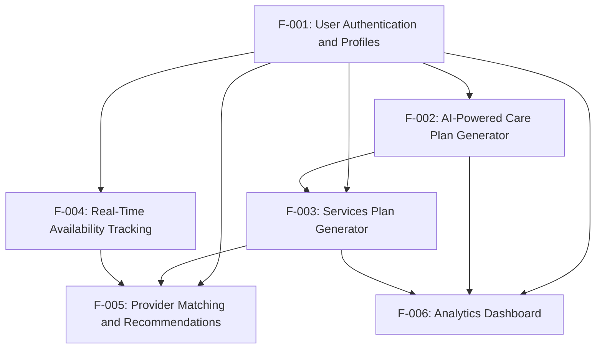
```mermaid
graph TD
    F001[F-001: User Authentication and Profiles]
    F002[F-002: AI-Powered Care Plan Generator]
    F003[F-003: Services Plan Generator]
    F004[F-004: Real-Time Availability Tracking]
    F005[F-005: Provider Matching and Recommendations]
    F006[F-006: Analytics Dashboard]
    
    F001 --> F002
    F001 --> F003
    F001 --> F004
    F001 --> F005
    F001 --> F006
    F002 --> F003
    F003 --> F005
    F002 --> F006
    F003 --> F006
    F004 --> F005
```

#### 2.3.2 Integration Points

| Feature | Integration Points | Description |
| --- | --- | --- |
| F-001 | External Authentication | Integration with social login providers and email verification services |
| F-002 | AI Services | Integration with NLP and document analysis services for medical record processing |
| F-003 | Service Directory | Integration with service catalog and pricing database |
| F-004 | Calendar Systems | Integration with Google Calendar and Microsoft Outlook for availability management |
| F-005 | Provider Directory | Integration with provider database and review system |
| F-006 | Data Visualization | Integration with visualization libraries for dashboard rendering |

#### 2.3.3 Shared Components

| Component | Used By Features | Description |
| --- | --- | --- |
| User Management | F-001, F-002, F-003, F-004, F-005, F-006 | Core user authentication and profile management |
| Document Processing | F-002, F-003 | Document upload, storage, and analysis functionality |
| Notification System | F-001, F-002, F-003, F-004, F-005 | Email, in-app, and SMS notification delivery |
| AI Engine | F-002, F-003, F-005 | Shared AI processing capabilities for multiple features |
| Data Analytics | F-002, F-003, F-005, F-006 | Data collection, processing, and reporting capabilities |

#### 2.3.4 Common Services

| Service | Used By Features | Description |
| --- | --- | --- |
| Authentication Service | F-001, F-002, F-003, F-004, F-005, F-006 | Handles user authentication and authorization |
| Document Service | F-002, F-003 | Manages document upload, storage, and retrieval |
| Notification Service | F-001, F-002, F-003, F-004, F-005 | Manages notification delivery across channels |
| Analytics Service | F-002, F-003, F-005, F-006 | Collects and processes analytics data |
| AI Service | F-002, F-003, F-005 | Provides AI capabilities to multiple features |

### 2.4 IMPLEMENTATION CONSIDERATIONS

#### 2.4.1 Technical Constraints

| Feature | Technical Constraints | Description |
| --- | --- | --- |
| F-001 | Authentication Security | Must implement industry-standard security practices for authentication |
| F-002 | AI Processing Limitations | Document analysis may have accuracy limitations for certain document types |
| F-003 | Service Data Accuracy | Service recommendations depend on accurate and up-to-date service data |
| F-004 | Real-time Data Challenges | Real-time availability requires robust synchronization mechanisms |
| F-005 | Matching Algorithm Complexity | Complex matching algorithms may require significant computational resources |
| F-006 | Data Volume Management | Analytics processing may be resource-intensive with large data volumes |

#### 2.4.2 Performance Requirements

| Feature | Performance Requirement | Target Metric |
| --- | --- | --- |
| F-001 | Authentication Response Time | < 1 second for authentication verification |
| F-002 | Document Analysis Time | < 60 seconds per document |
| F-003 | Service Plan Generation Time | < 30 seconds for complete plan generation |
| F-004 | Availability Update Propagation | < 2 seconds for updates to reflect system-wide |
| F-005 | Provider Recommendation Time | < 5 seconds for generating recommendations |
| F-006 | Dashboard Loading Time | < 3 seconds for initial dashboard load |

#### 2.4.3 Scalability Considerations

| Feature | Scalability Consideration | Approach |
| --- | --- | --- |
| F-001 | User Growth | Horizontal scaling of authentication services |
| F-002 | Document Processing Volume | Queue-based processing with worker scaling |
| F-003 | Service Plan Request Volume | Caching of common service components |
| F-004 | Availability Update Frequency | Event-driven architecture for real-time updates |
| F-005 | Recommendation Processing Load | Asynchronous processing with background workers |
| F-006 | Analytics Data Volume | Data aggregation and pre-computation strategies |

#### 2.4.4 Security Implications

| Feature | Security Implication | Mitigation Strategy |
| --- | --- | --- |
| F-001 | Authentication Vulnerabilities | Multi-factor authentication, rate limiting |
| F-002 | Medical Data Protection | End-to-end encryption, access controls |
| F-003 | Financial Information Security | PCI compliance for payment information |
| F-004 | Privacy of Availability Data | Role-based access to availability information |
| F-005 | Recommendation Algorithm Security | Secure algorithm parameters, audit logging |
| F-006 | Analytics Data Privacy | Data anonymization, aggregation |

#### 2.4.5 Maintenance Requirements

| Feature | Maintenance Requirement | Approach |
| --- | --- | --- |
| F-001 | User Data Management | Regular audits, data cleanup processes |
| F-002 | AI Model Updates | Scheduled model retraining and validation |
| F-003 | Service Catalog Updates | Automated service information updates |
| F-004 | Calendar Integration Maintenance | API version compatibility monitoring |
| F-005 | Matching Algorithm Tuning | Performance monitoring and parameter adjustment |
| F-006 | Analytics Schema Evolution | Backward-compatible schema updates |

### 2.5 TRACEABILITY MATRIX

| Requirement ID | Feature ID | User Story Reference | Technical Specification Reference |
| --- | --- | --- | --- |
| F-001-RQ-001 | F-001 | "As a new user, I want to register with my email or social accounts" | Authentication API: `/api/auth/register` |
| F-001-RQ-002 | F-001 | "As a client, I want to create a detailed profile" | User API: `/api/users/profile` |
| F-001-RQ-003 | F-001 | "As a provider, I want to showcase my services and qualifications" | User API: `/api/users/profile` |
| F-002-RQ-001 | F-002 | "As a case manager, I want to upload client medical records" | Care Plan API: `/api/care-plans/analyze` |
| F-002-RQ-002 | F-002 | "As a client, I want to review multiple care plan options" | Care Plan API: `/api/care-plans/generate` |
| F-002-RQ-003 | F-002 | "As a case manager, I want to edit and refine care plans" | Care Plan API: `/api/care-plans/[id]` |
| F-003-RQ-001 | F-003 | "As a case manager, I want to conduct a comprehensive needs assessment" | Services Plan API: `/api/services-plans/assess` |
| F-003-RQ-002 | F-003 | "As a client, I want to see service options that match my needs" | Services Plan API: `/api/services-plans/generate` |
| F-003-RQ-003 | F-003 | "As a case manager, I want to compare different service plans with cost estimates" | Services Plan API: `/api/services-plans/[id]` |
| F-004-RQ-001 | F-004 | "As a provider, I want to update my availability in real-time" | Provider API: `/api/providers/availability` |
| F-004-RQ-002 | F-004 | "As a client, I want to see which providers have immediate availability" | Provider API: `/api/providers/availability` |
| F-004-RQ-003 | F-004 | "As a client, I want to know estimated waiting times for services" | Provider API: `/api/providers/availability` |
| F-005-RQ-001 | F-005 | "As a client, I want to receive personalized provider recommendations" | Services Plan API: `/api/services-plans/providers` |
| F-005-RQ-002 | F-005 | "As a case manager, I want to compare providers based on multiple criteria" | Provider API: `/api/providers/search` |
| F-005-RQ-003 | F-005 | "As a client, I want to read reviews and ratings from other clients" | Provider API: `/api/providers/reviews` |
| F-006-RQ-001 | F-006 | "As an administrator, I want to view comprehensive analytics" | Analytics API: `/api/analytics/dashboard` |
| F-006-RQ-002 | F-006 | "As a provider, I want to track my performance metrics" | Analytics API: `/api/analytics/metrics` |
| F-006-RQ-003 | F-006 | "As a case manager, I want to monitor client outcomes" | Analytics API: `/api/analytics/reports` |

## 3. TECHNOLOGY STACK

### 3.1 PROGRAMMING LANGUAGES

| Platform/Component | Language | Version | Justification |
| --- | --- | --- | --- |
| Frontend | TypeScript | 5.0+ | Type safety for complex UI components, enhanced developer experience, and better maintainability for the responsive interfaces required by all user roles |
| Backend | TypeScript | 5.0+ | Consistent language across stack, strong typing for API contracts, and seamless integration with Next.js API routes |
| Database Access | SQL | PostgreSQL dialect | Structured queries for complex relational data with strong consistency requirements for care plans and user relationships |
| AI Processing | Python | 3.10+ | Industry standard for AI/ML processing, used in serverless functions for document analysis and recommendation algorithms |

The selection of TypeScript as the primary language provides consistency across the stack while ensuring type safety for the complex data structures involved in care plans, service matching, and user profiles. Python is strategically employed for AI-specific components where its ecosystem offers significant advantages for natural language processing and recommendation systems.

### 3.2 FRAMEWORKS & LIBRARIES

| Category | Framework/Library | Version | Purpose | Justification |
| --- | --- | --- | --- | --- |
| Frontend Framework | Next.js | 14.0+ | Core application framework | Server-side rendering for performance, API routes for backend functionality, and built-in routing for the complex multi-role application |
| UI Components | React | 18.0+ | User interface development | Component-based architecture for reusable UI elements across different user dashboards |
| UI Design System | Tailwind CSS | 3.3+ | Styling and responsive design | Utility-first approach for consistent styling and rapid development of responsive interfaces |
| UI Component Library | shadcn/ui | Latest | Pre-built accessible components | Accessible, customizable components that integrate with Tailwind CSS for faster development |
| State Management | React Query | 5.0+ | Data fetching and caching | Optimized data fetching with caching for real-time availability tracking and provider directory |
| State Management | React Context API | Latest | Global state management | Lightweight state management for user authentication and preferences |
| Animation | Framer Motion | 10.0+ | UI animations and transitions | Enhanced user experience with smooth transitions between views and interactive elements |
| Form Handling | React Hook Form | 7.0+ | Form validation and submission | Efficient form handling for complex forms in care plan creation and user profiles |
| Authentication | NextAuth.js | 4.0+ | Authentication framework | Flexible authentication with support for multiple providers and JWT tokens |
| API Client | Axios | 1.4+ | HTTP client | Consistent API for making HTTP requests with interceptors for authentication |
| Data Visualization | Recharts | 2.0+ | Analytics charts and graphs | Responsive, customizable charts for the analytics dashboard |
| PDF Generation | react-pdf | 3.0+ | Document generation | Generation of downloadable care plans and service plans |

Next.js was selected as the core framework due to its server-side rendering capabilities, which are crucial for initial page load performance and SEO. The combination of React, Tailwind CSS, and shadcn/ui provides a robust foundation for building accessible, responsive interfaces that can adapt to different user roles and device sizes.

### 3.3 DATABASES & STORAGE

| Type | Technology | Version | Purpose | Justification |
| --- | --- | --- | --- | --- |
| Primary Database | PostgreSQL | 15.0+ | Relational data storage | Strong consistency guarantees for complex relationships between users, care plans, and services |
| Database ORM | Prisma | 5.0+ | Database access and migrations | Type-safe database access with schema migrations for evolving data models |
| Caching | Redis | 7.0+ | Performance optimization | In-memory caching for frequently accessed data like provider availability and service catalogs |
| File Storage | Vercel Blob Storage | Latest | Document storage | Seamless integration with Next.js for storing and retrieving medical records and care plans |
| Search Engine | PostgreSQL Full-Text Search | Built-in | Provider and service search | Integrated search capabilities for finding providers and services without additional infrastructure |
| Data Backup | PostgreSQL WAL | Built-in | Data recovery | Point-in-time recovery capabilities for critical healthcare data |

PostgreSQL was chosen as the primary database due to its robust support for complex relational data models, which are essential for tracking relationships between users, care plans, services, and providers. The combination with Prisma provides type-safe database access and simplified migration management for the evolving data schema.

### 3.4 THIRD-PARTY SERVICES

| Category | Service | Purpose | Integration Method | Justification |
| --- | --- | --- | --- | --- |
| AI Processing | OpenAI API | Natural language processing | REST API | Advanced language models for medical record analysis and care plan generation |
| Document Analysis | Azure Form Recognizer | Document data extraction | REST API | Specialized service for extracting structured data from medical documents |
| Payment Processing | Stripe | Payment handling | SDK | Industry-standard payment processing with strong security and compliance features |
| Email Service | SendGrid | Transactional emails | SDK | Reliable email delivery for notifications, verifications, and alerts |
| SMS Notifications | Twilio | Text messaging | SDK | Real-time notifications for availability updates and appointment reminders |
| Maps & Geolocation | Google Maps API | Location services | JavaScript SDK | Provider proximity search and service area visualization |
| Calendar Integration | Google Calendar API | Availability management | REST API | Calendar synchronization for provider availability tracking |
| Calendar Integration | Microsoft Graph API | Outlook calendar integration | REST API | Calendar synchronization for enterprise users with Microsoft ecosystem |
| Analytics | Vercel Analytics | Usage tracking | JavaScript SDK | Built-in analytics for monitoring application performance and user behavior |
| Error Tracking | Sentry | Error monitoring | SDK | Real-time error tracking and debugging for production environment |

The selection of third-party services focuses on specialized capabilities that would be impractical to build in-house. OpenAI and Azure Form Recognizer provide advanced AI capabilities for document analysis and care plan generation, while Stripe ensures secure payment processing with compliance features essential for healthcare services.

### 3.5 DEVELOPMENT & DEPLOYMENT

| Category | Tool/Platform | Version | Purpose | Justification |
| --- | --- | --- | --- | --- |
| Cloud Platform | Vercel | Enterprise | Application hosting | Optimized for Next.js with integrated CI/CD and edge network for global performance |
| Version Control | GitHub | Enterprise | Code repository | Collaborative development with pull requests and code reviews |
| CI/CD | Vercel CI/CD | Built-in | Continuous integration/deployment | Seamless integration with Next.js and automatic preview deployments |
| Code Quality | ESLint | 8.0+ | Static code analysis | Enforce coding standards and catch potential issues early |
| Code Formatting | Prettier | 3.0+ | Code formatting | Consistent code style across the development team |
| Testing Framework | Jest | 29.0+ | Unit and integration testing | Comprehensive testing framework for frontend and backend code |
| E2E Testing | Playwright | 1.35+ | End-to-end testing | Cross-browser testing of critical user flows |
| API Testing | Postman | Latest | API development and testing | Collaborative API testing and documentation |
| Database Management | Prisma Studio | Built-in | Database visualization | Visual database management for development and debugging |
| Monitoring | Vercel Monitoring | Built-in | Application performance monitoring | Real-time monitoring of application performance and errors |
| Infrastructure as Code | Pulumi | Latest | Infrastructure management | Programmatic infrastructure management with TypeScript |
| Secret Management | Vercel Environment Variables | Built-in | Configuration management | Secure storage and access to sensitive configuration values |

Vercel was selected as the primary deployment platform due to its optimized support for Next.js applications, integrated CI/CD pipeline, and global edge network for optimal performance. The development toolchain is designed to ensure code quality, comprehensive testing, and efficient collaboration among team members.

### 3.6 ARCHITECTURE DIAGRAM


```mermaid
graph TD
    subgraph "Client Layer"
        Browser["Web Browser"]
        MobileWeb["Mobile Web"]
    end

    subgraph "Frontend Layer"
        NextJS["Next.js Application"]
        ReactComponents["React Components"]
        TailwindCSS["Tailwind CSS"]
        ShadcnUI["shadcn/ui Components"]
    end

    subgraph "API Layer"
        NextAPI["Next.js API Routes"]
        subgraph "Service Modules"
            AuthService["Authentication Service"]
            UserService["User Service"]
            CarePlanService["Care Plan Service"]
            ServicesPlanService["Services Plan Service"]
            ProviderService["Provider Service"]
            AnalyticsService["Analytics Service"]
        end
    end

    subgraph "Data Layer"
        PostgreSQL["PostgreSQL Database"]
        Redis["Redis Cache"]
        BlobStorage["Vercel Blob Storage"]
    end

    subgraph "External Services"
        OpenAI["OpenAI API"]
        AzureFormRecognizer["Azure Form Recognizer"]
        Stripe["Stripe Payment"]
        SendGrid["SendGrid Email"]
        Twilio["Twilio SMS"]
        GoogleMaps["Google Maps API"]
        GoogleCalendar["Google Calendar API"]
        MicrosoftGraph["Microsoft Graph API"]
    end

    Browser --> NextJS
    MobileWeb --> NextJS
    NextJS --> ReactComponents
    ReactComponents --> TailwindCSS
    ReactComponents --> ShadcnUI
    NextJS --> NextAPI
    
    NextAPI --> AuthService
    NextAPI --> UserService
    NextAPI --> CarePlanService
    NextAPI --> ServicesPlanService
    NextAPI --> ProviderService
    NextAPI --> AnalyticsService
    
    AuthService --> PostgreSQL
    UserService --> PostgreSQL
    CarePlanService --> PostgreSQL
    ServicesPlanService --> PostgreSQL
    ProviderService --> PostgreSQL
    AnalyticsService --> PostgreSQL
    
    AuthService --> Redis
    UserService --> Redis
    CarePlanService --> Redis
    ServicesPlanService --> Redis
    ProviderService --> Redis
    
    CarePlanService --> BlobStorage
    ServicesPlanService --> BlobStorage
    
    CarePlanService --> OpenAI
    ServicesPlanService --> OpenAI
    CarePlanService --> AzureFormRecognizer
    
    ServicesPlanService --> Stripe
    
    AuthService --> SendGrid
    UserService --> SendGrid
    ProviderService --> Twilio
    
    ProviderService --> GoogleMaps
    ProviderService --> GoogleCalendar
    ProviderService --> MicrosoftGraph
```

This architecture diagram illustrates the relationships between different components of the Revolucare platform, showing how data flows from the client layer through the application to the data storage and external services.

## 4. PROCESS FLOWCHART

### 4.1 SYSTEM WORKFLOWS

#### 4.1.1 Core Business Processes

##### User Registration and Authentication Flow

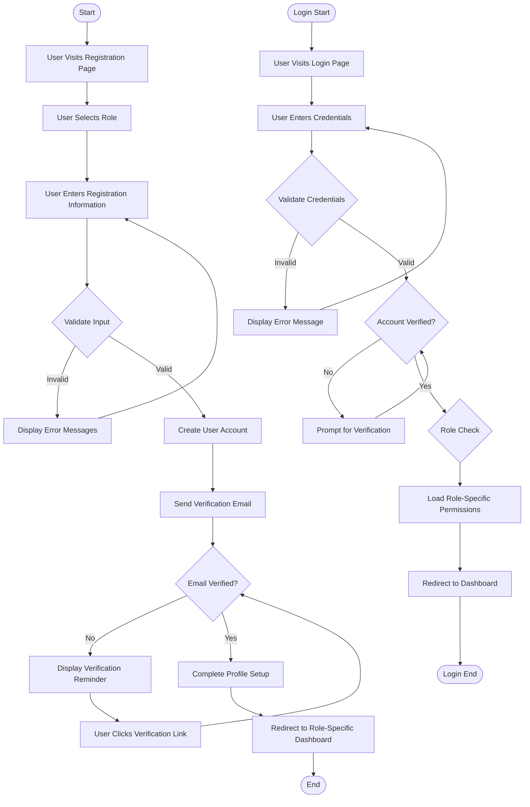
```mermaid
flowchart TD
    Start([Start]) --> A[User Visits Registration Page]
    A --> B[User Selects Role]
    B --> C[User Enters Registration Information]
    C --> D{Validate Input}
    D -->|Invalid| E[Display Error Messages]
    E --> C
    D -->|Valid| F[Create User Account]
    F --> G[Send Verification Email]
    G --> H{Email Verified?}
    H -->|No| I[Display Verification Reminder]
    I --> J[User Clicks Verification Link]
    J --> H
    H -->|Yes| K[Complete Profile Setup]
    K --> L[Redirect to Role-Specific Dashboard]
    L --> End([End])
    
    %% Authentication Flow
    M([Login Start]) --> N[User Visits Login Page]
    N --> O[User Enters Credentials]
    O --> P{Validate Credentials}
    P -->|Invalid| Q[Display Error Message]
    Q --> O
    P -->|Valid| R{Account Verified?}
    R -->|No| S[Prompt for Verification]
    S --> R
    R -->|Yes| T{Role Check}
    T --> U[Load Role-Specific Permissions]
    U --> V[Redirect to Dashboard]
    V --> W([Login End])
```

##### Care Plan Generation Flow

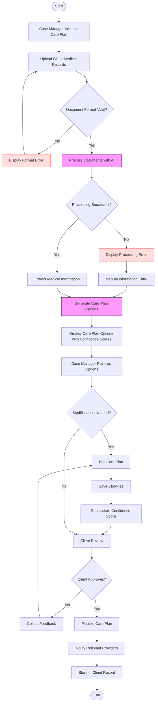
```mermaid
flowchart TD
    Start([Start]) --> A[Case Manager Initiates Care Plan]
    A --> B[Upload Client Medical Records]
    B --> C{Document Format Valid?}
    C -->|No| D[Display Format Error]
    D --> B
    C -->|Yes| E[Process Documents with AI]
    E --> F{Processing Successful?}
    F -->|No| G[Display Processing Error]
    G --> H[Manual Information Entry]
    F -->|Yes| I[Extract Medical Information]
    H --> J[Generate Care Plan Options]
    I --> J
    J --> K[Display Care Plan Options with Confidence Scores]
    K --> L[Case Manager Reviews Options]
    L --> M{Modifications Needed?}
    M -->|Yes| N[Edit Care Plan]
    N --> O[Save Changes]
    O --> P[Recalculate Confidence Score]
    P --> Q[Client Review]
    M -->|No| Q
    Q --> R{Client Approves?}
    R -->|No| S[Collect Feedback]
    S --> N
    R -->|Yes| T[Finalize Care Plan]
    T --> U[Notify Relevant Providers]
    U --> V[Store in Client Record]
    V --> End([End])
    
    %% SLA Timing
    classDef sla fill:#f9f,stroke:#333,stroke-width:1px
    class E,J sla
    
    %% Error States
    classDef error fill:#fdd,stroke:#f33,stroke-width:1px
    class D,G error
```

##### Provider Matching Flow

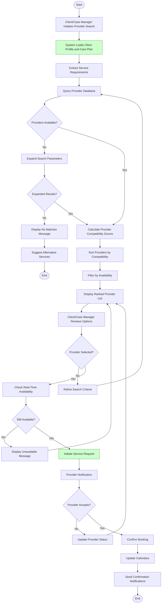
```mermaid
flowchart TD
    Start([Start]) --> A[Client/Case Manager Initiates Provider Search]
    A --> B[System Loads Client Profile and Care Plan]
    B --> C[Extract Service Requirements]
    C --> D[Query Provider Database]
    D --> E{Providers Available?}
    E -->|No| F[Expand Search Parameters]
    F --> G{Expanded Results?}
    G -->|No| H[Display No Matches Message]
    H --> I[Suggest Alternative Services]
    I --> End1([End])
    G -->|Yes| J[Calculate Provider Compatibility Scores]
    E -->|Yes| J
    J --> K[Sort Providers by Compatibility]
    K --> L[Filter by Availability]
    L --> M[Display Ranked Provider List]
    M --> N[Client/Case Manager Reviews Options]
    N --> O{Provider Selected?}
    O -->|No| P[Refine Search Criteria]
    P --> D
    O -->|Yes| Q[Check Real-Time Availability]
    Q --> R{Still Available?}
    R -->|No| S[Display Unavailable Message]
    S --> M
    R -->|Yes| T[Initiate Service Request]
    T --> U[Provider Notification]
    U --> V{Provider Accepts?}
    V -->|No| W[Update Provider Status]
    W --> M
    V -->|Yes| X[Confirm Booking]
    X --> Y[Update Calendars]
    Y --> Z[Send Confirmation Notifications]
    Z --> End2([End])
    
    %% Authorization Checkpoints
    classDef auth fill:#cfc,stroke:#393,stroke-width:1px
    class B,T auth
```

##### Analytics Dashboard Flow

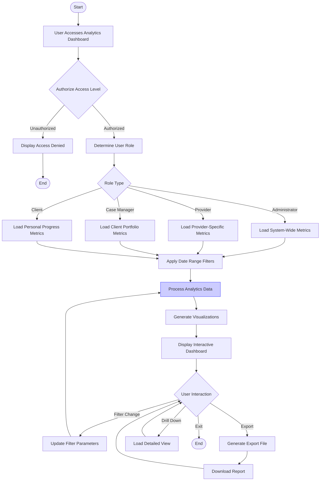
```mermaid
flowchart TD
    Start([Start]) --> A[User Accesses Analytics Dashboard]
    A --> B{Authorize Access Level}
    B -->|Unauthorized| C[Display Access Denied]
    C --> End1([End])
    B -->|Authorized| D[Determine User Role]
    D --> E{Role Type}
    E -->|Administrator| F[Load System-Wide Metrics]
    E -->|Provider| G[Load Provider-Specific Metrics]
    E -->|Case Manager| H[Load Client Portfolio Metrics]
    E -->|Client| I[Load Personal Progress Metrics]
    F --> J[Apply Date Range Filters]
    G --> J
    H --> J
    I --> J
    J --> K[Process Analytics Data]
    K --> L[Generate Visualizations]
    L --> M[Display Interactive Dashboard]
    M --> N{User Interaction}
    N -->|Filter Change| O[Update Filter Parameters]
    O --> K
    N -->|Export| P[Generate Export File]
    P --> Q[Download Report]
    Q --> N
    N -->|Drill Down| R[Load Detailed View]
    R --> N
    N -->|Exit| End2([End])
    
    %% Data Validation
    classDef validation fill:#ccf,stroke:#33f,stroke-width:1px
    class K validation
```

#### 4.1.2 Integration Workflows

##### External AI Service Integration Flow

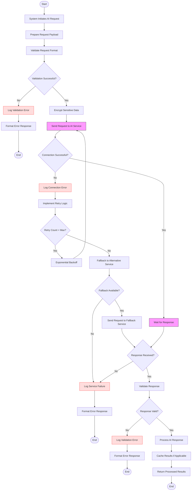
```mermaid
flowchart TD
    Start([Start]) --> A[System Initiates AI Request]
    A --> B[Prepare Request Payload]
    B --> C[Validate Request Format]
    C --> D{Validation Successful?}
    D -->|No| E[Log Validation Error]
    E --> F[Format Error Response]
    F --> End1([End])
    D -->|Yes| G[Encrypt Sensitive Data]
    G --> H[Send Request to AI Service]
    H --> I{Connection Successful?}
    I -->|No| J[Log Connection Error]
    J --> K[Implement Retry Logic]
    K --> L{Retry Count < Max?}
    L -->|Yes| M[Exponential Backoff]
    M --> H
    L -->|No| N[Fallback to Alternative Service]
    N --> O{Fallback Available?}
    O -->|No| P[Log Service Failure]
    P --> Q[Format Error Response]
    Q --> End2([End])
    O -->|Yes| R[Send Request to Fallback Service]
    R --> S{Response Received?}
    S -->|No| P
    I -->|Yes| T[Wait for Response]
    T --> S
    S -->|Yes| U[Validate Response]
    U --> V{Response Valid?}
    V -->|No| W[Log Validation Error]
    W --> X[Format Error Response]
    X --> End3([End])
    V -->|Yes| Y[Process AI Response]
    Y --> Z[Cache Results if Applicable]
    Z --> AA[Return Processed Results]
    AA --> End4([End])
    
    classDef sla fill:#f9f,stroke:#333,stroke-width:1px
    class H,T sla
    
    classDef error fill:#fdd,stroke:#f33,stroke-width:1px
    class E,J,P,W error
```

##### Calendar Integration Sequence

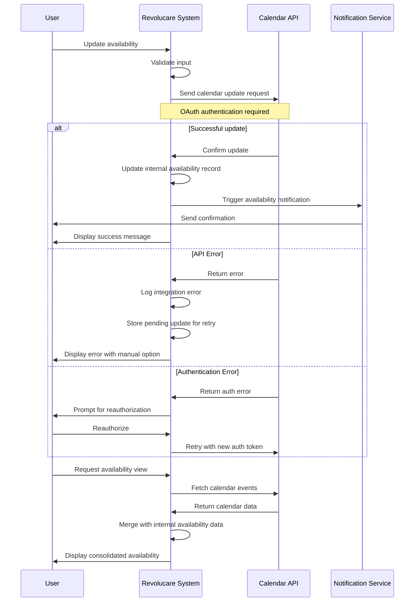
```mermaid
sequenceDiagram
    participant U as User
    participant S as Revolucare System
    participant C as Calendar API
    participant N as Notification Service
    
    U->>S: Update availability
    S->>S: Validate input
    S->>C: Send calendar update request
    Note over S,C: OAuth authentication required
    
    alt Successful update
        C->>S: Confirm update
        S->>S: Update internal availability record
        S->>N: Trigger availability notification
        N->>U: Send confirmation
        S->>U: Display success message
    else API Error
        C->>S: Return error
        S->>S: Log integration error
        S->>S: Store pending update for retry
        S->>U: Display error with manual option
    else Authentication Error
        C->>S: Return auth error
        S->>U: Prompt for reauthorization
        U->>S: Reauthorize
        S->>C: Retry with new auth token
    end
    
    U->>S: Request availability view
    S->>C: Fetch calendar events
    C->>S: Return calendar data
    S->>S: Merge with internal availability data
    S->>U: Display consolidated availability
```

##### Payment Processing Flow

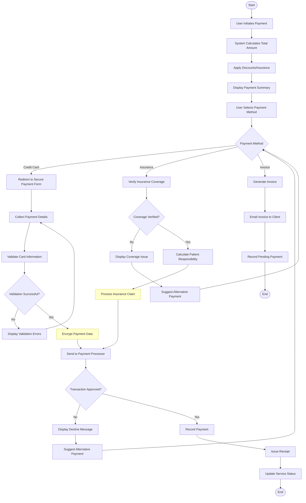
```mermaid
flowchart TD
    Start([Start]) --> A[User Initiates Payment]
    A --> B[System Calculates Total Amount]
    B --> C[Apply Discounts/Insurance]
    C --> D[Display Payment Summary]
    D --> E[User Selects Payment Method]
    E --> F{Payment Method}
    F -->|Credit Card| G[Redirect to Secure Payment Form]
    F -->|Insurance| H[Verify Insurance Coverage]
    F -->|Invoice| I[Generate Invoice]
    
    G --> J[Collect Payment Details]
    J --> K[Validate Card Information]
    K --> L{Validation Successful?}
    L -->|No| M[Display Validation Errors]
    M --> J
    L -->|Yes| N[Encrypt Payment Data]
    
    H --> O{Coverage Verified?}
    O -->|No| P[Display Coverage Issue]
    P --> Q[Suggest Alternative Payment]
    Q --> F
    O -->|Yes| R[Calculate Patient Responsibility]
    R --> S[Process Insurance Claim]
    
    I --> T[Email Invoice to Client]
    T --> U[Record Pending Payment]
    U --> End1([End])
    
    N --> V[Send to Payment Processor]
    S --> V
    V --> W{Transaction Approved?}
    W -->|No| X[Display Decline Message]
    X --> Y[Suggest Alternative Payment]
    Y --> F
    W -->|Yes| Z[Record Payment]
    Z --> AA[Issue Receipt]
    AA --> BB[Update Service Status]
    BB --> End2([End])
    
    %% Compliance Checks
    classDef compliance fill:#ffc,stroke:#cc3,stroke-width:1px
    class N,S compliance
```

### 4.2 FLOWCHART REQUIREMENTS

#### 4.2.1 User Journey: Client Onboarding to Service Delivery

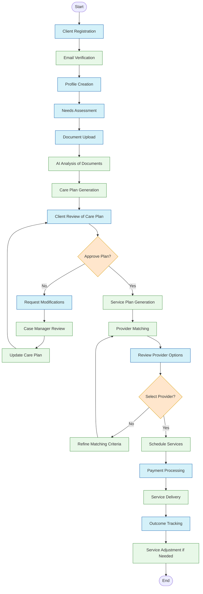
```mermaid
flowchart TD
    Start([Start]) --> A[Client Registration]
    A --> B[Email Verification]
    B --> C[Profile Creation]
    C --> D[Needs Assessment]
    D --> E[Document Upload]
    E --> F[AI Analysis of Documents]
    F --> G[Care Plan Generation]
    G --> H[Client Review of Care Plan]
    H --> I{Approve Plan?}
    I -->|No| J[Request Modifications]
    J --> K[Case Manager Review]
    K --> L[Update Care Plan]
    L --> H
    I -->|Yes| M[Service Plan Generation]
    M --> N[Provider Matching]
    N --> O[Review Provider Options]
    O --> P{Select Provider?}
    P -->|No| Q[Refine Matching Criteria]
    Q --> N
    P -->|Yes| R[Schedule Services]
    R --> S[Payment Processing]
    S --> T[Service Delivery]
    T --> U[Outcome Tracking]
    U --> V[Service Adjustment if Needed]
    V --> End([End])
    
    %% User Touchpoints
    classDef touchpoint fill:#d4f1f9,stroke:#05a,stroke-width:1px
    class A,C,D,E,H,J,O,P,S,U touchpoint
    
    %% System Boundaries
    classDef system fill:#e8f8e8,stroke:#383,stroke-width:1px
    class B,F,G,K,L,M,N,Q,R,T,V system
    
    %% Decision Points
    classDef decision fill:#ffe6cc,stroke:#d79b00,stroke-width:1px
    class I,P decision
```

#### 4.2.2 Error Handling: Document Processing Flow

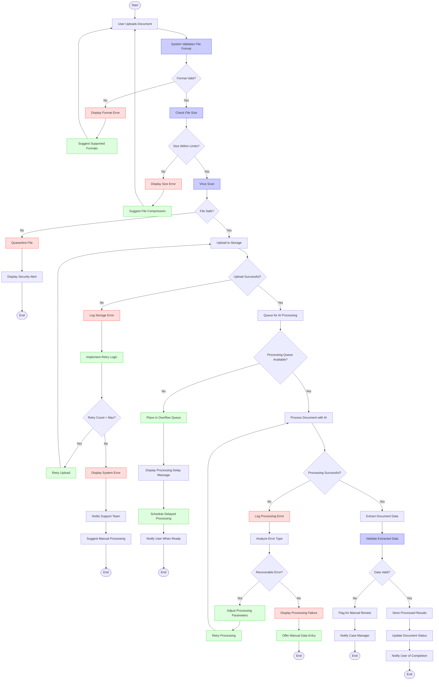
```mermaid
flowchart TD
    Start([Start]) --> A[User Uploads Document]
    A --> B[System Validates File Format]
    B --> C{Format Valid?}
    C -->|No| D[Display Format Error]
    D --> E[Suggest Supported Formats]
    E --> A
    C -->|Yes| F[Check File Size]
    F --> G{Size Within Limits?}
    G -->|No| H[Display Size Error]
    H --> I[Suggest File Compression]
    I --> A
    G -->|Yes| J[Virus Scan]
    J --> K{File Safe?}
    K -->|No| L[Quarantine File]
    L --> M[Display Security Alert]
    M --> End1([End])
    K -->|Yes| N[Upload to Storage]
    N --> O{Upload Successful?}
    O -->|No| P[Log Storage Error]
    P --> Q[Implement Retry Logic]
    Q --> R{Retry Count < Max?}
    R -->|Yes| S[Retry Upload]
    S --> N
    R -->|No| T[Display System Error]
    T --> U[Notify Support Team]
    U --> V[Suggest Manual Processing]
    V --> End2([End])
    O -->|Yes| W[Queue for AI Processing]
    W --> X{Processing Queue Available?}
    X -->|No| Y[Place in Overflow Queue]
    Y --> Z[Display Processing Delay Message]
    Z --> AA[Schedule Delayed Processing]
    AA --> AB[Notify User When Ready]
    AB --> End3([End])
    X -->|Yes| AC[Process Document with AI]
    AC --> AD{Processing Successful?}
    AD -->|No| AE[Log Processing Error]
    AE --> AF[Analyze Error Type]
    AF --> AG{Recoverable Error?}
    AG -->|Yes| AH[Adjust Processing Parameters]
    AH --> AI[Retry Processing]
    AI --> AC
    AG -->|No| AJ[Display Processing Failure]
    AJ --> AK[Offer Manual Data Entry]
    AK --> End4([End])
    AD -->|Yes| AL[Extract Document Data]
    AL --> AM[Validate Extracted Data]
    AM --> AN{Data Valid?}
    AN -->|No| AO[Flag for Manual Review]
    AO --> AP[Notify Case Manager]
    AP --> End5([End])
    AN -->|Yes| AQ[Store Processed Results]
    AQ --> AR[Update Document Status]
    AR --> AS[Notify User of Completion]
    AS --> End6([End])
    
    classDef error fill:#fdd,stroke:#f33,stroke-width:1px
    class D,H,L,P,T,AE,AJ error
    
    classDef recovery fill:#dfd,stroke:#3c3,stroke-width:1px
    class E,I,Q,S,Y,AA,AH,AI,AK recovery
    
    classDef validation fill:#ccf,stroke:#33f,stroke-width:1px
    class B,F,J,AM validation
```

#### 4.2.3 Integration Sequence: Provider Availability Synchronization

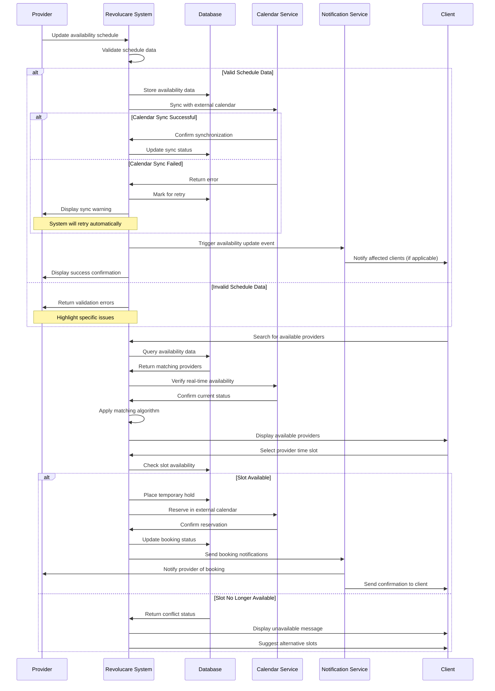
```mermaid
sequenceDiagram
    participant P as Provider
    participant RS as Revolucare System
    participant DB as Database
    participant CS as Calendar Service
    participant NS as Notification Service
    participant C as Client
    
    P->>RS: Update availability schedule
    RS->>RS: Validate schedule data
    
    alt Valid Schedule Data
        RS->>DB: Store availability data
        RS->>CS: Sync with external calendar
        
        alt Calendar Sync Successful
            CS->>RS: Confirm synchronization
            RS->>DB: Update sync status
        else Calendar Sync Failed
            CS->>RS: Return error
            RS->>DB: Mark for retry
            RS->>P: Display sync warning
            Note over RS,P: System will retry automatically
        end
        
        RS->>NS: Trigger availability update event
        NS->>C: Notify affected clients (if applicable)
        RS->>P: Display success confirmation
    else Invalid Schedule Data
        RS->>P: Return validation errors
        Note over RS,P: Highlight specific issues
    end
    
    C->>RS: Search for available providers
    RS->>DB: Query availability data
    DB->>RS: Return matching providers
    RS->>CS: Verify real-time availability
    CS->>RS: Confirm current status
    RS->>RS: Apply matching algorithm
    RS->>C: Display available providers
    
    C->>RS: Select provider time slot
    RS->>DB: Check slot availability
    
    alt Slot Available
        RS->>DB: Place temporary hold
        RS->>CS: Reserve in external calendar
        CS->>RS: Confirm reservation
        RS->>DB: Update booking status
        RS->>NS: Send booking notifications
        NS->>P: Notify provider of booking
        NS->>C: Send confirmation to client
    else Slot No Longer Available
        DB->>RS: Return conflict status
        RS->>C: Display unavailable message
        RS->>C: Suggest alternative slots
    end
```

### 4.3 TECHNICAL IMPLEMENTATION

#### 4.3.1 State Management: Care Plan Lifecycle

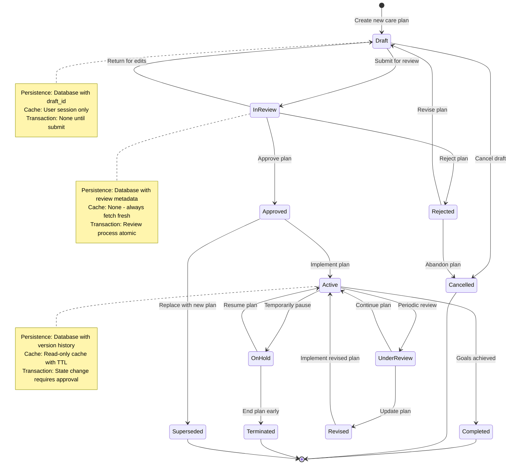
```mermaid
stateDiagram-v2
    [*] --> Draft: Create new care plan
    
    Draft --> InReview: Submit for review
    Draft --> Cancelled: Cancel draft
    
    InReview --> Draft: Return for edits
    InReview --> Approved: Approve plan
    InReview --> Rejected: Reject plan
    
    Rejected --> Draft: Revise plan
    Rejected --> Cancelled: Abandon plan
    
    Approved --> Active: Implement plan
    Approved --> Superseded: Replace with new plan
    
    Active --> UnderReview: Periodic review
    Active --> OnHold: Temporarily pause
    Active --> Completed: Goals achieved
    
    UnderReview --> Active: Continue plan
    UnderReview --> Revised: Update plan
    
    OnHold --> Active: Resume plan
    OnHold --> Terminated: End plan early
    
    Revised --> Active: Implement revised plan
    
    Completed --> [*]
    Cancelled --> [*]
    Terminated --> [*]
    Superseded --> [*]
    
    note right of Draft
        Persistence: Database with draft_id
        Cache: User session only
        Transaction: None until submit
    end note
    
    note right of InReview
        Persistence: Database with review metadata
        Cache: None - always fetch fresh
        Transaction: Review process atomic
    end note
    
    note right of Active
        Persistence: Database with version history
        Cache: Read-only cache with TTL
        Transaction: State change requires approval
    end note
```

#### 4.3.2 Error Handling: API Request Flow

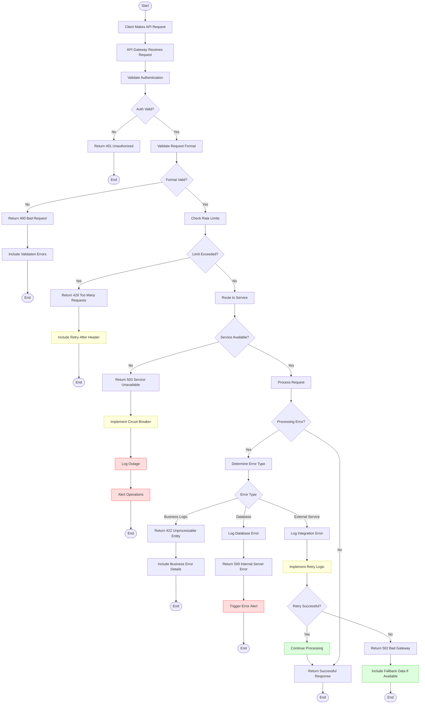
```mermaid
flowchart TD
    Start([Start]) --> A[Client Makes API Request]
    A --> B[API Gateway Receives Request]
    B --> C[Validate Authentication]
    C --> D{Auth Valid?}
    D -->|No| E[Return 401 Unauthorized]
    E --> End1([End])
    D -->|Yes| F[Validate Request Format]
    F --> G{Format Valid?}
    G -->|No| H[Return 400 Bad Request]
    H --> I[Include Validation Errors]
    I --> End2([End])
    G -->|Yes| J[Check Rate Limits]
    J --> K{Limit Exceeded?}
    K -->|Yes| L[Return 429 Too Many Requests]
    L --> M[Include Retry-After Header]
    M --> End3([End])
    K -->|No| N[Route to Service]
    N --> O{Service Available?}
    O -->|No| P[Return 503 Service Unavailable]
    P --> Q[Implement Circuit Breaker]
    Q --> R[Log Outage]
    R --> S[Alert Operations]
    S --> End4([End])
    O -->|Yes| T[Process Request]
    T --> U{Processing Error?}
    U -->|Yes| V[Determine Error Type]
    V --> W{Error Type}
    W -->|Business Logic| X[Return 422 Unprocessable Entity]
    X --> Y[Include Business Error Details]
    Y --> End5([End])
    W -->|Database| Z[Log Database Error]
    Z --> AA[Return 500 Internal Server Error]
    AA --> AB[Trigger Error Alert]
    AB --> End6([End])
    W -->|External Service| AC[Log Integration Error]
    AC --> AD[Implement Retry Logic]
    AD --> AE{Retry Successful?}
    AE -->|Yes| AF[Continue Processing]
    AF --> AG[Return Successful Response]
    AG --> End7([End])
    AE -->|No| AH[Return 502 Bad Gateway]
    AH --> AI[Include Fallback Data If Available]
    AI --> End8([End])
    U -->|No| AG
    
    %% Retry Mechanisms
    classDef retry fill:#ffd,stroke:#cc3,stroke-width:1px
    class M,Q,AD retry
    
    %% Error Notifications
    classDef notify fill:#fdd,stroke:#f33,stroke-width:1px
    class R,S,AB notify
    
    %% Recovery Procedures
    classDef recovery fill:#dfd,stroke:#3c3,stroke-width:1px
    class AF,AI recovery
```

#### 4.3.3 Transaction Boundaries: Payment Processing

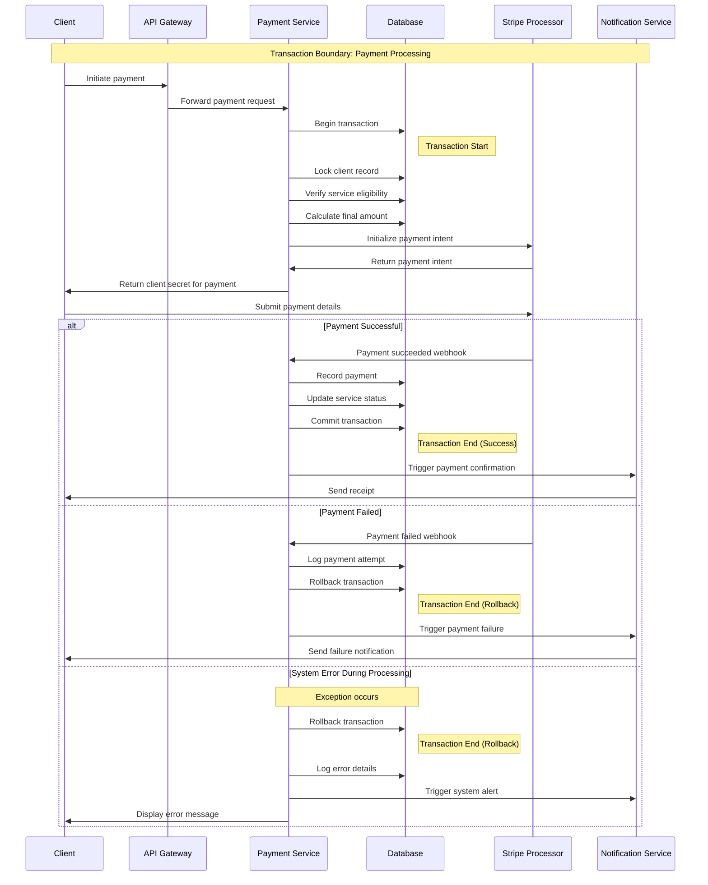
```mermaid
sequenceDiagram
    participant C as Client
    participant API as API Gateway
    participant PS as Payment Service
    participant DB as Database
    participant SP as Stripe Processor
    participant NS as Notification Service
    
    Note over C,NS: Transaction Boundary: Payment Processing
    
    C->>API: Initiate payment
    API->>PS: Forward payment request
    
    PS->>DB: Begin transaction
    Note right of DB: Transaction Start
    
    PS->>DB: Lock client record
    PS->>DB: Verify service eligibility
    PS->>DB: Calculate final amount
    
    PS->>SP: Initialize payment intent
    SP->>PS: Return payment intent
    
    PS->>C: Return client secret for payment
    C->>SP: Submit payment details
    
    alt Payment Successful
        SP->>PS: Payment succeeded webhook
        PS->>DB: Record payment
        PS->>DB: Update service status
        PS->>DB: Commit transaction
        Note right of DB: Transaction End (Success)
        PS->>NS: Trigger payment confirmation
        NS->>C: Send receipt
    else Payment Failed
        SP->>PS: Payment failed webhook
        PS->>DB: Log payment attempt
        PS->>DB: Rollback transaction
        Note right of DB: Transaction End (Rollback)
        PS->>NS: Trigger payment failure
        NS->>C: Send failure notification
    else System Error During Processing
        Note over PS,DB: Exception occurs
        PS->>DB: Rollback transaction
        Note right of DB: Transaction End (Rollback)
        PS->>DB: Log error details
        PS->>NS: Trigger system alert
        PS->>C: Display error message
    end
```

### 4.4 HIGH-LEVEL SYSTEM WORKFLOW

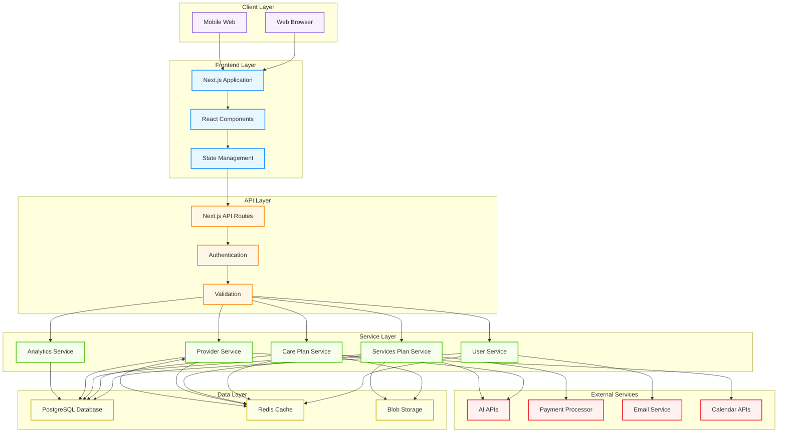
```mermaid
flowchart TD
    subgraph Client["Client Layer"]
        A[Web Browser]
        B[Mobile Web]
    end
    
    subgraph Frontend["Frontend Layer"]
        C[Next.js Application]
        D[React Components]
        E[State Management]
    end
    
    subgraph API["API Layer"]
        F[Next.js API Routes]
        G[Authentication]
        H[Validation]
    end
    
    subgraph Services["Service Layer"]
        I[User Service]
        J[Care Plan Service]
        K[Services Plan Service]
        L[Provider Service]
        M[Analytics Service]
    end
    
    subgraph Data["Data Layer"]
        N[PostgreSQL Database]
        O[Redis Cache]
        P[Blob Storage]
    end
    
    subgraph External["External Services"]
        Q[AI APIs]
        R[Payment Processor]
        S[Email Service]
        T[Calendar APIs]
    end
    
    %% Client to Frontend
    A --> C
    B --> C
    
    %% Frontend to API
    C --> D
    D --> E
    E --> F
    
    %% API to Services
    F --> G
    G --> H
    H --> I
    H --> J
    H --> K
    H --> L
    H --> M
    
    %% Services to Data
    I --> N
    J --> N
    K --> N
    L --> N
    M --> N
    
    I --> O
    J --> O
    K --> O
    L --> O
    
    J --> P
    K --> P
    
    %% Services to External
    J --> Q
    K --> Q
    K --> R
    I --> S
    L --> T
    
    %% Bidirectional flows
    L <--> O
    
    %% System Boundaries
    classDef clientLayer fill:#f9f0ff,stroke:#9370db,stroke-width:2px
    classDef frontendLayer fill:#e6f7ff,stroke:#1890ff,stroke-width:2px
    classDef apiLayer fill:#fff7e6,stroke:#fa8c16,stroke-width:2px
    classDef serviceLayer fill:#f6ffed,stroke:#52c41a,stroke-width:2px
    classDef dataLayer fill:#fcffe6,stroke:#d4b106,stroke-width:2px
    classDef externalLayer fill:#fff1f0,stroke:#f5222d,stroke-width:2px
    
    class A,B clientLayer
    class C,D,E frontendLayer
    class F,G,H apiLayer
    class I,J,K,L,M serviceLayer
    class N,O,P dataLayer
    class Q,R,S,T externalLayer
```

### 4.5 FEATURE-SPECIFIC PROCESS FLOWS

#### 4.5.1 AI-Powered Care Plan Generator Process Flow

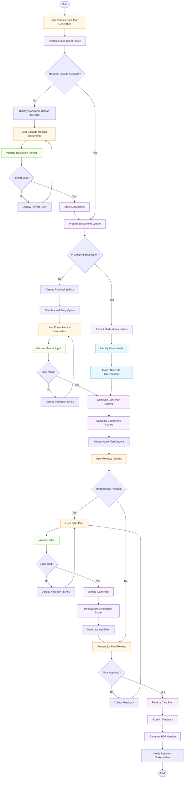
```mermaid
flowchart TD
    Start([Start]) --> A[User Initiates Care Plan Generation]
    A --> B[System Loads Client Profile]
    B --> C{Medical Records Available?}
    
    C -->|No| D[Display Document Upload Interface]
    D --> E[User Uploads Medical Documents]
    E --> F[Validate Document Format]
    F --> G{Format Valid?}
    G -->|No| H[Display Format Error]
    H --> E
    G -->|Yes| I[Store Documents]
    I --> J[Process Documents with AI]
    
    C -->|Yes| J
    
    J --> K{Processing Successful?}
    K -->|No| L[Display Processing Error]
    L --> M[Offer Manual Entry Option]
    M --> N[User Enters Medical Information]
    N --> O[Validate Manual Input]
    O --> P{Input Valid?}
    P -->|No| Q[Display Validation Errors]
    Q --> N
    P -->|Yes| R[Generate Care Plan Options]
    
    K -->|Yes| S[Extract Medical Information]
    S --> T[Identify Care Needs]
    T --> U[Match Needs to Interventions]
    U --> R
    
    R --> V[Calculate Confidence Scores]
    V --> W[Present Care Plan Options]
    W --> X[User Reviews Options]
    X --> Y{Modifications Needed?}
    
    Y -->|Yes| Z[User Edits Plan]
    Z --> AA[Validate Edits]
    AA --> AB{Edits Valid?}
    AB -->|No| AC[Display Validation Errors]
    AC --> Z
    AB -->|Yes| AD[Update Care Plan]
    AD --> AE[Recalculate Confidence Score]
    AE --> AF[Save Updated Plan]
    AF --> AG[Present for Final Review]
    
    Y -->|No| AG
    
    AG --> AH{Final Approval?}
    AH -->|No| AI[Collect Feedback]
    AI --> Z
    
    AH -->|Yes| AJ[Finalize Care Plan]
    AJ --> AK[Store in Database]
    AK --> AL[Generate PDF Version]
    AL --> AM[Notify Relevant Stakeholders]
    AM --> End([End])
    
    %% Business Rules
    classDef businessRule fill:#e6f7ff,stroke:#1890ff,stroke-width:1px
    class T,U,V businessRule
    
    %% Validation Points
    classDef validation fill:#f6ffed,stroke:#52c41a,stroke-width:1px
    class F,O,AA validation
    
    %% User Touchpoints
    classDef userTouch fill:#fff7e6,stroke:#fa8c16,stroke-width:1px
    class A,E,N,X,Z,AG userTouch
    
    %% System Processing
    classDef systemProc fill:#f9f0ff,stroke:#722ed1,stroke-width:1px
    class B,I,J,S,R,V,AD,AE,AJ,AK,AL systemProc
```

#### 4.5.2 Provider Matching Process Flow

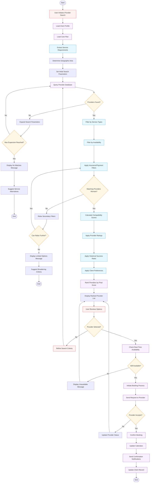
```mermaid
flowchart TD
    Start([Start]) --> A[User Initiates Provider Search]
    A --> B[Load Client Profile]
    B --> C[Load Care Plan]
    C --> D[Extract Service Requirements]
    D --> E[Determine Geographic Area]
    E --> F[Set Initial Search Parameters]
    
    F --> G[Query Provider Database]
    G --> H{Providers Found?}
    
    H -->|No| I[Expand Search Parameters]
    I --> J{Max Expansion Reached?}
    J -->|No| G
    J -->|Yes| K[Display No Matches Message]
    K --> L[Suggest Service Alternatives]
    L --> End1([End])
    
    H -->|Yes| M[Filter by Service Types]
    M --> N[Filter by Availability]
    N --> O[Apply Insurance/Payment Filters]
    
    O --> P{Matching Providers Remain?}
    P -->|No| Q[Relax Secondary Filters]
    Q --> R{Can Relax Further?}
    R -->|Yes| O
    R -->|No| S[Display Limited Options Message]
    S --> T[Suggest Broadening Criteria]
    T --> End2([End])
    
    P -->|Yes| U[Calculate Compatibility Scores]
    U --> V[Apply Provider Ratings]
    V --> W[Apply Historical Success Rates]
    W --> X[Apply Client Preferences]
    
    X --> Y[Rank Providers by Final Score]
    Y --> Z[Display Ranked Provider List]
    Z --> AA[User Reviews Options]
    
    AA --> AB{Provider Selected?}
    AB -->|No| AC[Refine Search Criteria]
    AC --> G
    
    AB -->|Yes| AD[Check Real-Time Availability]
    AD --> AE{Still Available?}
    AE -->|No| AF[Display Unavailable Message]
    AF --> Z
    
    AE -->|Yes| AG[Initiate Booking Process]
    AG --> AH[Send Request to Provider]
    AH --> AI{Provider Accepts?}
    AI -->|No| AJ[Update Provider Status]
    AJ --> Z
    
    AI -->|Yes| AK[Confirm Booking]
    AK --> AL[Update Calendars]
    AL --> AM[Send Confirmation Notifications]
    AM --> AN[Update Client Record]
    AN --> End3([End])
    
    %% Business Rules
    classDef businessRule fill:#e6f7ff,stroke:#1890ff,stroke-width:1px
    class D,M,N,O,U,V,W,X businessRule
    
    %% Decision Points
    classDef decision fill:#fff7e6,stroke:#fa8c16,stroke-width:1px
    class H,J,P,R,AB,AE,AI decision
    
    %% User Touchpoints
    classDef userTouch fill:#fff1f0,stroke:#f5222d,stroke-width:1px
    class A,AA,AC userTouch
    
    %% System Processing
    classDef systemProc fill:#f9f0ff,stroke:#722ed1,stroke-width:1px
    class B,C,G,Y,AD,AG,AH,AK,AL,AM,AN systemProc
```

#### 4.5.3 Real-Time Availability Tracking Process Flow

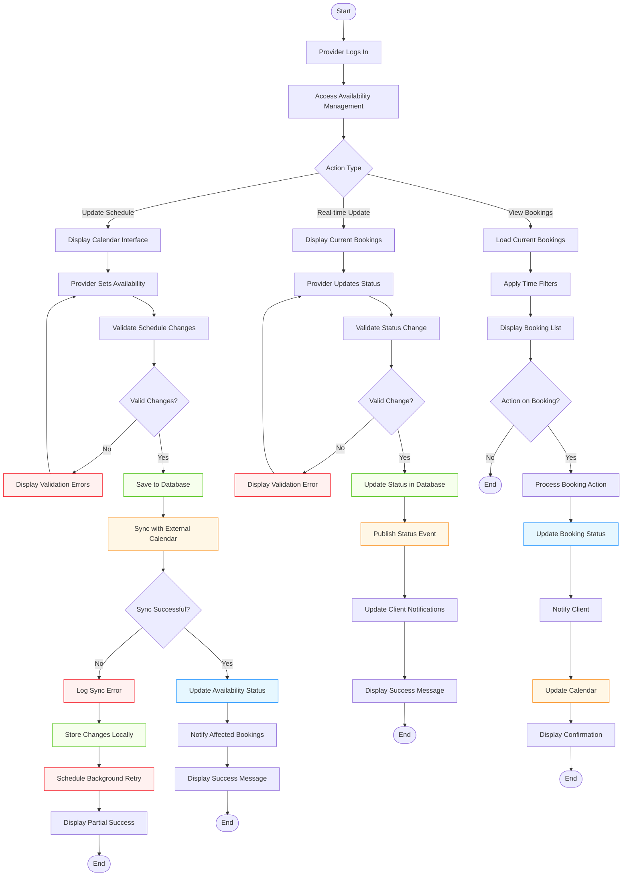
```mermaid
flowchart TD
    Start([Start]) --> A[Provider Logs In]
    A --> B[Access Availability Management]
    
    B --> C{Action Type}
    
    C -->|Update Schedule| D[Display Calendar Interface]
    D --> E[Provider Sets Availability]
    E --> F[Validate Schedule Changes]
    F --> G{Valid Changes?}
    G -->|No| H[Display Validation Errors]
    H --> E
    G -->|Yes| I[Save to Database]
    I --> J[Sync with External Calendar]
    J --> K{Sync Successful?}
    K -->|No| L[Log Sync Error]
    L --> M[Store Changes Locally]
    M --> N[Schedule Background Retry]
    N --> O[Display Partial Success]
    O --> End1([End])
    K -->|Yes| P[Update Availability Status]
    P --> Q[Notify Affected Bookings]
    Q --> R[Display Success Message]
    R --> End2([End])
    
    C -->|Real-time Update| S[Display Current Bookings]
    S --> T[Provider Updates Status]
    T --> U[Validate Status Change]
    U --> V{Valid Change?}
    V -->|No| W[Display Validation Error]
    W --> T
    V -->|Yes| X[Update Status in Database]
    X --> Y[Publish Status Event]
    Y --> Z[Update Client Notifications]
    Z --> AA[Display Success Message]
    AA --> End3([End])
    
    C -->|View Bookings| AB[Load Current Bookings]
    AB --> AC[Apply Time Filters]
    AC --> AD[Display Booking List]
    AD --> AE{Action on Booking?}
    AE -->|No| End4([End])
    AE -->|Yes| AF[Process Booking Action]
    AF --> AG[Update Booking Status]
    AG --> AH[Notify Client]
    AH --> AI[Update Calendar]
    AI --> AJ[Display Confirmation]
    AJ --> End5([End])
    
    %% State Transitions
    classDef stateTransition fill:#e6f7ff,stroke:#1890ff,stroke-width:1px
    class I,P,X,AG stateTransition
    
    %% Data Persistence
    classDef dataPersistence fill:#f6ffed,stroke:#52c41a,stroke-width:1px
    class I,M,X dataPersistence
    
    %% External Integration
    classDef externalInt fill:#fff7e6,stroke:#fa8c16,stroke-width:1px
    class J,Y,AI externalInt
    
    %% Error Handling
    classDef errorHandle fill:#fff1f0,stroke:#f5222d,stroke-width:1px
    class H,L,N,W errorHandle
```

### 4.6 ERROR HANDLING FLOWCHARTS

#### 4.6.1 API Error Handling Flow

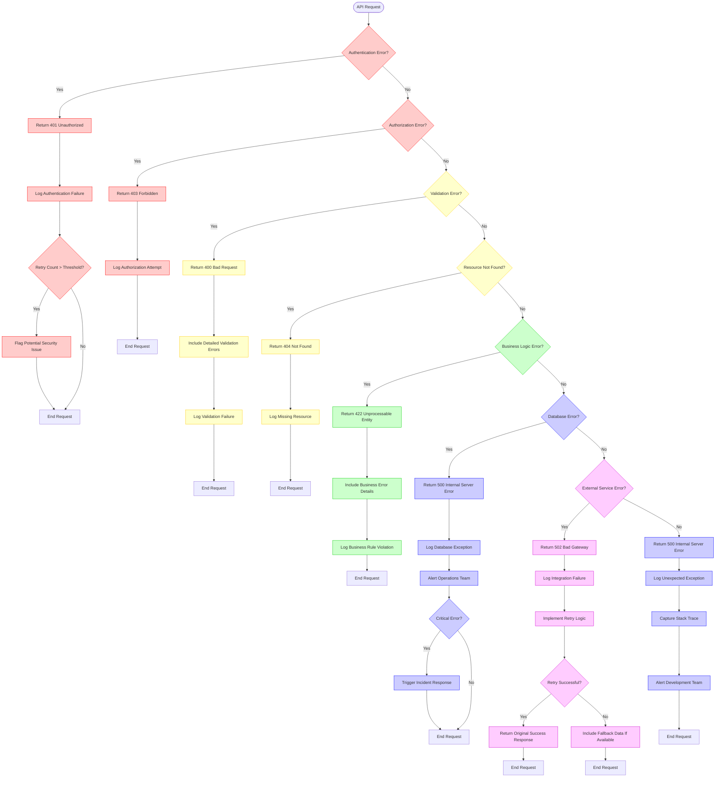
```mermaid
flowchart TD
    Start([API Request]) --> A{Authentication Error?}
    A -->|Yes| B[Return 401 Unauthorized]
    B --> C[Log Authentication Failure]
    C --> D{Retry Count > Threshold?}
    D -->|Yes| E[Flag Potential Security Issue]
    E --> F[End Request]
    D -->|No| F
    
    A -->|No| G{Authorization Error?}
    G -->|Yes| H[Return 403 Forbidden]
    H --> I[Log Authorization Attempt]
    I --> J[End Request]
    
    G -->|No| K{Validation Error?}
    K -->|Yes| L[Return 400 Bad Request]
    L --> M[Include Detailed Validation Errors]
    M --> N[Log Validation Failure]
    N --> O[End Request]
    
    K -->|No| P{Resource Not Found?}
    P -->|Yes| Q[Return 404 Not Found]
    Q --> R[Log Missing Resource]
    R --> S[End Request]
    
    P -->|No| T{Business Logic Error?}
    T -->|Yes| U[Return 422 Unprocessable Entity]
    U --> V[Include Business Error Details]
    V --> W[Log Business Rule Violation]
    W --> X[End Request]
    
    T -->|No| Y{Database Error?}
    Y -->|Yes| Z[Return 500 Internal Server Error]
    Z --> AA[Log Database Exception]
    AA --> AB[Alert Operations Team]
    AB --> AC{Critical Error?}
    AC -->|Yes| AD[Trigger Incident Response]
    AD --> AE[End Request]
    AC -->|No| AE
    
    Y -->|No| AF{External Service Error?}
    AF -->|Yes| AG[Return 502 Bad Gateway]
    AG --> AH[Log Integration Failure]
    AH --> AI[Implement Retry Logic]
    AI --> AJ{Retry Successful?}
    AJ -->|Yes| AK[Return Original Success Response]
    AK --> AL[End Request]
    AJ -->|No| AM[Include Fallback Data If Available]
    AM --> AN[End Request]
    
    AF -->|No| AO[Return 500 Internal Server Error]
    AO --> AP[Log Unexpected Exception]
    AP --> AQ[Capture Stack Trace]
    AQ --> AR[Alert Development Team]
    AR --> AS[End Request]
    
    %% Error Types
    classDef authError fill:#ffcccb,stroke:#ff0000,stroke-width:1px
    classDef validationError fill:#ffffcc,stroke:#ffcc00,stroke-width:1px
    classDef businessError fill:#ccffcc,stroke:#00cc00,stroke-width:1px
    classDef systemError fill:#ccccff,stroke:#0000ff,stroke-width:1px
    classDef integrationError fill:#ffccff,stroke:#cc00cc,stroke-width:1px
    
    class A,B,C,D,E,G,H,I authError
    class K,L,M,N,P,Q,R validationError
    class T,U,V,W businessError
    class Y,Z,AA,AB,AC,AD,AO,AP,AQ,AR systemError
    class AF,AG,AH,AI,AJ,AK,AM integrationError
```

#### 4.6.2 Fallback Process for AI Service Failure

```mermaid
flowchart TD
    Start([AI Service Request]) --> A[Prepare Request Payload]
    A --> B[Send Request to Primary AI Service]
    B --> C{Response Received?}
    
    C -->|Yes| D{Response Valid?}
    D -->|Yes| E[Process AI Response]
    E --> F[Return Results]
    F --> End1([End])
    
    D -->|No| G[Log Validation Error]
    G --> H[Determine Error Type]
    
    C -->|No| I[Log Connection Error]
    I --> J[Check Service Status]
    
    H --> K{Error Type}
    K -->|Temporary| L[Implement Retry with Backoff]
    L --> M{Retry Successful?}
    M -->|Yes| E
    M -->|No| N[Escalate to Fallback Process]
    
    K -->|Permanent| N
    
    J --> O{Service Down?}
    O -->|Yes| P[Update Service Status Cache]
    P --> N
    O -->|No| L
    
    N --> Q{Fallback AI Service Available?}
    Q -->|Yes| R[Prepare Fallback Request]
    R --> S[Send to Fallback AI Service]
    S --> T{Fallback Successful?}
    T -->|Yes| U[Process Fallback Response]
    U --> V[Mark as Fallback Result]
    V --> F
    
    T -->|No| W[Log Fallback Failure]
    W --> X[Implement Manual Processing Option]
    
    Q -->|No| X
    
    X --> Y{Critical Function?}
    Y -->|Yes| Z[Notify User of Delay]
    Z --> AA[Queue for Manual Processing]
    AA --> AB[Alert Operations Team]
    AB --> AC[Process Manually When Available]
    AC --> AD[Return Manual Results]
    AD --> End2([End])
    
    Y -->|No| AE[Use Cached Results If Available]
    AE --> AF{Cache Available?}
    AF -->|Yes| AG[Return Cached Results with Notice]
    AG --> End3([End])
    
    AF -->|No| AH[Return Graceful Degradation Response]
    AH --> AI[Suggest Alternative Workflow]
    AI --> End4([End])
    
    %% Retry Mechanisms
    classDef retry fill:#ffcccb,stroke:#ff0000,stroke-width:1px
    class L,M retry
    
    %% Fallback Processes
    classDef fallback fill:#ccffcc,stroke:#00cc00,stroke-width:1px
    class N,Q,R,S,T,U,V fallback
    
    %% Manual Intervention
    classDef manual fill:#ffffcc,stroke:#ffcc00,stroke-width:1px
    class X,Z,AA,AB,AC,AD manual
    
    %% Degradation Paths
    classDef degrade fill:#ccccff,stroke:#0000ff,stroke-width:1px
    class AE,AF,AG,AH,AI degrade
```

### 4.7 INTEGRATION SEQUENCE DIAGRAMS

#### 4.7.1 Document Analysis Integration Sequence

```mermaid
sequenceDiagram
    participant U as User
    participant FE as Frontend
    participant API as API Gateway
    participant DS as Document Service
    participant BS as Blob Storage
    participant AI as AI Analysis Service
    participant DB as Database
    
    U->>FE: Upload medical document
    FE->>API: POST /api/documents/upload
    API->>DS: Process document upload
    
    DS->>DS: Validate document
    DS->>BS: Store document
    BS->>DS: Return storage reference
    DS->>DB: Record document metadata
    DS->>API: Return upload confirmation
    API->>FE: Display upload success
    FE->>U: Show processing status
    
    DS->>AI: Queue document for analysis
    Note over DS,AI: Include document reference and analysis parameters
    
    alt Successful Analysis
        AI->>AI: Process document
        AI->>DS: Return analysis results
        DS->>DB: Store analysis results
        DS->>DB: Update document status
        
        U->>FE: Request document status
        FE->>API: GET /api/documents/{id}
        API->>DS: Fetch document status
        DS->>DB: Query document and analysis
        DB->>DS: Return document data
        DS->>API: Return complete document info
        API->>FE: Display document and analysis
        FE->>U: Show completed analysis
        
    else Analysis Timeout
        AI->>DS: Return timeout notification
        DS->>DB: Update document status to "processing_timeout"
        DS->>AI: Requeue with extended timeout
        
        U->>FE: Request document status
        FE->>API: GET /api/documents/{id}
        API->>DS: Fetch document status
        DS->>DB: Query document status
        DB->>DS: Return "processing" status
        DS->>API: Return processing status with ETA
        API->>FE: Display extended processing time
        FE->>U: Show processing delay message
        
    else Analysis Error
        AI->>DS: Return error details
        DS->>DB: Update document status to "processing_error"
        DS->>DB: Store error information
        
        U->>FE: Request document status
        FE->>API: GET /api/documents/{id}
        API->>DS: Fetch document status
        DS->>DB: Query document status
        DB->>DS: Return error status
        DS->>API: Return error information
        API->>FE: Display error message
        FE->>U: Show manual processing option
        
        U->>FE: Select manual processing
        FE->>API: POST /api/documents/{id}/manual
        API->>DS: Flag for manual processing
        DS->>DB: Update document status
        DS->>API: Confirm manual processing
        API->>FE: Display confirmation
        FE->>U: Show waiting for manual processing
    end
```

#### 4.7.2 Payment Processing Integration Sequence

```mermaid
sequenceDiagram
    participant C as Client
    participant FE as Frontend
    participant API as API Gateway
    participant PS as Payment Service
    participant DB as Database
    participant SP as Stripe
    participant NS as Notification Service
    
    C->>FE: Initiate payment
    FE->>API: POST /api/payments/initialize
    API->>PS: Create payment intent
    
    PS->>DB: Verify service eligibility
    DB->>PS: Return eligibility status
    
    PS->>DB: Calculate final amount
    DB->>PS: Return calculated amount
    
    PS->>SP: Create payment intent
    SP->>PS: Return client secret
    PS->>API: Return payment details
    API->>FE: Display payment form
    
    FE->>C: Show payment form with amount
    C->>FE: Enter payment details
    FE->>SP: Submit payment directly to Stripe
    
    alt Payment Successful
        SP->>PS: Send webhook (payment_intent.succeeded)
        PS->>DB: Verify webhook authenticity
        PS->>DB: Record payment
        PS->>DB: Update service status
        
        PS->>NS: Trigger payment confirmation
        NS->>C: Send email receipt
        
        PS->>API: Return success status
        API->>FE: Display success message
        FE->>C: Show confirmation and receipt
        
    else Payment Failed
        SP->>PS: Send webhook (payment_intent.payment_failed)
        PS->>DB: Record failed attempt
        
        PS->>NS: Trigger payment failure notification
        NS->>C: Send failure email
        
        PS->>API: Return failure status
        API->>FE: Display failure message
        FE->>C: Show retry options
        
    else Payment Processing
        SP->>PS: Send webhook (payment_intent.processing)
        PS->>DB: Update payment status to processing
        
        PS->>API: Return processing status
        API->>FE: Display processing message
        FE->>C: Show payment processing
        
        Note over SP,PS: Later webhook will update status
        
    else System Error
        PS->>DB: Log error details
        PS->>NS: Trigger system alert
        NS->>PS: Alert support team
        
        PS->>API: Return error status
        API->>FE: Display error message
        FE->>C: Show contact support message
    end
    
    C->>FE: Request payment history
    FE->>API: GET /api/payments/history
    API->>PS: Fetch payment records
    PS->>DB: Query payment history
    DB->>PS: Return payment records
    PS->>API: Return formatted history
    API->>FE: Display payment history
    FE->>C: Show transaction history
```

### 4.8 STATE TRANSITION DIAGRAMS

#### 4.8.1 Service Request State Transitions

```mermaid
stateDiagram-v2
    [*] --> Draft: Create service request
    
    Draft --> Submitted: Submit request
    Draft --> Cancelled: Cancel draft
    
    Submitted --> InReview: Case manager review
    Submitted --> Rejected: Automatic rejection
    
    InReview --> Approved: Approve request
    InReview --> Rejected: Reject request
    InReview --> PendingInfo: Request more information
    
    PendingInfo --> InReview: Information provided
    PendingInfo --> Cancelled: Timeout/abandonment
    
    Approved --> Matching: Find provider
    
    Matching --> ProviderAssigned: Provider found
    Matching --> NoProviders: No providers available
    
    NoProviders --> Matching: Expand search criteria
    NoProviders --> OnHold: Pause until providers available
    
    ProviderAssigned --> Scheduled: Appointment scheduled
    ProviderAssigned --> Declined: Provider declines
    
    Declined --> Matching: Find new provider
    
    Scheduled --> InProgress: Service started
    Scheduled --> Cancelled: Client/provider cancels
    
    InProgress --> Completed: Service delivered
    InProgress --> Interrupted: Service interrupted
    
    Interrupted --> Rescheduled: New appointment set
    Interrupted --> Cancelled: Service cancelled
    
    Rescheduled --> Scheduled: New schedule confirmed
    
    OnHold --> Matching: Providers become available
    OnHold --> Cancelled: Client cancels while on hold
    
    Completed --> [*]: Service cycle complete
    Cancelled --> [*]: Request terminated
    Rejected --> [*]: Request denied
    
    note right of Draft
        User can edit all details
        No provider visibility
        No financial commitment
    end note
    
    note right of Submitted
        System validation occurs
        Automatic checks for eligibility
        Timestamp recorded for SLA tracking
    end note
    
    note right of Approved
        Payment pre-authorization if needed
        Provider matching criteria finalized
        Client notified of approval
    end note
    
    note right of InProgress
        Check-in recorded
        Real-time status updates
        Incident reporting available
    end note
    
    note right of Completed
        Outcome documentation required
        Satisfaction survey triggered
        Follow-up recommendations generated
    end note
```

## 5. SYSTEM ARCHITECTURE

### 5.1 HIGH-LEVEL ARCHITECTURE

#### 5.1.1 System Overview

Revolucare employs a modern cloud-native architecture based on a microservices-inspired approach with a monolithic deployment model. This hybrid architecture provides the conceptual separation of microservices while maintaining the deployment simplicity of a monolith, which is appropriate for the MVP phase.

**Architectural Style and Rationale:**
- **Next.js Full-Stack Application**: Utilizing Next.js for both frontend and backend provides a unified development experience while enabling server-side rendering for performance and SEO benefits.
- **API-First Design**: All functionality is exposed through well-defined API endpoints, enabling future expansion to native mobile applications.
- **Domain-Driven Design**: The system is organized around business domains (users, care plans, services, providers) rather than technical concerns.
- **Event-Driven Components**: Critical workflows like document processing and availability updates use event-driven patterns for resilience and scalability.

**Key Architectural Principles:**
- **Separation of Concerns**: Clear boundaries between UI, business logic, and data access layers.
- **Progressive Enhancement**: Core functionality works without JavaScript, with enhanced experiences for modern browsers.
- **Defense in Depth**: Multiple security layers protect sensitive healthcare data.
- **Graceful Degradation**: System remains functional with reduced capabilities when external services are unavailable.
- **Observability by Design**: Comprehensive logging, monitoring, and tracing built into the architecture.

**System Boundaries and Interfaces:**
- **Client Boundary**: Browser and mobile web applications interact with the system through the Next.js frontend.
- **API Boundary**: External systems integrate through the REST API layer.
- **External Service Boundary**: The system connects to third-party services (AI, payment processing, etc.) through dedicated integration layers.

#### 5.1.2 Core Components Table

| Component Name | Primary Responsibility | Key Dependencies | Critical Considerations |
| --- | --- | --- | --- |
| Next.js Frontend | Deliver responsive UI for all user roles | React, Tailwind CSS, shadcn/ui | Accessibility, performance, progressive enhancement |
| API Gateway | Route and validate API requests | Next.js API routes, authentication service | Rate limiting, request validation, error handling |
| Authentication Service | Manage user identity and access | NextAuth.js, database | Security, token management, session handling |
| User Service | Handle user profiles and preferences | Database, document storage | Privacy, data validation, profile completeness |
| Care Plan Service | Generate and manage care plans | AI service, document service | Medical data accuracy, version control, compliance |
| Services Plan Service | Create and track service plans | Provider service, payment service | Service matching accuracy, cost calculation, funding rules |
| Provider Service | Manage provider profiles and availability | Calendar service, notification service | Real-time updates, scheduling conflicts, provider matching |
| Analytics Service | Generate insights and reports | Database, caching layer | Data aggregation, performance, visualization |
| Document Service | Process and analyze documents | AI service, blob storage | Format handling, extraction accuracy, processing queue |
| Notification Service | Deliver alerts and messages | Email service, SMS service | Delivery guarantees, template management, preferences |

#### 5.1.3 Data Flow Description

The Revolucare platform's data flows are organized around key user journeys and business processes:

**Authentication and Profile Management:**
Data begins with user registration, flowing through the authentication service for validation and secure storage. Profile data is collected incrementally and stored in the user service, with document uploads processed asynchronously through the document service. Profile completeness metrics flow to the analytics service.

**Care Plan Generation:**
Client medical data flows from document uploads to the document service, which coordinates with AI services for analysis. Extracted information flows to the care plan service, which generates plan options. These options flow to users for review, with feedback looping back for refinement. Finalized care plans flow to the services plan service for implementation.

**Provider Matching:**
Client needs data flows from care plans to the provider service, which applies matching algorithms against provider profiles. Availability data is continuously updated through calendar integrations. Match results flow to users for selection, with booking requests flowing back to providers for confirmation. Booking data flows to notification services for alerts and to analytics for reporting.

**Service Delivery and Tracking:**
Service status updates flow from providers to clients through the notification service. Outcome data flows to the analytics service for performance tracking. Payment information flows through the payment service with confirmation events triggering status updates.

**Key Data Stores:**
- **PostgreSQL Database**: Primary persistent storage for all structured data
- **Blob Storage**: Document repository for medical records and generated plans
- **Redis Cache**: Performance optimization for frequently accessed data like provider availability and service catalogs

**Data Transformation Points:**
- Document processing pipeline (raw documents → structured medical data)
- Care plan generation (medical data → personalized care plans)
- Provider matching (client needs → ranked provider recommendations)
- Analytics processing (raw events → aggregated insights)

#### 5.1.4 External Integration Points

| System Name | Integration Type | Data Exchange Pattern | Protocol/Format | SLA Requirements |
| --- | --- | --- | --- | --- |
| OpenAI API | AI Processing | Request-Response | REST/JSON | 99.5% availability, <2s response time |
| Azure Form Recognizer | Document Analysis | Asynchronous | REST/JSON | 99% availability, <30s processing time |
| Stripe | Payment Processing | Event-Driven | REST/JSON, Webhooks | 99.9% availability, <3s transaction time |
| SendGrid | Email Delivery | Fire-and-Forget | REST/JSON | 99.5% availability, <5min delivery time |
| Twilio | SMS Notifications | Fire-and-Forget | REST/JSON | 99.5% availability, <1min delivery time |
| Google Maps API | Location Services | Request-Response | REST/JSON | 99.9% availability, <1s response time |
| Google Calendar API | Calendar Integration | Bidirectional Sync | REST/JSON, Webhooks | 99.5% availability, <5min sync time |
| Microsoft Graph API | Calendar Integration | Bidirectional Sync | REST/JSON, Webhooks | 99.5% availability, <5min sync time |

### 5.2 COMPONENT DETAILS

#### 5.2.1 Next.js Frontend

**Purpose and Responsibilities:**
- Deliver responsive, accessible user interfaces for all user roles
- Implement client-side validation and state management
- Handle client-side routing and navigation
- Manage form submissions and user interactions
- Implement progressive enhancement for core functionality

**Technologies and Frameworks:**
- Next.js 14+ with App Router for routing and server components
- React 18+ for component-based UI development
- Tailwind CSS for styling and responsive design
- shadcn/ui for accessible, customizable UI components
- React Query for data fetching and caching
- Framer Motion for animations and transitions

**Key Interfaces:**
- REST API endpoints for data retrieval and manipulation
- WebSocket connections for real-time updates (future enhancement)
- Browser localStorage/sessionStorage for client-side persistence
- Service worker for offline capabilities (future enhancement)

**Data Persistence Requirements:**
- Client-side caching of frequently accessed data
- Form state persistence during navigation
- User preferences and settings in localStorage
- Authentication tokens in secure HTTP-only cookies

**Scaling Considerations:**
- Static generation of public pages for performance
- Code splitting and lazy loading for large component trees
- Image optimization and responsive loading
- Edge caching of static assets

```mermaid
flowchart TD
    subgraph "Frontend Architecture"
        A[Browser/Mobile Client] --> B[Next.js App]
        B --> C[React Components]
        C --> D[UI Components]
        C --> E[Page Components]
        C --> F[Layout Components]
        
        B --> G[Client-Side Hooks]
        G --> H[Data Fetching]
        G --> I[State Management]
        G --> J[Form Handling]
        
        B --> K[API Client]
        K --> L[Authentication]
        K --> M[Data Services]
        
        D --> N[shadcn/ui Components]
        D --> O[Custom Components]
        
        H --> P[React Query]
        I --> Q[React Context]
        J --> R[React Hook Form]
    end
```

#### 5.2.2 API Gateway

**Purpose and Responsibilities:**
- Route API requests to appropriate service handlers
- Validate request authentication and authorization
- Implement rate limiting and request throttling
- Handle cross-cutting concerns like logging and error handling
- Provide consistent error responses and status codes

**Technologies and Frameworks:**
- Next.js API Routes for endpoint implementation
- NextAuth.js for authentication middleware
- Custom middleware for request validation and transformation
- Zod for request schema validation

**Key Interfaces:**
- RESTful API endpoints following consistent patterns
- Authentication headers and tokens
- Standardized error response format
- Health check and status endpoints

**Data Persistence Requirements:**
- No direct data persistence (stateless)
- Temporary caching of authentication tokens
- Rate limiting counters in Redis

**Scaling Considerations:**
- Stateless design for horizontal scaling
- Edge function deployment for global low-latency
- Request batching for high-volume endpoints
- Circuit breakers for downstream service protection

```mermaid
sequenceDiagram
    participant Client
    participant APIGateway as API Gateway
    participant Auth as Auth Service
    participant Service as Domain Service
    participant DB as Database
    
    Client->>APIGateway: API Request
    APIGateway->>APIGateway: Validate Request Format
    APIGateway->>Auth: Authenticate Request
    
    alt Authentication Failed
        Auth->>APIGateway: 401 Unauthorized
        APIGateway->>Client: 401 Response
    else Authentication Successful
        Auth->>APIGateway: User Context
        APIGateway->>APIGateway: Authorize Request
        
        alt Authorization Failed
            APIGateway->>Client: 403 Forbidden
        else Authorization Successful
            APIGateway->>Service: Forward Request
            Service->>DB: Data Operation
            DB->>Service: Operation Result
            Service->>APIGateway: Service Response
            APIGateway->>Client: API Response
        end
    end
```

#### 5.2.3 Authentication Service

**Purpose and Responsibilities:**
- Manage user registration and authentication
- Issue and validate authentication tokens
- Handle password reset and account recovery
- Implement multi-factor authentication (future enhancement)
- Maintain user sessions and access control

**Technologies and Frameworks:**
- NextAuth.js for authentication framework
- JWT for token-based authentication
- Bcrypt for password hashing
- PostgreSQL for user credential storage

**Key Interfaces:**
- Authentication API endpoints (/api/auth/*)
- JWT token validation interface
- Role-based permission checking
- Session management interface

**Data Persistence Requirements:**
- Secure storage of hashed passwords
- User account status and verification state
- Authentication logs for security auditing
- Session tokens and refresh tokens

**Scaling Considerations:**
- Stateless token validation for horizontal scaling
- Distributed session storage for high availability
- Token revocation strategy for security incidents
- Cache of frequently accessed permission data

```mermaid
stateDiagram-v2
    [*] --> Unauthenticated
    
    Unauthenticated --> PendingRegistration: Register
    Unauthenticated --> Authenticating: Login
    
    PendingRegistration --> PendingVerification: Submit Registration
    PendingVerification --> Authenticated: Verify Email
    
    Authenticating --> Authenticated: Valid Credentials
    Authenticating --> FailedAuthentication: Invalid Credentials
    FailedAuthentication --> Authenticating: Retry
    FailedAuthentication --> PasswordReset: Request Reset
    
    PasswordReset --> Authenticating: Reset Complete
    
    Authenticated --> Unauthenticated: Logout
    Authenticated --> TokenRefresh: Token Expiring
    TokenRefresh --> Authenticated: New Token Issued
    TokenRefresh --> Unauthenticated: Refresh Failed
    
    Authenticated --> MFAChallenge: MFA Required
    MFAChallenge --> Authenticated: MFA Successful
    MFAChallenge --> FailedAuthentication: MFA Failed
```

#### 5.2.4 Care Plan Service

**Purpose and Responsibilities:**
- Process medical records and extract relevant information
- Generate personalized care plan options
- Manage care plan versions and history
- Track care plan implementation and outcomes
- Facilitate care plan reviews and updates

**Technologies and Frameworks:**
- Custom NLP processing pipeline
- OpenAI API integration for text analysis
- Azure Form Recognizer for document processing
- Version control system for care plan tracking

**Key Interfaces:**
- Care plan generation API
- Document analysis API
- Care plan management API
- Care plan version control API

**Data Persistence Requirements:**
- Structured care plan data in PostgreSQL
- Document metadata and references
- Version history and change tracking
- Care plan templates and components

**Scaling Considerations:**
- Asynchronous processing for document analysis
- Caching of analysis results for similar documents
- Parallel processing of multiple plan options
- Prioritization queue for urgent care plans

```mermaid
sequenceDiagram
    participant CM as Case Manager
    participant CPS as Care Plan Service
    participant DS as Document Service
    participant AI as AI Service
    participant DB as Database
    
    CM->>CPS: Upload Medical Records
    CPS->>DS: Process Documents
    DS->>AI: Analyze Content
    AI->>DS: Return Extracted Data
    DS->>CPS: Provide Structured Medical Data
    
    CPS->>AI: Generate Care Plan Options
    AI->>CPS: Return Plan Options with Confidence Scores
    CPS->>DB: Store Plan Options
    CPS->>CM: Present Care Plan Options
    
    CM->>CPS: Select/Modify Plan
    CPS->>DB: Save Final Care Plan
    CPS->>CM: Confirm Plan Creation
    
    Note over CM,DB: Plan Review Cycle
    
    CM->>CPS: Request Plan Update
    CPS->>DB: Create New Version
    CPS->>AI: Generate Update Recommendations
    AI->>CPS: Return Recommendations
    CPS->>CM: Present Update Options
    CM->>CPS: Approve Updates
    CPS->>DB: Save New Plan Version
```

#### 5.2.5 Provider Service

**Purpose and Responsibilities:**
- Manage provider profiles and service offerings
- Track real-time provider availability
- Implement provider matching algorithms
- Handle provider reviews and ratings
- Facilitate service booking and scheduling

**Technologies and Frameworks:**
- Custom matching algorithm
- Calendar integration APIs
- Geospatial search capabilities
- Real-time availability tracking

**Key Interfaces:**
- Provider search and filtering API
- Availability management API
- Booking and scheduling API
- Review and rating API

**Data Persistence Requirements:**
- Provider profile data in PostgreSQL
- Availability calendar data with real-time updates
- Service offering catalog
- Review and rating history

**Scaling Considerations:**
- Real-time availability updates through WebSockets
- Geospatial indexing for location-based searches
- Caching of provider search results
- Background processing of matching algorithms

```mermaid
flowchart TD
    subgraph "Provider Matching Process"
        A[Client Needs Assessment] --> B[Extract Matching Criteria]
        B --> C[Query Provider Database]
        C --> D[Apply Primary Filters]
        D --> E[Calculate Compatibility Scores]
        E --> F[Apply Availability Filter]
        F --> G[Apply Geographic Filter]
        G --> H[Sort by Composite Score]
        H --> I[Return Ranked Providers]
        
        J[Provider Updates Availability] --> K[Update Availability Store]
        K --> L[Invalidate Affected Caches]
        L --> M[Notify Subscribed Clients]
        
        N[Client Books Provider] --> O[Check Real-time Availability]
        O --> P{Still Available?}
        P -->|Yes| Q[Create Booking]
        P -->|No| R[Return Unavailable Status]
        Q --> S[Update Provider Calendar]
        S --> T[Send Notifications]
        R --> U[Suggest Alternatives]
    end
```

#### 5.2.6 Analytics Service

**Purpose and Responsibilities:**
- Collect and process usage and performance data
- Generate insights and visualizations
- Provide role-specific dashboards and reports
- Track key performance indicators
- Support data-driven decision making

**Technologies and Frameworks:**
- Custom analytics processing pipeline
- Data aggregation and transformation logic
- Visualization components for dashboards
- Export functionality for reports

**Key Interfaces:**
- Dashboard data API
- Custom report generation API
- Metrics and KPI API
- Data export API

**Data Persistence Requirements:**
- Aggregated metrics in PostgreSQL
- Time-series data for trend analysis
- Report templates and configurations
- User dashboard preferences

**Scaling Considerations:**
- Asynchronous processing of analytics data
- Pre-aggregation of common metrics
- Time-based partitioning of historical data
- Caching of dashboard components

```mermaid
flowchart TD
    subgraph "Analytics Data Flow"
        A[User Actions] --> B[Event Collection]
        C[System Events] --> B
        D[Service Outcomes] --> B
        
        B --> E[Event Processing Pipeline]
        E --> F[Raw Event Storage]
        E --> G[Real-time Metrics]
        F --> H[Batch Processing]
        
        H --> I[Aggregation]
        I --> J[Dimension Analysis]
        J --> K[Metric Calculation]
        K --> L[Insight Generation]
        
        G --> M[Real-time Dashboards]
        L --> N[Historical Reports]
        L --> O[KPI Tracking]
        
        P[User Requests Dashboard] --> Q[Dashboard Assembly]
        Q --> R[Apply User Filters]
        R --> S[Retrieve Metrics]
        S --> T[Generate Visualizations]
        T --> U[Deliver Dashboard]
    end
```

### 5.3 TECHNICAL DECISIONS

#### 5.3.1 Architecture Style Decisions

| Decision Area | Selected Approach | Alternatives Considered | Rationale |
| --- | --- | --- | --- |
| Overall Architecture | Microservices-inspired Monolith | Pure Microservices, Traditional Monolith | Balances separation of concerns with deployment simplicity for MVP phase; enables future migration to true microservices |
| Frontend Architecture | Next.js with App Router | SPA with React Router, Traditional SSR | Provides optimal mix of SEO benefits, performance, and developer experience; server components reduce client-side JavaScript |
| API Design | RESTful with Resource-Oriented Design | GraphQL, RPC | Familiar pattern with broad tooling support; simpler implementation for MVP while maintaining flexibility |
| State Management | React Query + Context API | Redux, MobX, Zustand | Combines efficient server state management with lightweight UI state; reduces boilerplate while maintaining performance |

**Key Architecture Tradeoffs:**

The architecture prioritizes developer productivity and time-to-market for the MVP while establishing patterns that will support future scaling. The monolithic deployment model simplifies DevOps requirements but introduces some coupling between services. This tradeoff is acceptable for the initial release but will require refactoring as the system grows.

The decision to use Next.js for both frontend and backend creates a unified development experience but ties the scaling characteristics of these components together. This limitation is mitigated by the ability to extract API routes into separate services as needed.

```mermaid
flowchart TD
    A[Architecture Decision] --> B{Deployment Model}
    B -->|Option 1| C[Pure Microservices]
    B -->|Option 2| D[Microservices-inspired Monolith]
    B -->|Option 3| E[Traditional Monolith]
    
    C --> F[Pros: Maximum Scalability]
    C --> G[Cons: Complex DevOps, Longer Time-to-Market]
    
    D --> H[Pros: Logical Separation, Simpler Deployment]
    D --> I[Cons: Some Service Coupling, Limited Independent Scaling]
    
    E --> J[Pros: Simplest Implementation, Fastest Development]
    E --> K[Cons: Poor Scalability, Difficult Maintenance]
    
    F --> L{Decision Factors}
    G --> L
    H --> L
    I --> L
    J --> L
    K --> L
    
    L --> M[Time Constraints]
    L --> N[Team Experience]
    L --> O[Future Scalability Needs]
    L --> P[Operational Complexity Tolerance]
    
    M --> Q[Selected: Microservices-inspired Monolith]
    N --> Q
    O --> Q
    P --> Q
```

#### 5.3.2 Communication Pattern Choices

| Pattern | Use Cases | Benefits | Considerations |
| --- | --- | --- | --- |
| Synchronous Request-Response | User-initiated actions, UI data loading | Immediate feedback, Simplicity | Potential for cascading failures, Limited scalability |
| Asynchronous Processing | Document analysis, Report generation | Background processing, Resilience | Complexity in tracking status, Additional infrastructure |
| Event-Driven | Availability updates, Notifications | Loose coupling, Real-time updates | Event consistency challenges, Debugging complexity |
| Publish-Subscribe | Multi-recipient notifications, Analytics | Scalable distribution, Decoupling | Message delivery guarantees, Ordering challenges |

**Communication Pattern Rationale:**

The system employs multiple communication patterns based on the specific requirements of each interaction:

- **Synchronous patterns** are used for user-facing operations where immediate feedback is essential, such as authentication and basic CRUD operations.
- **Asynchronous processing** is employed for computationally intensive operations like document analysis and care plan generation, allowing the system to remain responsive.
- **Event-driven patterns** enable real-time updates for availability changes and booking confirmations, ensuring all components have current information.
- **Publish-subscribe** facilitates notifications to multiple interested parties, such as alerting both clients and providers about booking changes.

This mixed approach balances responsiveness, scalability, and system resilience while managing complexity.

#### 5.3.3 Data Storage Solution Rationale

| Data Type | Selected Solution | Alternatives Considered | Rationale |
| --- | --- | --- | --- |
| Relational Data | PostgreSQL | MySQL, SQL Server | Strong consistency guarantees, Advanced features (JSON, full-text search), Open-source with enterprise support |
| Document Storage | Vercel Blob Storage | S3, Azure Blob Storage | Seamless integration with Next.js, Simplified deployment, Adequate performance for MVP needs |
| Caching | Redis | Memcached, In-memory cache | Versatility (caching, pub/sub, rate limiting), Data structures support, Widespread adoption |
| Search | PostgreSQL Full-Text Search | Elasticsearch, Algolia | Simplifies infrastructure for MVP, Adequate for initial search needs, Integrated with primary database |

**Data Storage Considerations:**

The data storage strategy prioritizes simplicity and integration while ensuring adequate performance and scalability for the MVP phase:

- PostgreSQL provides a solid foundation for structured data with strong consistency guarantees, which are essential for healthcare information.
- Vercel Blob Storage simplifies the infrastructure stack while providing adequate performance for document storage needs.
- Redis offers versatility beyond simple caching, supporting multiple system needs with a single technology.
- Using PostgreSQL's built-in full-text search capabilities avoids introducing additional infrastructure components while meeting initial search requirements.

As the system scales, specialized services like Elasticsearch may be introduced for advanced search capabilities, and the document storage strategy may evolve to include more sophisticated content management features.

#### 5.3.4 Caching Strategy Justification

| Cache Type | Implementation | Use Cases | Invalidation Strategy |
| --- | --- | --- | --- |
| Data Cache | Redis | Provider directory, Service catalog, User profiles | Time-based expiration + explicit invalidation on updates |
| API Response Cache | Redis | Search results, Analytics dashboards | Time-based expiration with varying TTLs based on data volatility |
| Session Cache | Redis | Authentication sessions, User preferences | Token-based expiration + explicit logout invalidation |
| Static Asset Cache | CDN | Images, CSS, JavaScript | Cache-Control headers with long TTLs + versioned file names |

**Caching Strategy Rationale:**

The caching strategy is designed to balance performance improvements with data freshness requirements:

- Frequently accessed, relatively static data like provider directories and service catalogs are cached with longer TTLs to reduce database load.
- Search results and analytics dashboards are cached with shorter TTLs to balance performance with data freshness.
- Authentication sessions use token-based expiration with explicit invalidation on logout for security.
- Static assets are cached aggressively with versioned file names to ensure updates are immediately available.

This multi-layered approach ensures optimal performance while maintaining data integrity and security. Cache invalidation is handled through a combination of time-based expiration and explicit invalidation events triggered by data updates.

#### 5.3.5 Security Mechanism Selection

| Security Concern | Selected Mechanism | Alternatives Considered | Rationale |
| --- | --- | --- | --- |
| Authentication | JWT with HTTP-only cookies | Session-based, OAuth-only | Stateless scalability with protection against XSS, Support for multiple auth providers |
| Authorization | Role-based access control with fine-grained permissions | Simple role-based, Attribute-based | Balances security granularity with implementation complexity, Supports complex healthcare access patterns |
| Data Protection | End-to-end encryption for sensitive data | Database-level encryption only | Protects data throughout its lifecycle, Complies with healthcare regulations |
| API Security | Rate limiting, CORS, CSP | API keys only | Defense in depth approach, Protection against common attack vectors |

**Security Architecture Decisions:**

The security architecture implements defense in depth with multiple layers of protection:

- Authentication combines the scalability benefits of JWTs with the security of HTTP-only cookies to prevent token theft via XSS.
- Authorization uses a role-based model with fine-grained permissions to support complex access patterns in healthcare scenarios.
- Sensitive data is encrypted end-to-end, ensuring protection throughout its lifecycle from client to storage and back.
- API security includes rate limiting to prevent abuse, CORS to control access, and Content Security Policy to mitigate injection attacks.

These mechanisms work together to provide comprehensive security while maintaining system performance and usability.

```mermaid
flowchart TD
    A[Security Threat] --> B{Threat Type}
    
    B -->|Authentication Bypass| C[JWT with HTTP-only Cookies]
    C --> D[Short Expiration]
    C --> E[Secure + HttpOnly Flags]
    C --> F[CSRF Protection]
    
    B -->|Unauthorized Access| G[Role-Based Access Control]
    G --> H[Fine-grained Permissions]
    G --> I[Resource Ownership Checks]
    G --> J[Audit Logging]
    
    B -->|Data Exposure| K[End-to-End Encryption]
    K --> L[TLS for Transit]
    K --> M[Field-level Encryption]
    K --> N[Encrypted Backups]
    
    B -->|API Abuse| O[Rate Limiting]
    O --> P[IP-based Limits]
    O --> Q[User-based Limits]
    O --> R[Graduated Response]
    
    B -->|Injection Attacks| S[Input Validation]
    S --> T[Schema Validation]
    S --> U[Parameterized Queries]
    S --> V[Content Security Policy]
```

### 5.4 CROSS-CUTTING CONCERNS

#### 5.4.1 Monitoring and Observability Approach

Revolucare implements a comprehensive monitoring and observability strategy to ensure system health, performance, and reliability:

**Key Monitoring Components:**
- **Application Performance Monitoring**: Vercel Analytics and custom instrumentation track frontend and backend performance metrics.
- **Infrastructure Monitoring**: Server health, database performance, and cache utilization are monitored through cloud provider tools.
- **Business Metrics**: Key business indicators like user registrations, care plan generations, and provider matches are tracked in real-time.
- **Synthetic Monitoring**: Critical user journeys are regularly tested through automated scripts to detect issues before users do.

**Observability Implementation:**
- **Distributed Tracing**: Request flows are traced across system components to identify bottlenecks and failures.
- **Structured Logging**: Consistent log formats with correlation IDs enable request tracking across services.
- **Metrics Aggregation**: System and business metrics are aggregated for dashboards and alerts.
- **Health Checks**: Regular probes verify component availability and performance.

| Monitoring Aspect | Implementation | Key Metrics | Alert Thresholds |
| --- | --- | --- | --- |
| Frontend Performance | Vercel Analytics, Web Vitals | LCP, FID, CLS, TTFB | LCP > 2.5s, FID > 100ms, CLS > 0.1 |
| API Performance | Custom middleware, Vercel Analytics | Response time, Error rate, Request volume | Response time > 500ms, Error rate > 1% |
| Database Performance | PostgreSQL metrics, Connection pooling | Query time, Connection count, Cache hit ratio | Query time > 100ms, Connections > 80% |
| Business Health | Custom analytics | User engagement, Conversion rates, Matching success | Daily active users -20%, Conversion rate -15% |

#### 5.4.2 Logging and Tracing Strategy

The logging and tracing strategy ensures comprehensive visibility into system behavior while managing storage and performance impacts:

**Logging Approach:**
- **Structured JSON Logs**: All logs use a consistent JSON format for machine parseability.
- **Contextual Information**: Each log includes user context, request IDs, and relevant business entities.
- **Log Levels**: Appropriate log levels (DEBUG, INFO, WARN, ERROR) are used to control verbosity.
- **Sensitive Data Handling**: PII and PHI are automatically redacted from logs.

**Tracing Implementation:**
- **Correlation IDs**: Unique identifiers flow through all system components for request tracking.
- **Span Collection**: Key operations are wrapped in spans to measure duration and relationships.
- **Service Maps**: Automatically generated visualizations show system dependencies and bottlenecks.
- **Sampling Strategy**: Production uses adaptive sampling to balance visibility with performance.

| Log Category | Purpose | Retention Period | Sampling Rate |
| --- | --- | --- | --- |
| Security Logs | Authentication, authorization, and security events | 1 year | 100% |
| Application Logs | System behavior and business events | 30 days | 100% |
| Debug Logs | Detailed troubleshooting information | 7 days | 10% in production |
| Performance Traces | Detailed timing of operations | 7 days | Adaptive (1-100%) |

#### 5.4.3 Error Handling Patterns

Revolucare implements consistent error handling patterns across all system components to ensure reliability, maintainability, and user experience:

**Error Handling Principles:**
- **Fail Gracefully**: System components degrade functionality rather than failing completely.
- **Meaningful Messages**: User-facing errors provide clear guidance without technical details.
- **Comprehensive Logging**: All errors are logged with context for troubleshooting.
- **Recovery Mechanisms**: Automatic retry logic with exponential backoff for transient failures.

**Error Categorization:**
- **Validation Errors**: Client-provided data fails validation rules.
- **Business Logic Errors**: Valid operations that violate business rules.
- **System Errors**: Internal failures in system components.
- **Integration Errors**: Failures in external service communication.

```mermaid
flowchart TD
    A[Error Occurs] --> B{Error Type}
    
    B -->|Validation Error| C[Return 400 Bad Request]
    C --> D[Include Validation Details]
    D --> E[Log at INFO Level]
    
    B -->|Business Logic Error| F[Return 422 Unprocessable Entity]
    F --> G[Include Business Rule Details]
    G --> H[Log at INFO Level]
    
    B -->|System Error| I[Return 500 Internal Server Error]
    I --> J[Generic User Message]
    J --> K[Log at ERROR Level with Stack Trace]
    K --> L[Alert On-Call if Critical]
    
    B -->|Integration Error| M[Return 502 Bad Gateway]
    M --> N[Implement Retry with Backoff]
    N --> O{Retry Successful?}
    O -->|Yes| P[Return Success Response]
    O -->|No| Q[Return Error with Fallback Data if Available]
    Q --> R[Log at ERROR Level]
    R --> S[Alert On-Call if Critical Service]
    
    E --> T[Client Handles Error]
    H --> T
    L --> U[Operations Team Investigates]
    S --> U
```

#### 5.4.4 Authentication and Authorization Framework

The authentication and authorization framework provides secure, flexible access control while maintaining usability:

**Authentication Components:**
- **Multi-provider Authentication**: Support for email/password, Google, and Microsoft authentication.
- **JWT-based Sessions**: Secure, stateless authentication with short-lived tokens.
- **Refresh Token Rotation**: Enhanced security through token rotation on refresh.
- **MFA Support**: Optional multi-factor authentication for sensitive operations.

**Authorization Model:**
- **Role-Based Access Control**: Base permissions determined by user role.
- **Resource-Based Permissions**: Access control based on resource ownership and relationships.
- **Permission Inheritance**: Hierarchical permission model for organizational structures.
- **Contextual Authorization**: Access decisions consider request context (time, location, device).

| Role | Base Permissions | Resource Access | Special Capabilities |
| --- | --- | --- | --- |
| Client | View own profile and care plans | Own records only | Request services, rate providers |
| Provider | Manage availability, view assigned clients | Assigned clients only | Update service status, manage calendar |
| Case Manager | Create/edit care plans, assign providers | Assigned client records | Generate reports, override matching |
| Administrator | System configuration, user management | All records (with audit) | Analytics access, compliance reporting |

#### 5.4.5 Performance Requirements and SLAs

Revolucare defines clear performance targets to ensure a responsive, reliable user experience:

**Key Performance Indicators:**
- **Page Load Time**: Initial page load < 2 seconds, subsequent navigation < 1 second.
- **API Response Time**: 95th percentile < 500ms, 99th percentile < 1 second.
- **Care Plan Generation**: 90% of plans generated in < 30 seconds.
- **Search Performance**: Provider search results returned in < 2 seconds.

**System Availability Targets:**
- **Overall Platform**: 99.9% uptime (< 8.8 hours downtime per year).
- **Authentication Services**: 99.95% uptime (< 4.4 hours downtime per year).
- **Core API Services**: 99.9% uptime (< 8.8 hours downtime per year).
- **Analytics Services**: 99.5% uptime (< 43.8 hours downtime per year).

| Service Component | Response Time Target | Throughput Capacity | Degradation Policy |
| --- | --- | --- | --- |
| Authentication API | 95% < 300ms | 100 requests/second | Prioritize over other services |
| Care Plan Generation | 90% < 30s | 10 concurrent generations | Queue requests when overloaded |
| Provider Matching | 95% < 2s | 50 requests/second | Reduce match complexity under load |
| Document Processing | 90% < 60s | 5 documents/second | Implement fair queuing system |

#### 5.4.6 Disaster Recovery Procedures

Revolucare implements comprehensive disaster recovery procedures to ensure business continuity in the event of system failures:

**Backup Strategy:**
- **Database Backups**: Full daily backups with point-in-time recovery through WAL archiving.
- **Document Backups**: Daily snapshots of document storage with versioning.
- **Configuration Backups**: Infrastructure-as-code repositories with version control.
- **Retention Policy**: 30 days of daily backups, 12 months of monthly backups.

**Recovery Procedures:**
- **Database Restoration**: Automated recovery procedures with documented manual fallbacks.
- **Service Restoration**: Infrastructure-as-code deployment for consistent environment recreation.
- **Data Validation**: Automated integrity checks post-recovery with manual verification.
- **Communication Plan**: Predefined notification templates and stakeholder communication procedures.

| Disaster Scenario | Recovery Time Objective | Recovery Point Objective | Key Recovery Steps |
| --- | --- | --- | --- |
| Database Corruption | 4 hours | < 15 minutes | Restore from latest backup, replay WAL logs, verify integrity |
| Service Outage | 2 hours | 0 (no data loss) | Deploy from IaC, restore configuration, verify connectivity |
| Data Center Failure | 8 hours | < 24 hours | Deploy to alternate region, restore from backups, update DNS |
| Security Breach | 12 hours | Varies by scenario | Isolate affected systems, deploy clean infrastructure, restore verified data |

## 6. SYSTEM COMPONENTS DESIGN

### 6.1 COMPONENT ARCHITECTURE

The Revolucare platform is built using a modular architecture with clearly defined components that work together to deliver the complete system functionality. Each component is designed with specific responsibilities and interfaces to ensure maintainability, scalability, and separation of concerns.

#### 6.1.1 Component Overview Diagram

```mermaid
graph TD
    subgraph "Client Layer"
        CL[Client Browser/App]
    end

    subgraph "Presentation Layer"
        PL[Next.js Frontend]
        PL1[User Interface Components]
        PL2[State Management]
        PL3[Form Handling]
        PL4[Client-side Validation]
        PL --> PL1
        PL --> PL2
        PL --> PL3
        PL --> PL4
    end

    subgraph "API Layer"
        AL[Next.js API Routes]
        AL1[Request Validation]
        AL2[Authentication/Authorization]
        AL3[Error Handling]
        AL4[Response Formatting]
        AL --> AL1
        AL --> AL2
        AL --> AL3
        AL --> AL4
    end

    subgraph "Service Layer"
        SL1[Authentication Service]
        SL2[User Service]
        SL3[Care Plan Service]
        SL4[Services Plan Service]
        SL5[Provider Service]
        SL6[Analytics Service]
        SL7[Document Service]
        SL8[Notification Service]
    end

    subgraph "Data Access Layer"
        DAL1[Database Access]
        DAL2[Cache Management]
        DAL3[Document Storage]
        DAL4[External API Integration]
    end

    subgraph "Infrastructure Layer"
        IL1[PostgreSQL Database]
        IL2[Redis Cache]
        IL3[Blob Storage]
        IL4[External AI APIs]
    end

    CL --> PL
    PL --> AL
    AL --> SL1
    AL --> SL2
    AL --> SL3
    AL --> SL4
    AL --> SL5
    AL --> SL6
    AL --> SL7
    AL --> SL8
    
    SL1 --> DAL1
    SL2 --> DAL1
    SL3 --> DAL1
    SL4 --> DAL1
    SL5 --> DAL1
    SL6 --> DAL1
    SL7 --> DAL3
    
    SL1 --> DAL2
    SL2 --> DAL2
    SL3 --> DAL2
    SL4 --> DAL2
    SL5 --> DAL2
    
    SL3 --> DAL4
    SL4 --> DAL4
    SL7 --> DAL4
    
    DAL1 --> IL1
    DAL2 --> IL2
    DAL3 --> IL3
    DAL4 --> IL4
```

#### 6.1.2 Component Interaction Matrix

| Component | Interacts With | Interaction Type | Purpose |
| --- | --- | --- | --- |
| Next.js Frontend | API Layer | HTTP Requests | Data retrieval and manipulation |
| API Layer | Authentication Service | Function Calls | User authentication and authorization |
| API Layer | Domain Services | Function Calls | Business logic execution |
| Care Plan Service | Document Service | Function Calls | Medical record processing |
| Care Plan Service | AI Service | API Calls | Care plan generation |
| Services Plan Service | Provider Service | Function Calls | Provider matching |
| Provider Service | Notification Service | Event Publishing | Availability updates |
| Analytics Service | All Domain Services | Data Queries | Metrics collection and reporting |
| Document Service | Blob Storage | API Calls | Document storage and retrieval |
| All Services | Database Access | ORM Queries | Data persistence |
| All Services | Cache Management | Cache Operations | Performance optimization |

#### 6.1.3 Component Dependency Graph

```mermaid
graph TD
    subgraph "Core Components"
        Auth[Authentication Service]
        User[User Service]
        Doc[Document Service]
    end
    
    subgraph "Business Components"
        Care[Care Plan Service]
        Services[Services Plan Service]
        Provider[Provider Service]
        Analytics[Analytics Service]
        Notification[Notification Service]
    end
    
    subgraph "Infrastructure Components"
        DB[Database Access]
        Cache[Cache Management]
        Storage[Document Storage]
        AI[AI Integration]
    end
    
    Auth --> DB
    Auth --> Cache
    
    User --> Auth
    User --> DB
    User --> Cache
    
    Doc --> Auth
    Doc --> DB
    Doc --> Storage
    Doc --> AI
    
    Care --> Auth
    Care --> User
    Care --> Doc
    Care --> DB
    Care --> AI
    
    Services --> Auth
    Services --> User
    Services --> Care
    Services --> Provider
    Services --> DB
    
    Provider --> Auth
    Provider --> User
    Provider --> DB
    Provider --> Cache
    Provider --> Notification
    
    Analytics --> Auth
    Analytics --> DB
    Analytics --> Cache
    
    Notification --> Auth
    Notification --> User
    Notification --> DB
```

### 6.2 COMPONENT SPECIFICATIONS

#### 6.2.1 Authentication Service

**Purpose:** Manage user authentication, authorization, and session handling.

**Key Responsibilities:**
- User registration and account creation
- Authentication with email/password and social providers
- JWT token issuance and validation
- Role-based access control
- Password reset and account recovery

**Interfaces:**
- `register(userData: RegisterDTO): Promise<User>`
- `login(credentials: LoginDTO): Promise<AuthResponse>`
- `validateToken(token: string): Promise<UserContext>`
- `refreshToken(refreshToken: string): Promise<AuthResponse>`
- `resetPassword(email: string): Promise<void>`
- `changePassword(userId: string, passwords: PasswordChangeDTO): Promise<void>`

**Dependencies:**
- Database Access (PostgreSQL)
- Cache Management (Redis)
- Email Service (external)

**Data Models:**
```typescript
interface User {
  id: string;
  email: string;
  passwordHash: string;
  role: UserRole;
  firstName: string;
  lastName: string;
  isVerified: boolean;
  createdAt: Date;
  updatedAt: Date;
}

interface AuthResponse {
  accessToken: string;
  refreshToken: string;
  user: UserDTO;
}

enum UserRole {
  CLIENT = 'client',
  PROVIDER = 'provider',
  CASE_MANAGER = 'case_manager',
  ADMINISTRATOR = 'administrator'
}
```

#### 6.2.2 User Service

**Purpose:** Manage user profiles, preferences, and related user data.

**Key Responsibilities:**
- User profile creation and management
- Role-specific profile data handling
- User preferences management
- User search and filtering

**Interfaces:**
- `getProfile(userId: string): Promise<UserProfile>`
- `updateProfile(userId: string, profileData: ProfileUpdateDTO): Promise<UserProfile>`
- `getPreferences(userId: string): Promise<UserPreferences>`
- `updatePreferences(userId: string, preferences: PreferencesUpdateDTO): Promise<UserPreferences>`
- `searchUsers(criteria: UserSearchDTO): Promise<PaginatedResponse<UserDTO>>`

**Dependencies:**
- Authentication Service
- Database Access (PostgreSQL)
- Document Service (for profile documents)

**Data Models:**
```typescript
interface UserProfile {
  userId: string;
  role: UserRole;
  firstName: string;
  lastName: string;
  email: string;
  phone?: string;
  address?: Address;
  profilePictureUrl?: string;
  bio?: string;
  roleSpecificData: ClientProfile | ProviderProfile | CaseManagerProfile | AdminProfile;
  createdAt: Date;
  updatedAt: Date;
}

interface UserPreferences {
  userId: string;
  theme: 'light' | 'dark' | 'system';
  notifications: NotificationPreferences;
  accessibility: AccessibilityPreferences;
  language: string;
  updatedAt: Date;
}
```

#### 6.2.3 Care Plan Service

**Purpose:** Generate and manage personalized care plans based on client needs and medical information.

**Key Responsibilities:**
- Medical record analysis and data extraction
- AI-powered care plan generation
- Care plan versioning and history tracking
- Care plan review and approval workflow

**Interfaces:**
- `analyzeMedicalRecords(clientId: string, documentIds: string[]): Promise<AnalysisResult>`
- `generateCarePlans(clientId: string, criteria: CarePlanCriteriaDTO): Promise<CarePlanOptions>`
- `getCarePlan(carePlanId: string): Promise<CarePlan>`
- `updateCarePlan(carePlanId: string, updates: CarePlanUpdateDTO): Promise<CarePlan>`
- `approveCarePlan(carePlanId: string, approvalData: ApprovalDTO): Promise<CarePlan>`
- `getCarePlanHistory(clientId: string): Promise<CarePlanHistoryResponse>`

**Dependencies:**
- Authentication Service
- User Service
- Document Service
- AI Integration
- Database Access (PostgreSQL)

**Data Models:**
```typescript
interface CarePlan {
  id: string;
  clientId: string;
  createdById: string;
  title: string;
  description: string;
  goals: CarePlanGoal[];
  interventions: CarePlanIntervention[];
  confidenceScore: number;
  status: 'draft' | 'review' | 'approved' | 'active' | 'completed' | 'archived';
  version: number;
  previousVersionId?: string;
  approvedBy?: string;
  approvedAt?: Date;
  createdAt: Date;
  updatedAt: Date;
}

interface CarePlanGoal {
  id: string;
  description: string;
  targetDate?: Date;
  status: 'pending' | 'in_progress' | 'achieved' | 'discontinued';
  measures: string[];
}

interface CarePlanIntervention {
  id: string;
  description: string;
  frequency: string;
  duration: string;
  responsibleParty: string;
  status: 'pending' | 'active' | 'completed' | 'discontinued';
}
```

#### 6.2.4 Services Plan Service

**Purpose:** Create and manage service plans that match client needs with appropriate services.

**Key Responsibilities:**
- Client needs assessment
- Service matching based on needs
- Cost estimation and funding source identification
- Service plan approval and implementation tracking

**Interfaces:**
- `createNeedsAssessment(clientId: string, assessmentData: AssessmentDTO): Promise<NeedsAssessment>`
- `generateServicesPlan(clientId: string, criteria: ServicePlanCriteriaDTO): Promise<ServicesPlanOptions>`
- `getServicesPlan(planId: string): Promise<ServicesPlan>`
- `updateServicesPlan(planId: string, updates: ServicesPlanUpdateDTO): Promise<ServicesPlan>`
- `estimateCosts(planId: string): Promise<CostEstimateResponse>`
- `identifyFundingSources(clientId: string, planId: string): Promise<FundingSourcesResponse>`

**Dependencies:**
- Authentication Service
- User Service
- Care Plan Service
- Provider Service
- Database Access (PostgreSQL)

**Data Models:**
```typescript
interface ServicesPlan {
  id: string;
  clientId: string;
  createdById: string;
  title: string;
  description: string;
  needsAssessmentId: string;
  services: ServiceItem[];
  estimatedCost: number;
  fundingSources: FundingSource[];
  status: 'draft' | 'review' | 'approved' | 'active' | 'completed' | 'archived';
  approvedBy?: string;
  approvedAt?: Date;
  createdAt: Date;
  updatedAt: Date;
}

interface ServiceItem {
  id: string;
  serviceType: string;
  providerId?: string;
  description: string;
  frequency: string;
  duration: string;
  estimatedCost: number;
  status: 'pending' | 'scheduled' | 'active' | 'completed' | 'discontinued';
}

interface FundingSource {
  id: string;
  name: string;
  type: 'insurance' | 'medicaid' | 'medicare' | 'private_pay' | 'grant' | 'other';
  coveragePercentage: number;
  coverageAmount: number;
  verificationStatus: 'pending' | 'verified' | 'denied';
}
```

#### 6.2.5 Provider Service

**Purpose:** Manage provider profiles, availability, and matching with clients.

**Key Responsibilities:**
- Provider profile management
- Real-time availability tracking
- Provider search and filtering
- Provider matching algorithm
- Review and rating system

**Interfaces:**
- `getProviderProfile(providerId: string): Promise<ProviderProfile>`
- `updateProviderProfile(providerId: string, updates: ProviderProfileUpdateDTO): Promise<ProviderProfile>`
- `updateAvailability(providerId: string, availability: AvailabilityUpdateDTO): Promise<AvailabilityResponse>`
- `searchProviders(criteria: ProviderSearchDTO): Promise<PaginatedResponse<ProviderDTO>>`
- `matchProviders(clientId: string, criteria: MatchingCriteriaDTO): Promise<ProviderMatchesResponse>`
- `getProviderReviews(providerId: string): Promise<PaginatedResponse<ProviderReview>>`
- `submitReview(providerId: string, review: ReviewSubmissionDTO): Promise<ProviderReview>`

**Dependencies:**
- Authentication Service
- User Service
- Database Access (PostgreSQL)
- Cache Management (Redis)
- Notification Service

**Data Models:**
```typescript
interface ProviderProfile {
  userId: string;
  organizationName: string;
  serviceTypes: string[];
  licenseNumber: string;
  licenseExpiration: Date;
  insuranceAccepted: string[];
  serviceAreas: ServiceArea[];
  bio: string;
  specializations: string[];
  averageRating: number;
  reviewCount: number;
  createdAt: Date;
  updatedAt: Date;
}

interface Availability {
  providerId: string;
  slots: TimeSlot[];
  recurringSchedule: RecurringSchedule[];
  exceptions: AvailabilityException[];
  lastUpdated: Date;
}

interface ProviderReview {
  id: string;
  providerId: string;
  clientId: string;
  rating: number;
  comment: string;
  serviceDate: Date;
  createdAt: Date;
}
```

#### 6.2.6 Analytics Service

**Purpose:** Collect, process, and present analytics data for all user roles.

**Key Responsibilities:**
- Data collection and aggregation
- Metrics calculation and KPI tracking
- Dashboard generation
- Custom report creation
- Data export functionality

**Interfaces:**
- `getDashboard(userId: string, role: UserRole): Promise<DashboardResponse>`
- `getMetrics(criteria: MetricsRequestDTO): Promise<MetricsResponse>`
- `generateReport(criteria: ReportRequestDTO): Promise<ReportResponse>`
- `exportData(criteria: ExportRequestDTO): Promise<ExportResponse>`
- `trackEvent(eventData: AnalyticsEventDTO): Promise<void>`

**Dependencies:**
- Authentication Service
- Database Access (PostgreSQL)
- Cache Management (Redis)

**Data Models:**
```typescript
interface AnalyticsEvent {
  id: string;
  userId: string;
  userRole: UserRole;
  eventType: string;
  eventData: Record<string, any>;
  timestamp: Date;
}

interface Metric {
  id: string;
  name: string;
  description: string;
  value: number;
  unit: string;
  trend: 'up' | 'down' | 'stable';
  changePercentage: number;
  period: 'daily' | 'weekly' | 'monthly' | 'quarterly' | 'yearly';
  lastUpdated: Date;
}

interface Dashboard {
  id: string;
  userId: string;
  role: UserRole;
  widgets: DashboardWidget[];
  layout: DashboardLayout;
  lastViewed: Date;
  createdAt: Date;
  updatedAt: Date;
}
```

#### 6.2.7 Document Service

**Purpose:** Handle document upload, storage, processing, and analysis.

**Key Responsibilities:**
- Document upload and validation
- Secure document storage
- Document metadata management
- Document analysis and data extraction
- Document version control

**Interfaces:**
- `uploadDocument(userId: string, file: File, metadata: DocumentMetadataDTO): Promise<Document>`
- `getDocument(documentId: string): Promise<DocumentResponse>`
- `analyzeDocument(documentId: string, analysisType: string): Promise<DocumentAnalysisResponse>`
- `listDocuments(userId: string, filters: DocumentFilterDTO): Promise<PaginatedResponse<DocumentDTO>>`
- `deleteDocument(documentId: string): Promise<void>`

**Dependencies:**
- Authentication Service
- Document Storage (Blob Storage)
- AI Integration
- Database Access (PostgreSQL)

**Data Models:**
```typescript
interface Document {
  id: string;
  ownerId: string;
  name: string;
  type: string;
  mimeType: string;
  size: number;
  storageUrl: string;
  metadata: DocumentMetadata;
  status: 'uploading' | 'processing' | 'available' | 'error';
  analysisResults?: DocumentAnalysis;
  createdAt: Date;
  updatedAt: Date;
}

interface DocumentMetadata {
  title: string;
  description?: string;
  tags: string[];
  category: string;
  documentDate?: Date;
  source?: string;
  isConfidential: boolean;
}

interface DocumentAnalysis {
  id: string;
  documentId: string;
  analysisType: string;
  status: 'pending' | 'processing' | 'completed' | 'failed';
  results: Record<string, any>;
  confidence: number;
  processingTime: number;
  createdAt: Date;
  completedAt?: Date;
}
```

#### 6.2.8 Notification Service

**Purpose:** Manage and deliver notifications across multiple channels.

**Key Responsibilities:**
- Notification generation and formatting
- Multi-channel delivery (in-app, email, SMS)
- Notification preferences management
- Notification history tracking

**Interfaces:**
- `sendNotification(notification: NotificationDTO): Promise<NotificationResponse>`
- `getNotifications(userId: string, filters: NotificationFilterDTO): Promise<PaginatedResponse<Notification>>`
- `markAsRead(notificationId: string): Promise<Notification>`
- `updatePreferences(userId: string, preferences: NotificationPreferencesDTO): Promise<NotificationPreferences>`

**Dependencies:**
- Authentication Service
- User Service
- Database Access (PostgreSQL)
- Email Service (external)
- SMS Service (external)

**Data Models:**
```typescript
interface Notification {
  id: string;
  userId: string;
  type: string;
  title: string;
  message: string;
  data?: Record<string, any>;
  priority: 'low' | 'normal' | 'high' | 'urgent';
  channels: ('in_app' | 'email' | 'sms')[];
  status: 'pending' | 'sent' | 'delivered' | 'read' | 'failed';
  createdAt: Date;
  sentAt?: Date;
  readAt?: Date;
}

interface NotificationPreferences {
  userId: string;
  channels: {
    in_app: boolean;
    email: boolean;
    sms: boolean;
  };
  types: Record<string, {
    enabled: boolean;
    channels: ('in_app' | 'email' | 'sms')[];
  }>;
  quietHours: {
    enabled: boolean;
    start: string; // HH:MM format
    end: string; // HH:MM format
    timezone: string;
  };
  updatedAt: Date;
}
```

### 6.3 DATA ACCESS LAYER

#### 6.3.1 Database Access Component

**Purpose:** Provide a consistent interface for database operations across all services.

**Key Responsibilities:**
- Database connection management
- Transaction handling
- Query execution and result mapping
- Data validation and sanitization

**Interfaces:**
- `query<T>(sql: string, params: any[]): Promise<T[]>`
- `findById<T>(table: string, id: string): Promise<T | null>`
- `findOne<T>(table: string, criteria: Record<string, any>): Promise<T | null>`
- `findMany<T>(table: string, criteria: Record<string, any>, options: QueryOptions): Promise<PaginatedResult<T>>`
- `create<T>(table: string, data: Partial<T>): Promise<T>`
- `update<T>(table: string, id: string, data: Partial<T>): Promise<T>`
- `delete(table: string, id: string): Promise<boolean>`
- `transaction<T>(callback: (trx: Transaction) => Promise<T>): Promise<T>`

**Implementation Details:**
- Uses Prisma ORM for type-safe database access
- Implements connection pooling for performance
- Provides transaction support for atomic operations
- Includes logging and performance monitoring

**Error Handling:**
- Database connection errors
- Query execution errors
- Constraint violation errors
- Transaction rollback on errors

#### 6.3.2 Cache Management Component

**Purpose:** Optimize performance through strategic data caching.

**Key Responsibilities:**
- Cache key management
- Data serialization and deserialization
- Cache invalidation strategies
- Cache hit/miss monitoring

**Interfaces:**
- `get<T>(key: string): Promise<T | null>`
- `set<T>(key: string, value: T, options?: CacheOptions): Promise<void>`
- `delete(key: string): Promise<void>`
- `clear(pattern: string): Promise<void>`
- `wrap<T>(key: string, callback: () => Promise<T>, options?: CacheOptions): Promise<T>`

**Implementation Details:**
- Uses Redis for distributed caching
- Implements key namespacing for organization
- Supports TTL-based expiration
- Provides pattern-based cache invalidation

**Caching Strategies:**
- Read-through caching for frequently accessed data
- Write-through caching for updated data
- Cache-aside pattern for complex queries
- Time-based expiration for volatile data

#### 6.3.3 Document Storage Component

**Purpose:** Manage secure storage and retrieval of documents and files.

**Key Responsibilities:**
- File upload and download
- Secure storage with access control
- Metadata management
- Version control

**Interfaces:**
- `uploadFile(file: Buffer, metadata: FileMetadata): Promise<FileUploadResult>`
- `downloadFile(fileId: string): Promise<FileDownloadResult>`
- `getFileMetadata(fileId: string): Promise<FileMetadata>`
- `deleteFile(fileId: string): Promise<boolean>`
- `generateSignedUrl(fileId: string, options: UrlOptions): Promise<string>`

**Implementation Details:**
- Uses Vercel Blob Storage for document storage
- Implements content-type validation
- Provides secure access control
- Supports metadata indexing

**Security Measures:**
- Encrypted storage
- Access control based on user permissions
- Signed URLs with expiration
- Virus scanning for uploaded files

#### 6.3.4 External API Integration Component

**Purpose:** Provide a consistent interface for external API interactions.

**Key Responsibilities:**
- API request formatting and execution
- Authentication with external services
- Response parsing and error handling
- Rate limiting and retry logic

**Interfaces:**
- `request<T>(config: ApiRequestConfig): Promise<ApiResponse<T>>`
- `get<T>(url: string, params?: Record<string, any>, options?: ApiOptions): Promise<T>`
- `post<T>(url: string, data?: any, options?: ApiOptions): Promise<T>`
- `put<T>(url: string, data?: any, options?: ApiOptions): Promise<T>`
- `delete<T>(url: string, options?: ApiOptions): Promise<T>`

**Implementation Details:**
- Uses Axios for HTTP requests
- Implements request interceptors for authentication
- Provides response transformers for consistent formatting
- Includes retry logic with exponential backoff

**Integration Patterns:**
- Request-response for synchronous operations
- Webhooks for asynchronous notifications
- Polling for status updates
- Circuit breaker for fault tolerance

### 6.4 INFRASTRUCTURE COMPONENTS

#### 6.4.1 PostgreSQL Database

**Purpose:** Primary data store for structured application data.

**Key Characteristics:**
- Relational database with strong consistency guarantees
- Support for complex queries and transactions
- Advanced features including JSON storage and full-text search
- Robust backup and recovery capabilities

**Configuration:**
- Connection pooling for optimal performance
- Statement timeout to prevent long-running queries
- WAL archiving for point-in-time recovery
- Regular vacuum and analyze for maintenance

**Schema Management:**
- Prisma migrations for version-controlled schema changes
- Indexes for performance optimization
- Foreign key constraints for data integrity
- Role-based access control for security

**Performance Considerations:**
- Query optimization through proper indexing
- Connection pooling to manage database connections
- Partitioning for large tables
- Regular performance monitoring and tuning

#### 6.4.2 Redis Cache

**Purpose:** In-memory data store for caching and real-time features.

**Key Characteristics:**
- High-performance in-memory data structure store
- Support for various data structures (strings, hashes, lists, sets)
- Pub/sub capabilities for real-time features
- Persistence options for data durability

**Use Cases:**
- Session storage for authentication
- API response caching
- Rate limiting implementation
- Real-time availability tracking
- Pub/sub for notifications

**Configuration:**
- Memory limits to prevent resource exhaustion
- Eviction policies for cache management
- Persistence configuration for data durability
- Sentinel/Cluster for high availability

**Performance Considerations:**
- Key design to prevent hot keys
- Pipeline commands for batch operations
- Appropriate data structures for different use cases
- Monitoring for memory usage and hit rates

#### 6.4.3 Blob Storage

**Purpose:** Secure storage for documents and unstructured data.

**Key Characteristics:**
- Object storage optimized for unstructured data
- Scalable storage with high durability
- Content-addressable for efficient storage
- Access control for security

**Use Cases:**
- Medical document storage
- Care plan document storage
- User profile pictures
- Generated reports and exports

**Configuration:**
- Access control policies
- Lifecycle management for data retention
- Encryption for data security
- CORS configuration for direct browser access

**Performance Considerations:**
- Content distribution for fast access
- Metadata indexing for efficient queries
- Chunked uploads for large files
- Signed URLs for secure, temporary access

#### 6.4.4 External AI APIs

**Purpose:** Provide advanced AI capabilities for document analysis and recommendation systems.

**Key Characteristics:**
- Natural language processing capabilities
- Document analysis and data extraction
- Recommendation algorithms
- Machine learning models

**Integration Points:**
- OpenAI API for natural language processing
- Azure Form Recognizer for document analysis
- Custom recommendation services
- Sentiment analysis for reviews

**Configuration:**
- API key management
- Rate limiting and quota management
- Fallback mechanisms for service unavailability
- Model version control

**Performance Considerations:**
- Asynchronous processing for long-running operations
- Caching of results for similar inputs
- Batch processing where applicable
- Monitoring for API usage and costs

### 6.5 CROSS-CUTTING CONCERNS

#### 6.5.1 Logging and Monitoring

**Purpose:** Provide comprehensive visibility into system behavior and performance.

**Key Components:**
- Structured logging framework
- Centralized log collection
- Real-time monitoring dashboards
- Alerting system for critical issues

**Implementation Details:**
- JSON-formatted logs with consistent schema
- Log levels (DEBUG, INFO, WARN, ERROR, FATAL)
- Context enrichment with request IDs and user information
- Sensitive data redaction for compliance

**Monitoring Metrics:**
- Request rates and response times
- Error rates and types
- Resource utilization (CPU, memory, disk)
- Business metrics (user registrations, care plans created)

**Alerting Strategy:**
- Threshold-based alerts for critical metrics
- Anomaly detection for unusual patterns
- On-call rotation for incident response
- Escalation paths for unresolved issues

#### 6.5.2 Error Handling

**Purpose:** Provide consistent, user-friendly error handling across the system.

**Key Components:**
- Centralized error handling middleware
- Error classification system
- User-friendly error messages
- Detailed error logging for troubleshooting

**Error Categories:**
- Validation errors (400 Bad Request)
- Authentication errors (401 Unauthorized)
- Authorization errors (403 Forbidden)
- Resource not found errors (404 Not Found)
- Business logic errors (422 Unprocessable Entity)
- Server errors (500 Internal Server Error)
- External service errors (502 Bad Gateway)

**Implementation Details:**
- Error codes for consistent identification
- Localized error messages for internationalization
- Stack traces in development, sanitized in production
- Correlation IDs for tracking errors across services

**Recovery Strategies:**
- Automatic retry for transient failures
- Circuit breakers for external service failures
- Graceful degradation for non-critical features
- Fallback mechanisms for critical operations

#### 6.5.3 Security

**Purpose:** Ensure data protection, user privacy, and system integrity.

**Key Components:**
- Authentication and authorization framework
- Data encryption at rest and in transit
- Input validation and sanitization
- Security monitoring and auditing

**Security Measures:**
- HTTPS for all communications
- JWT with HTTP-only cookies for authentication
- Role-based access control for authorization
- Input validation to prevent injection attacks
- Rate limiting to prevent abuse
- CORS configuration to prevent cross-site attacks
- Content Security Policy to mitigate XSS

**Compliance Considerations:**
- HIPAA compliance for medical data
- GDPR compliance for user privacy
- SOC 2 compliance for security controls
- Regular security audits and penetration testing

**Security Monitoring:**
- Authentication failure monitoring
- Suspicious activity detection
- Regular security scanning
- Vulnerability management process

#### 6.5.4 Performance Optimization

**Purpose:** Ensure system responsiveness and efficiency under various load conditions.

**Key Components:**
- Performance monitoring and profiling
- Caching strategy
- Database optimization
- Frontend optimization

**Performance Strategies:**
- Strategic caching of frequently accessed data
- Database query optimization and indexing
- Server-side rendering for initial page load
- Client-side rendering for interactive components
- Code splitting and lazy loading for frontend
- Image optimization and responsive loading
- CDN for static assets

**Performance Metrics:**
- Page load time (< 2 seconds target)
- Time to First Byte (< 200ms target)
- API response time (< 500ms target)
- Database query time (< 100ms target)

**Scalability Considerations:**
- Horizontal scaling for API servers
- Database connection pooling
- Asynchronous processing for long-running tasks
- Queue-based architecture for high-volume operations

### 6.6 INTEGRATION INTERFACES

#### 6.6.1 External Service Integration

| Service | Integration Type | Purpose | Key Endpoints/Methods |
| --- | --- | --- | --- |
| OpenAI API | REST API | Natural language processing, care plan generation | `/v1/completions`, `/v1/chat/completions` |
| Azure Form Recognizer | REST API | Document analysis, data extraction | `/formrecognizer/v2.1/prebuilt/invoice`, `/formrecognizer/v2.1/custom/models` |
| Stripe | REST API, Webhooks | Payment processing | `/v1/payment_intents`, `/v1/customers`, webhook events |
| SendGrid | REST API | Email notifications | `/v3/mail/send`, `/v3/templates` |
| Twilio | REST API | SMS notifications | `/2010-04-01/Accounts/{AccountSid}/Messages` |
| Google Maps API | JavaScript SDK | Location services, provider proximity | `Maps JavaScript API`, `Geocoding API` |
| Google Calendar API | REST API | Calendar integration | `/v3/calendars`, `/v3/events` |
| Microsoft Graph API | REST API | Outlook calendar integration | `/v1.0/me/calendar`, `/v1.0/me/events` |

#### 6.6.2 Internal API Contracts

**Authentication API**

| Endpoint | Method | Purpose | Request Body | Response |
| --- | --- | --- | --- | --- |
| `/api/auth/register` | POST | User registration | `{ email, password, firstName, lastName, role }` | `{ user, message }` |
| `/api/auth/login` | POST | User authentication | `{ email, password }` | `{ accessToken, refreshToken, user }` |
| `/api/auth/refresh` | POST | Token refresh | `{ refreshToken }` | `{ accessToken, refreshToken }` |
| `/api/auth/logout` | POST | User logout | `{ refreshToken }` | `{ success, message }` |
| `/api/auth/password-reset` | POST | Password reset request | `{ email }` | `{ success, message }` |
| `/api/auth/password-reset/confirm` | POST | Password reset confirmation | `{ token, password }` | `{ success, message }` |

**User API**

| Endpoint | Method | Purpose | Request Body | Response |
| --- | --- | --- | --- | --- |
| `/api/users/profile` | GET | Get user profile | N/A | `{ profile }` |
| `/api/users/profile` | PUT | Update user profile | `{ firstName, lastName, ... }` | `{ profile, message }` |
| `/api/users/preferences` | GET | Get user preferences | N/A | `{ preferences }` |
| `/api/users/preferences` | PUT | Update user preferences | `{ theme, notifications, ... }` | `{ preferences, message }` |
| `/api/users/documents` | GET | List user documents | Query params | `{ documents, pagination }` |
| `/api/users/documents` | POST | Upload user document | Form data | `{ document, message }` |

**Care Plan API**

| Endpoint | Method | Purpose | Request Body | Response |
| --- | --- | --- | --- | --- |
| `/api/care-plans/analyze` | POST | Analyze medical records | `{ clientId, documentIds }` | `{ analysisResult }` |
| `/api/care-plans/generate` | POST | Generate care plans | `{ clientId, criteria }` | `{ carePlans, confidenceScores }` |
| `/api/care-plans/[id]` | GET | Get care plan details | N/A | `{ carePlan }` |
| `/api/care-plans/[id]` | PUT | Update care plan | `{ title, goals, interventions, ... }` | `{ carePlan, message }` |
| `/api/care-plans/[id]/approve` | POST | Approve care plan | `{ approvalNotes }` | `{ carePlan, message }` |
| `/api/care-plans/[id]/history` | GET | Get care plan history | N/A | `{ versions }` |

**Services Plan API**

| Endpoint | Method | Purpose | Request Body | Response |
| --- | --- | --- | --- | --- |
| `/api/services-plans/assess` | POST | Create needs assessment | `{ clientId, assessmentData }` | `{ assessment }` |
| `/api/services-plans/generate` | POST | Generate service plans | `{ clientId, criteria }` | `{ servicePlans }` |
| `/api/services-plans/[id]` | GET | Get service plan details | N/A | `{ servicesPlan }` |
| `/api/services-plans/[id]` | PUT | Update service plan | `{ title, services, ... }` | `{ servicesPlan, message }` |
| `/api/services-plans/[id]/costs` | GET | Get cost estimates | N/A | `{ estimates }` |
| `/api/services-plans/[id]/funding` | GET | Get funding sources | N/A | `{ fundingSources }` |

**Provider API**

| Endpoint | Method | Purpose | Request Body | Response |
| --- | --- | --- | --- | --- |
| `/api/providers/search` | GET | Search providers | Query params | `{ providers, pagination }` |
| `/api/providers/[id]` | GET | Get provider details | N/A | `{ provider }` |
| `/api/providers/[id]` | PUT | Update provider profile | `{ organizationName, services, ... }` | `{ provider, message }` |
| `/api/providers/availability` | GET | Get provider availability | Query params | `{ availability }` |
| `/api/providers/availability` | PUT | Update availability | `{ slots, schedule, ... }` | `{ availability, message }` |
| `/api/providers/match` | POST | Match providers to client | `{ clientId, criteria }` | `{ matches, scores }` |
| `/api/providers/[id]/reviews` | GET | Get provider reviews | Query params | `{ reviews, pagination }` |
| `/api/providers/[id]/reviews` | POST | Submit provider review | `{ rating, comment, ... }` | `{ review, message }` |

**Analytics API**

| Endpoint | Method | Purpose | Request Body | Response |
| --- | --- | --- | --- | --- |
| `/api/analytics/dashboard` | GET | Get dashboard data | Query params | `{ dashboard }` |
| `/api/analytics/metrics` | GET | Get specific metrics | Query params | `{ metrics }` |
| `/api/analytics/reports` | POST | Generate custom report | `{ criteria, format }` | `{ report }` |
| `/api/analytics/export` | POST | Export data | `{ dataType, filters, format }` | `{ exportUrl, expiresAt }` |

#### 6.6.3 Event-Driven Integration

**Event Types and Payloads**

| Event Type | Publisher | Subscribers | Payload Structure | Purpose |
| --- | --- | --- | --- | --- |
| `user.registered` | Authentication Service | User Service, Notification Service | `{ userId, email, role, timestamp }` | Trigger welcome email, profile setup |
| `care-plan.created` | Care Plan Service | Notification Service, Analytics Service | `{ planId, clientId, createdBy, timestamp }` | Notify stakeholders, update analytics |
| `care-plan.approved` | Care Plan Service | Services Plan Service, Notification Service | `{ planId, clientId, approvedBy, timestamp }` | Trigger service plan creation, notify client |
| `provider.availability-updated` | Provider Service | Notification Service | `{ providerId, updatedSlots, timestamp }` | Notify affected bookings, update cache |
| `service.booked` | Services Plan Service | Provider Service, Notification Service | `{ serviceId, clientId, providerId, timestamp }` | Update provider calendar, notify parties |
| `document.analyzed` | Document Service | Care Plan Service | `{ documentId, clientId, analysisResults, timestamp }` | Trigger care plan generation |

**Event Bus Implementation**

The event-driven integration is implemented using a combination of:

1. **In-process events** for synchronous, same-service communication
2. **Redis Pub/Sub** for real-time, cross-service communication
3. **Persistent event log** for reliable event processing and replay

**Event Handling Patterns**

- **Publisher-Subscriber**: Services publish events to topics, and subscribers receive events they're interested in
- **Event Sourcing**: Critical business events are stored in an append-only log for audit and replay
- **Command Query Responsibility Segregation (CQRS)**: Separate write and read operations for complex domains

**Reliability Considerations**

- **At-least-once delivery**: Events are retried until successful processing
- **Idempotent handlers**: Event handlers are designed to safely process duplicate events
- **Dead letter queues**: Failed events are moved to a separate queue for investigation
- **Event versioning**: Event schemas include version information for backward compatibility

## 6.1 CORE SERVICES ARCHITECTURE

While Revolucare is initially implemented as a monolithic application for the MVP phase, it is designed with a service-oriented architecture internally to facilitate future evolution into a true microservices architecture. This approach provides the benefits of logical service separation while maintaining deployment simplicity.

### 6.1.1 SERVICE COMPONENTS

#### Service Boundaries and Responsibilities

| Service | Primary Responsibilities | Key Dependencies | Data Ownership |
| --- | --- | --- | --- |
| Authentication Service | User authentication, authorization, session management | User Service, Redis Cache | User credentials, tokens, sessions |
| User Service | Profile management, preferences, user data | Authentication Service, Document Service | User profiles, preferences, settings |
| Care Plan Service | Medical record analysis, care plan generation | Document Service, AI Service | Care plans, medical data, plan versions |
| Services Plan Service | Needs assessment, service matching, cost estimation | Care Plan Service, Provider Service | Service plans, assessments, funding data |
| Provider Service | Provider profiles, availability, matching | User Service, Notification Service | Provider profiles, availability, reviews |
| Analytics Service | Data collection, metrics, reporting | All domain services | Metrics, reports, dashboards |
| Document Service | Document processing, storage, analysis | Blob Storage, AI Service | Documents, analysis results, metadata |
| Notification Service | Alert delivery, preferences, history | User Service, Email/SMS Services | Notification templates, delivery status |

#### Inter-Service Communication Patterns

```mermaid
flowchart TD
    subgraph "Communication Patterns"
        A[Synchronous Request-Response] --> B[Direct API Calls]
        A --> C[HTTP/REST]
        
        D[Asynchronous Communication] --> E[Event-Driven]
        D --> F[Message Queue]
        
        G[Hybrid Approaches] --> H[Request-Reply Pattern]
        G --> I[Saga Pattern for Transactions]
    end
    
    subgraph "Implementation"
        J[Function Calls] --> K[Within Monolith]
        L[Redis Pub/Sub] --> M[Real-time Events]
        N[Event Log] --> O[Persistent Events]
    end
```

The system employs multiple communication patterns based on specific requirements:

| Pattern | Use Cases | Implementation | Considerations |
| --- | --- | --- | --- |
| Synchronous | User-initiated actions, UI data loading | Direct function calls within monolith | Potential for cascading failures |
| Event-Driven | Availability updates, notifications | Redis Pub/Sub for real-time events | Eventual consistency challenges |
| Asynchronous | Document processing, report generation | Background jobs with persistent storage | Complexity in tracking status |

#### Service Discovery and Load Balancing

For the MVP phase with a monolithic deployment, traditional service discovery and load balancing are simplified:

- **Service Discovery**: Services are registered in a central service registry within the application
- **Load Balancing**: Application-level load balancing for internal services based on resource utilization

As the system evolves toward microservices, the following strategies will be implemented:

- **Service Discovery**: DNS-based discovery with health checks
- **Load Balancing**: Round-robin with health awareness for even distribution

#### Circuit Breaker Patterns

```mermaid
stateDiagram-v2
    [*] --> Closed
    Closed --> Open: Failure threshold exceeded
    Open --> HalfOpen: Timeout period elapsed
    HalfOpen --> Closed: Success threshold met
    HalfOpen --> Open: Failure occurs
    
    note right of Closed
        Normal operation
        Failures counted
    end note
    
    note right of Open
        All requests fail fast
        No external calls made
    end note
    
    note right of HalfOpen
        Limited requests allowed
        Testing if system recovered
    end note
```

Circuit breakers are implemented for critical external service integrations:

| Service Integration | Failure Threshold | Timeout Period | Recovery Strategy |
| --- | --- | --- | --- |
| AI Service | 5 failures in 30 seconds | 60 seconds | Fallback to cached results |
| Payment Processing | 3 failures in 60 seconds | 120 seconds | Manual processing option |
| Email/SMS Service | 10 failures in 60 seconds | 300 seconds | In-app notifications only |
| Calendar Integration | 5 failures in 60 seconds | 180 seconds | Local availability storage |

#### Retry and Fallback Mechanisms

| Operation | Retry Strategy | Fallback Mechanism | Recovery Action |
| --- | --- | --- | --- |
| Document Analysis | Exponential backoff (3 retries) | Manual processing option | Alert operations team |
| Payment Processing | Immediate retry, then 30s, 60s | Alternative payment method | Notification to user |
| Email Delivery | 5min, 15min, 60min delays | In-app notification | Log for manual follow-up |
| Provider Matching | No retry (idempotent operation) | Broader matching criteria | Suggest manual matching |

### 6.1.2 SCALABILITY DESIGN

#### Horizontal vs. Vertical Scaling Approach

```mermaid
flowchart TD
    subgraph "Scaling Strategy"
        A[Initial Deployment] --> B[Vertical Scaling]
        B --> C[Resource Limits Reached]
        C --> D[Horizontal Scaling]
        
        E[Monolith] --> F[Extract API Routes]
        F --> G[Separate Frontend/Backend]
        G --> H[Extract Microservices]
    end
    
    subgraph "Component Scaling"
        I[Web Tier] --> J[Stateless Horizontal Scaling]
        K[Database Tier] --> L[Vertical Scaling + Read Replicas]
        M[Cache Tier] --> N[Distributed Caching]
    end
```

Revolucare implements a hybrid scaling approach:

| Component | Initial Scaling | Growth Scaling | Scaling Triggers |
| --- | --- | --- | --- |
| Web Application | Vertical scaling | Horizontal scaling with load balancer | CPU > 70%, Memory > 80% |
| Database | Vertical scaling | Read replicas for query-heavy operations | Query latency > 100ms, CPU > 60% |
| Cache | Single instance | Distributed cache cluster | Cache hit ratio < 80%, Memory > 70% |
| Document Processing | Queue-based processing | Worker pool scaling | Queue depth > 100, Processing time > 30s |

#### Auto-Scaling Triggers and Rules

For the MVP phase, manual scaling is implemented with monitoring alerts. As the system evolves, the following auto-scaling rules will be applied:

| Component | Scale Out Trigger | Scale In Trigger | Cooldown Period | Scaling Limits |
| --- | --- | --- | --- | --- |
| Web Servers | CPU > 70% for 3 minutes | CPU < 30% for 10 minutes | 5 minutes | Min: 2, Max: 10 |
| Worker Processes | Queue depth > 100 for 5 minutes | Queue depth < 10 for 15 minutes | 10 minutes | Min: 1, Max: 5 |
| Database | Manual scaling based on performance metrics | N/A | N/A | Based on capacity planning |
| Cache | Memory usage > 70% for 5 minutes | Memory usage < 40% for 15 minutes | 10 minutes | Min: 1, Max: 3 |

#### Resource Allocation Strategy

| Resource Type | Allocation Strategy | Optimization Approach | Monitoring Metrics |
| --- | --- | --- | --- |
| CPU | Baseline + burst capacity | Efficient algorithms, caching | Utilization, throttling events |
| Memory | Right-sized with 30% headroom | Memory profiling, leak detection | Usage patterns, garbage collection |
| Storage | Tiered approach based on access patterns | Data lifecycle management | I/O operations, growth rate |
| Network | Bandwidth allocation by service priority | Compression, batching | Throughput, latency, errors |

#### Performance Optimization Techniques

```mermaid
flowchart TD
    subgraph "Performance Optimization Layers"
        A[Application Layer] --> A1[Code Optimization]
        A[Application Layer] --> A2[Caching Strategy]
        A[Application Layer] --> A3[Asynchronous Processing]
        
        B[Data Layer] --> B1[Query Optimization]
        B[Data Layer] --> B2[Indexing Strategy]
        B[Data Layer] --> B3[Data Partitioning]
        
        C[Infrastructure Layer] --> C1[Resource Allocation]
        C[Infrastructure Layer] --> C2[Load Distribution]
        C[Infrastructure Layer] --> C3[Network Optimization]
    end
```

| Layer | Optimization Techniques | Implementation | Expected Impact |
| --- | --- | --- | --- |
| Frontend | Code splitting, lazy loading, image optimization | Next.js built-in optimizations | 30-50% faster page loads |
| API | Response caching, pagination, compression | Redis cache, middleware | 40-60% reduced response times |
| Database | Query optimization, indexing, connection pooling | Prisma optimizations, PostgreSQL tuning | 50-70% faster query execution |
| External Services | Batching, parallel processing, caching | Custom integration layer | 30-50% reduced integration times |

#### Capacity Planning Guidelines

| Metric | Current Capacity | Growth Projection | Scaling Threshold |
| --- | --- | --- | --- |
| Concurrent Users | 1,000 | 10% monthly growth | Scale at 70% capacity |
| Database Size | 50GB initial | 5GB monthly growth | Vertical scaling at 70% |
| Document Storage | 100GB initial | 10GB monthly growth | Add storage at 80% usage |
| API Requests | 50 req/sec | 15% monthly growth | Scale at 60% capacity |

### 6.1.3 RESILIENCE PATTERNS

#### Fault Tolerance Mechanisms

```mermaid
flowchart TD
    subgraph "Fault Tolerance Strategies"
        A[Isolation] --> A1[Service Boundaries]
        A[Isolation] --> A2[Bulkhead Pattern]
        
        B[Redundancy] --> B1[Multiple Instances]
        B[Redundancy] --> B2[Data Replication]
        
        C[Graceful Degradation] --> C1[Feature Toggles]
        C[Graceful Degradation] --> C2[Fallback Responses]
        
        D[Error Handling] --> D1[Retry Mechanisms]
        D[Error Handling] --> D2[Circuit Breakers]
    end
```

| Component | Fault Tolerance Mechanism | Implementation | Recovery Behavior |
| --- | --- | --- | --- |
| Authentication | Token validation redundancy | Multiple validation methods | Fallback to secondary validation |
| Document Processing | Queue-based isolation | Separate processing queues | Failed jobs requeued with backoff |
| Provider Matching | Algorithm redundancy | Multiple matching strategies | Fallback to simpler algorithm |
| External Integrations | Circuit breakers | Custom middleware | Graceful degradation with cached data |

#### Disaster Recovery Procedures

| Disaster Type | Recovery Procedure | RTO | RPO | Testing Frequency |
| --- | --- | --- | --- |
| Database Failure | Restore from backup, replay WAL | 4 hours | 15 minutes | Quarterly |
| Application Failure | Deploy from known good version | 1 hour | 0 (no data loss) | Monthly |
| Infrastructure Outage | Deploy to alternate region | 8 hours | 1 hour | Semi-annually |
| Data Corruption | Point-in-time recovery | 6 hours | 1 hour | Quarterly |

#### Data Redundancy Approach

```mermaid
flowchart TD
    subgraph "Data Redundancy Strategy"
        A[Primary Database] --> B[WAL Archiving]
        A --> C[Daily Full Backups]
        A --> D[Read Replicas]
        
        E[Document Storage] --> F[Cross-Region Replication]
        E --> G[Versioned Storage]
        
        H[Cache Layer] --> I[Distributed Cache]
        H --> J[Cache Warming]
    end
```

| Data Type | Redundancy Approach | Synchronization Method | Recovery Process |
| --- | --- | --- | --- |
| Relational Data | Primary with read replicas | Synchronous replication | Promote replica on failure |
| Document Storage | Cross-region replication | Asynchronous replication | Region failover |
| User Sessions | Distributed cache with persistence | Redis replication | Automatic failover |
| Application Logs | Multi-destination logging | Real-time streaming | Log aggregation recovery |

#### Failover Configurations

| Component | Failover Trigger | Failover Target | Failover Method | Recovery Time |
| --- | --- | --- | --- |
| Database | Primary node failure | Read replica | Automatic promotion | < 5 minutes |
| Web Application | Instance health check failure | Healthy instance | Load balancer routing | < 1 minute |
| Cache | Primary node failure | Replica node | Redis Sentinel | < 2 minutes |
| External Services | Service unavailability | Alternative service | Circuit breaker | < 30 seconds |

#### Service Degradation Policies

```mermaid
flowchart TD
    subgraph "Degradation Levels"
        A[Level 1: Full Functionality] --> B[Level 2: Reduced Functionality]
        B --> C[Level 3: Core Functionality Only]
        C --> D[Level 4: Read-Only Mode]
        D --> E[Level 5: Maintenance Mode]
    end
    
    subgraph "Degradation Triggers"
        F[Resource Exhaustion] --> G[High CPU/Memory]
        H[Service Failures] --> I[Dependent Service Unavailable]
        J[Database Issues] --> K[High Latency/Errors]
    end
```

| Degradation Level | Triggered By | Features Affected | User Communication |
| --- | --- | --- | --- |
| Reduced Functionality | AI service unavailability | Automated recommendations | Banner notification |
| Core Functionality Only | Database performance degradation | Analytics, reporting | System notification |
| Read-Only Mode | Database write failures | Updates, new records | Modal notification |
| Maintenance Mode | Critical system failure | All write operations | Maintenance page |

### 6.1.4 SERVICE INTERACTION DIAGRAM

```mermaid
flowchart TD
    subgraph "Client Layer"
        CL[Client Browser/App]
    end

    subgraph "Frontend Layer"
        FL[Next.js Frontend]
    end

    subgraph "API Gateway"
        AG[Next.js API Routes]
    end

    subgraph "Core Services"
        AS[Authentication Service]
        US[User Service]
        CPS[Care Plan Service]
        SPS[Services Plan Service]
        PS[Provider Service]
        ANS[Analytics Service]
        DS[Document Service]
        NS[Notification Service]
    end

    subgraph "Data Layer"
        DB[PostgreSQL Database]
        RC[Redis Cache]
        BS[Blob Storage]
    end

    subgraph "External Services"
        AI[AI Services]
        ES[Email Service]
        SMS[SMS Service]
        PS[Payment Service]
        CS[Calendar Service]
    end

    CL <--> FL
    FL <--> AG
    
    AG <--> AS
    AG <--> US
    AG <--> CPS
    AG <--> SPS
    AG <--> PS
    AG <--> ANS
    AG <--> DS
    
    AS <--> US
    CPS <--> US
    CPS <--> DS
    SPS <--> CPS
    SPS <--> PS
    PS <--> NS
    ANS <--> DB
    
    AS <--> DB
    AS <--> RC
    US <--> DB
    CPS <--> DB
    SPS <--> DB
    PS <--> DB
    PS <--> RC
    DS <--> BS
    NS <--> DB
    
    DS <--> AI
    CPS <--> AI
    SPS <--> AI
    NS <--> ES
    NS <--> SMS
    SPS <--> PS
    PS <--> CS
    
    classDef client fill:#f9f0ff,stroke:#9370db,stroke-width:2px
    classDef frontend fill:#e6f7ff,stroke:#1890ff,stroke-width:2px
    classDef api fill:#fff7e6,stroke:#fa8c16,stroke-width:2px
    classDef service fill:#f6ffed,stroke:#52c41a,stroke-width:2px
    classDef data fill:#fcffe6,stroke:#d4b106,stroke-width:2px
    classDef external fill:#fff1f0,stroke:#f5222d,stroke-width:2px
    
    class CL client
    class FL frontend
    class AG api
    class AS,US,CPS,SPS,PS,ANS,DS,NS service
    class DB,RC,BS data
    class AI,ES,SMS,PS,CS external
```

### 6.1.5 SCALABILITY ARCHITECTURE

```mermaid
flowchart TD
    subgraph "User Layer"
        Users[Users] --> LB[Load Balancer]
    end
    
    subgraph "Web Tier"
        LB --> WS1[Web Server 1]
        LB --> WS2[Web Server 2]
        LB --> WSN[Web Server N]
    end
    
    subgraph "API Tier"
        WS1 --> API1[API Server 1]
        WS2 --> API2[API Server 2]
        WSN --> APIN[API Server N]
    end
    
    subgraph "Service Tier"
        API1 --> S1[Service Instances]
        API2 --> S1
        APIN --> S1
    end
    
    subgraph "Background Processing"
        S1 --> Q[Job Queue]
        Q --> W1[Worker 1]
        Q --> W2[Worker 2]
        Q --> WN[Worker N]
    end
    
    subgraph "Data Tier"
        S1 --> DB_P[Database Primary]
        W1 --> DB_P
        W2 --> DB_P
        WN --> DB_P
        
        DB_P --> DB_R1[Read Replica 1]
        DB_P --> DB_R2[Read Replica 2]
        
        S1 -.-> DB_R1
        S1 -.-> DB_R2
        
        S1 --> C[Cache Cluster]
        S1 --> BS[Blob Storage]
    end
    
    classDef user fill:#f9f0ff,stroke:#9370db,stroke-width:2px
    classDef web fill:#e6f7ff,stroke:#1890ff,stroke-width:2px
    classDef api fill:#fff7e6,stroke:#fa8c16,stroke-width:2px
    classDef service fill:#f6ffed,stroke:#52c41a,stroke-width:2px
    classDef queue fill:#fff1f0,stroke:#f5222d,stroke-width:2px
    classDef data fill:#fcffe6,stroke:#d4b106,stroke-width:2px
    
    class Users,LB user
    class WS1,WS2,WSN web
    class API1,API2,APIN api
    class S1 service
    class Q,W1,W2,WN queue
    class DB_P,DB_R1,DB_R2,C,BS data
```

### 6.1.6 RESILIENCE PATTERN IMPLEMENTATION

```mermaid
flowchart TD
    subgraph "Client Request Flow"
        A[Client Request] --> B[Load Balancer]
        B --> C[API Gateway]
        
        C --> D{Authentication}
        D -->|Success| E[Service Router]
        D -->|Failure| F[Auth Error Response]
        
        E --> G{Circuit Breaker}
        G -->|Closed| H[Service Call]
        G -->|Open| I[Fallback Response]
        
        H --> J{Service Available}
        J -->|Yes| K[Process Request]
        J -->|No| L[Retry with Backoff]
        
        L --> M{Retry Limit}
        M -->|Not Reached| H
        M -->|Exceeded| N[Degraded Response]
        
        K --> O[Success Response]
    end
    
    subgraph "Failure Scenarios"
        P[Database Failure] --> Q[Read from Replica]
        R[Cache Failure] --> S[Direct Database Query]
        T[External Service Failure] --> U[Use Cached Data]
        V[Worker Failure] --> W[Requeue Job]
    end
    
    subgraph "Recovery Processes"
        X[Health Check Failure] --> Y[Remove from Load Balancer]
        Y --> Z[Restart Service]
        Z --> AA[Health Check Recovery]
        AA --> AB[Add to Load Balancer]
    end
    
    classDef request fill:#e6f7ff,stroke:#1890ff,stroke-width:2px
    classDef failure fill:#fff1f0,stroke:#f5222d,stroke-width:2px
    classDef recovery fill:#f6ffed,stroke:#52c41a,stroke-width:2px
    
    class A,B,C,D,E,G,H,J,K,L,M,N,O request
    class P,Q,R,S,T,U,V,W failure
    class X,Y,Z,AA,AB recovery
```

## 6.2 DATABASE DESIGN

### 6.2.1 SCHEMA DESIGN

#### Entity Relationships

The Revolucare platform uses a relational database model with PostgreSQL to manage complex relationships between users, care plans, services, and providers. The schema is designed to support the core business domains while ensuring data integrity and performance.

```mermaid
erDiagram
    User ||--o{ ClientProfile : has
    User ||--o{ ProviderProfile : has
    User ||--o{ CaseManagerProfile : has
    User ||--o{ AdminProfile : has
    User ||--o{ Document : uploads
    User ||--o{ Notification : receives
    
    ClientProfile ||--o{ CarePlan : has
    ClientProfile ||--o{ ServicesPlan : has
    ClientProfile ||--o{ NeedsAssessment : undergoes
    
    CarePlan ||--o{ CarePlanGoal : contains
    CarePlan ||--o{ CarePlanIntervention : includes
    CarePlan ||--o{ CarePlanVersion : has
    
    ServicesPlan ||--o{ ServiceItem : contains
    ServicesPlan ||--o{ FundingSource : uses
    
    ProviderProfile ||--o{ Availability : manages
    ProviderProfile ||--o{ ServiceType : offers
    ProviderProfile ||--o{ ServiceArea : serves
    ProviderProfile ||--o{ ProviderReview : receives
    
    ServiceItem ||--o{ Booking : generates
    
    Booking ||--|| ProviderProfile : assigns
    Booking ||--|| ClientProfile : serves
    
    Document ||--o{ DocumentAnalysis : undergoes
```

#### Data Models and Structures

**Core Tables**

| Table Name | Primary Purpose | Key Fields | Relationships |
| --- | --- | --- | --- |
| users | User authentication and base information | id, email, password_hash, role, created_at | One-to-many with profiles |
| client_profiles | Client-specific information | user_id, dob, medical_info, address | Belongs to users |
| provider_profiles | Provider-specific information | user_id, organization, license, services | Belongs to users |
| case_manager_profiles | Case manager information | user_id, certification, specialty | Belongs to users |
| admin_profiles | Administrator information | user_id, department, permissions | Belongs to users |

**Care Management Tables**

| Table Name | Primary Purpose | Key Fields | Relationships |
| --- | --- | --- | --- |
| care_plans | Store care plan information | id, client_id, status, confidence_score | Belongs to client_profiles |
| care_plan_goals | Track individual care goals | care_plan_id, description, status | Belongs to care_plans |
| care_plan_interventions | Define care interventions | care_plan_id, description, frequency | Belongs to care_plans |
| care_plan_versions | Track care plan history | care_plan_id, version, changes | Belongs to care_plans |
| needs_assessments | Store client needs data | client_id, assessment_data, created_at | Belongs to client_profiles |

**Service Management Tables**

| Table Name | Primary Purpose | Key Fields | Relationships |
| --- | --- | --- | --- |
| services_plans | Store service plan information | id, client_id, status, estimated_cost | Belongs to client_profiles |
| service_items | Individual services in a plan | plan_id, service_type, provider_id | Belongs to services_plans |
| funding_sources | Track funding for services | plan_id, source_type, amount | Belongs to services_plans |
| service_types | Catalog of available services | id, name, description, category | Many-to-many with provider_profiles |
| service_areas | Geographic service coverage | provider_id, location, radius | Belongs to provider_profiles |

**Availability and Booking Tables**

| Table Name | Primary Purpose | Key Fields | Relationships |
| --- | --- | --- | --- |
| availability | Provider availability slots | provider_id, start_time, end_time | Belongs to provider_profiles |
| recurring_schedules | Regular availability patterns | provider_id, day_of_week, time_range | Belongs to provider_profiles |
| availability_exceptions | Overrides to regular schedule | provider_id, date, is_available | Belongs to provider_profiles |
| bookings | Service appointments | service_item_id, client_id, provider_id, status | Joins service_items, clients, providers |

#### Indexing Strategy

The indexing strategy is designed to optimize the most common query patterns while balancing write performance.

**Primary Indexes**

| Table | Index Type | Columns | Purpose |
| --- | --- | --- | --- |
| users | Primary Key | id | Unique identifier lookup |
| users | Unique | email | Email-based authentication |
| client_profiles | Primary Key | id | Unique identifier lookup |
| client_profiles | Foreign Key | user_id | User relationship lookup |
| provider_profiles | Primary Key | id | Unique identifier lookup |
| provider_profiles | Foreign Key | user_id | User relationship lookup |
| care_plans | Primary Key | id | Unique identifier lookup |
| care_plans | Foreign Key | client_id | Client relationship lookup |
| services_plans | Primary Key | id | Unique identifier lookup |
| services_plans | Foreign Key | client_id | Client relationship lookup |

**Secondary Indexes**

| Table | Index Type | Columns | Purpose |
| --- | --- | --- | --- |
| users | B-tree | role | Role-based filtering |
| users | B-tree | created_at | Chronological sorting |
| provider_profiles | B-tree | organization_name | Name-based search |
| provider_profiles | GIN | service_types | Service-based filtering |
| service_areas | GiST | location | Geographic proximity search |
| availability | B-tree | (provider_id, start_time) | Availability lookup |
| care_plans | B-tree | (client_id, status) | Status filtering by client |
| services_plans | B-tree | (client_id, status) | Status filtering by client |
| bookings | B-tree | (provider_id, start_time) | Provider schedule lookup |
| bookings | B-tree | (client_id, start_time) | Client appointment lookup |

#### Partitioning Approach

For the MVP phase, horizontal partitioning will be implemented for the following high-volume tables:

| Table | Partition Key | Partition Strategy | Retention Policy |
| --- | --- | --- | --- |
| availability | date_trunc('month', start_time) | Range partitioning by month | 12 months online, archive older |
| bookings | date_trunc('month', created_at) | Range partitioning by month | 24 months online, archive older |
| notifications | date_trunc('month', created_at) | Range partitioning by month | 6 months online, archive older |
| audit_logs | date_trunc('month', created_at) | Range partitioning by month | 12 months online, archive older |

#### Replication Configuration

```mermaid
graph TD
    subgraph "Primary Database"
        PG_Primary[PostgreSQL Primary]
    end
    
    subgraph "Read Replicas"
        PG_Read1[Read Replica 1]
        PG_Read2[Read Replica 2]
    end
    
    subgraph "Standby for Failover"
        PG_Standby[Standby Replica]
    end
    
    PG_Primary -->|Synchronous Replication| PG_Standby
    PG_Primary -->|Asynchronous Replication| PG_Read1
    PG_Primary -->|Asynchronous Replication| PG_Read2
    
    subgraph "Client Applications"
        App[Application Servers]
    end
    
    App -->|Write Operations| PG_Primary
    App -->|Read Operations| PG_Read1
    App -->|Read Operations| PG_Read2
    
    subgraph "Monitoring"
        Monitor[Database Monitoring]
    end
    
    Monitor -->|Health Checks| PG_Primary
    Monitor -->|Health Checks| PG_Standby
    Monitor -->|Health Checks| PG_Read1
    Monitor -->|Health Checks| PG_Read2
```

The replication strategy includes:

1. **Primary Database**: Handles all write operations and critical read operations
2. **Synchronous Standby**: Maintains an up-to-date copy for high availability and failover
3. **Asynchronous Read Replicas**: Handle read-heavy operations to distribute load

#### Backup Architecture

```mermaid
graph TD
    subgraph "Database Servers"
        PG[PostgreSQL Database]
    end
    
    subgraph "Backup Process"
        Full[Daily Full Backup]
        WAL[Continuous WAL Archiving]
        Inc[Hourly Incremental Backup]
    end
    
    subgraph "Storage Locations"
        Local[Local Storage]
        Cloud[Cloud Object Storage]
        OffSite[Off-site Storage]
    end
    
    PG -->|pg_basebackup| Full
    PG -->|pg_receivewal| WAL
    PG -->|pg_dump| Inc
    
    Full -->|Store| Local
    WAL -->|Stream| Local
    Inc -->|Store| Local
    
    Local -->|Replicate| Cloud
    Cloud -->|Archive| OffSite
    
    subgraph "Retention Policy"
        Daily[Daily: 14 days]
        Weekly[Weekly: 8 weeks]
        Monthly[Monthly: 12 months]
        Yearly[Yearly: 7 years]
    end
    
    Cloud --> Daily
    Cloud --> Weekly
    Cloud --> Monthly
    OffSite --> Yearly
```

The backup strategy includes:

1. **Full Backups**: Daily complete database backups
2. **WAL Archiving**: Continuous transaction log archiving for point-in-time recovery
3. **Incremental Backups**: Hourly changes to reduce recovery time
4. **Multi-tier Storage**: Local, cloud, and off-site storage for redundancy

### 6.2.2 DATA MANAGEMENT

#### Migration Procedures

Database migrations follow a structured approach to ensure consistency and reliability:

| Migration Phase | Tools | Validation Steps | Rollback Strategy |
| --- | --- | --- | --- |
| Schema Design | Prisma Schema | Entity relationship validation | Version control for schema files |
| Migration Generation | Prisma Migrate | Automated diff detection | Generated up/down migrations |
| Testing | Jest, Database Sandbox | Test against sample data | Isolated test environment |
| Deployment | CI/CD Pipeline | Schema validation checks | Automated rollback on failure |

**Migration Workflow**:

1. Developers create schema changes in development environment
2. Prisma Migrate generates migration files
3. Automated tests validate migrations against test data
4. CI/CD pipeline applies migrations in staging environment
5. After approval, migrations are applied to production
6. Monitoring for any post-migration issues

#### Versioning Strategy

Database schema versioning follows semantic versioning principles:

| Version Component | Meaning | Example Changes | Migration Approach |
| --- | --- | --- | --- |
| Major Version | Breaking schema changes | Table removal, column type changes | Scheduled maintenance window |
| Minor Version | Non-breaking additions | New tables, new columns | Zero-downtime migration |
| Patch Version | Data fixes, index changes | Index optimization, data correction | Background migration |

Each migration is tracked with:
- Unique identifier
- Timestamp
- Author
- Description
- Dependencies
- Validation tests

#### Archival Policies

| Data Type | Active Retention | Archive Retention | Archival Method | Retrieval Process |
| --- | --- | --- | --- | --- |
| User Data | Indefinite | 7 years after deletion | Encrypted object storage | Admin-initiated restore |
| Care Plans | 3 years after last update | 7 years | Compressed JSON in object storage | Client or admin request |
| Service Records | 2 years after completion | 7 years | Compressed JSON in object storage | Client or admin request |
| Availability Data | 1 year | None (deleted) | N/A | N/A |
| Audit Logs | 1 year | 7 years | Compressed files in cold storage | Legal or compliance request |

#### Data Storage and Retrieval Mechanisms

```mermaid
graph TD
    subgraph "Data Access Patterns"
        Write[Write Operations]
        Read[Read Operations]
        Analytics[Analytical Queries]
        Archive[Archival Access]
    end
    
    subgraph "Storage Layers"
        PG[PostgreSQL]
        Redis[Redis Cache]
        Blob[Blob Storage]
        Archive_Store[Archive Storage]
    end
    
    Write -->|Direct Write| PG
    Read -->|Cached Read| Redis
    Read -->|Cache Miss| PG
    PG -->|Cache Fill| Redis
    
    Analytics -->|Aggregated Data| PG
    
    PG -->|Document Storage| Blob
    PG -->|Archival Process| Archive_Store
    
    Archive -->|Retrieval Request| Archive_Store
    Archive_Store -->|Restored Data| PG
```

**Storage Mechanisms**:

1. **Relational Data**: PostgreSQL for structured data with relationships
2. **Document Storage**: Vercel Blob Storage for medical records and documents
3. **Caching Layer**: Redis for frequently accessed data
4. **Archive Storage**: Cold storage for historical data

#### Caching Policies

| Data Type | Cache Duration | Invalidation Trigger | Cache Key Pattern | Storage Location |
| --- | --- | --- | --- | --- |
| User Profiles | 30 minutes | Profile update | `user:{id}:profile` | Redis |
| Provider Directory | 15 minutes | Provider update | `providers:{filters}` | Redis |
| Care Plan Data | 10 minutes | Plan update | `care-plan:{id}` | Redis |
| Service Availability | 5 minutes | Availability update | `availability:{provider_id}:{date}` | Redis |
| Authentication Tokens | Token lifetime | Logout, password change | `auth:{user_id}:tokens` | Redis |

### 6.2.3 COMPLIANCE CONSIDERATIONS

#### Data Retention Rules

| Data Category | Retention Period | Legal Basis | Deletion Process | Exception Handling |
| --- | --- | --- | --- | --- |
| Personal Identifiers | 7 years after account closure | HIPAA, state regulations | Soft delete, then anonymization | Legal hold process |
| Medical Records | 7-10 years (varies by state) | HIPAA, state regulations | Soft delete, then secure archive | Legal hold process |
| Payment Information | 7 years | Tax regulations | Tokenization, then deletion | Audit trail preserved |
| Communication Records | 3 years | Business records | Soft delete, then secure archive | Legal hold process |
| Audit Logs | 7 years | Compliance requirements | Compressed archive | Never deleted during retention |

#### Backup and Fault Tolerance Policies

| Component | Backup Frequency | Recovery Time Objective | Recovery Point Objective | Testing Frequency |
| --- | --- | --- | --- | --- |
| Primary Database | Daily full, continuous WAL | 4 hours | 15 minutes | Monthly |
| Document Storage | Daily incremental | 8 hours | 24 hours | Quarterly |
| User Uploads | Real-time replication | 2 hours | 1 hour | Monthly |
| Configuration Data | Version-controlled, backed up with code | 1 hour | 0 (no data loss) | With deployments |

**Fault Tolerance Measures**:

1. **High Availability**: Primary-standby configuration with automatic failover
2. **Geographic Redundancy**: Data replicated across multiple regions
3. **Data Integrity**: Checksums and validation on all backups
4. **Recovery Testing**: Regular restoration drills and validation

#### Privacy Controls

| Privacy Measure | Implementation | Data Categories | Verification Method |
| --- | --- | --- | --- |
| Data Encryption | AES-256 at rest, TLS in transit | All PII and PHI | Regular security audits |
| Data Minimization | Schema design with purpose limitation | All collected data | Privacy impact assessments |
| Access Controls | Role-based with least privilege | All data | Access log reviews |
| Data Anonymization | Removal of identifiers for analytics | User data, medical records | De-identification validation |

**Special Category Data Handling**:

1. **Medical Records**: End-to-end encryption with access logging
2. **Payment Information**: Tokenization with PCI DSS compliance
3. **Biometric Data**: Encrypted storage with strict access controls
4. **Location Data**: Generalized for analytics, precise only when needed

#### Audit Mechanisms

```mermaid
graph TD
    subgraph "Audit Sources"
        DB[Database Changes]
        Auth[Authentication Events]
        API[API Access]
        Admin[Administrative Actions]
    end
    
    subgraph "Audit Collection"
        Logger[Audit Logger]
        Trigger[Database Triggers]
        Middleware[API Middleware]
    end
    
    subgraph "Audit Storage"
        AuditDB[Audit Database]
        AuditArchive[Audit Archive]
    end
    
    subgraph "Audit Reporting"
        Reports[Compliance Reports]
        Alerts[Security Alerts]
        Dashboard[Audit Dashboard]
    end
    
    DB -->|Change Tracking| Trigger
    Auth -->|Event Logging| Logger
    API -->|Request Logging| Middleware
    Admin -->|Action Logging| Logger
    
    Trigger -->|Write Audit| AuditDB
    Logger -->|Write Audit| AuditDB
    Middleware -->|Write Audit| AuditDB
    
    AuditDB -->|Archive Process| AuditArchive
    AuditDB -->|Generate| Reports
    AuditDB -->|Monitor| Alerts
    AuditDB -->|Visualize| Dashboard
```

**Audit Record Contents**:

1. **Who**: User identifier and role
2. **What**: Action performed and affected data
3. **When**: Timestamp with timezone
4. **Where**: Source IP and system component
5. **How**: Access method and application context

#### Access Controls

| Access Level | User Roles | Control Mechanism | Validation Process |
| --- | --- | --- | --- |
| Read-only | Clients (own data) | Row-level security policies | Access log review |
| Create/Update | Providers, Case Managers | Role-based permissions | Permission validation |
| Administrative | Administrators | Explicit grants with MFA | Regular access review |
| System-level | DevOps | Temporary elevated access | Just-in-time access |

**Database-level Controls**:

1. **Row-Level Security**: Enforces data access based on user context
2. **Column-Level Encryption**: Protects sensitive fields
3. **Role Separation**: Different database roles for different access patterns
4. **Connection Security**: TLS encryption and certificate validation

### 6.2.4 PERFORMANCE OPTIMIZATION

#### Query Optimization Patterns

| Query Pattern | Optimization Technique | Implementation | Monitoring Metric |
| --- | --- | --- | --- |
| Frequent Lookups | Covering Indexes | Composite indexes including all query fields | Index hit ratio |
| Complex Joins | Materialized Views | Pre-computed joins for complex reports | Query execution time |
| Full-text Search | GIN Indexes | Optimized text search on key fields | Search response time |
| Geospatial Queries | GiST Indexes | Spatial indexing for location-based searches | Query execution time |

**Query Optimization Strategies**:

1. **Query Analysis**: Regular review of slow query logs
2. **Execution Plans**: Monitoring and optimization of query plans
3. **Parameterization**: Use of prepared statements to leverage plan caching
4. **Pagination**: Limit-offset pattern for large result sets

#### Caching Strategy

```mermaid
graph TD
    subgraph "Cache Layers"
        L1[Application Memory]
        L2[Redis Cache]
        L3[Database Result Cache]
    end
    
    subgraph "Cache Types"
        T1[Data Cache]
        T2[Query Result Cache]
        T3[Session Cache]
        T4[Computed Value Cache]
    end
    
    subgraph "Invalidation Strategies"
        I1[Time-based Expiration]
        I2[Event-based Invalidation]
        I3[Version Tagging]
        I4[LRU Eviction]
    end
    
    Client[Client Request] --> L1
    L1 -->|Miss| L2
    L2 -->|Miss| L3
    L3 -->|Miss| DB[Database]
    
    DB -->|Cache Fill| L3
    L3 -->|Cache Fill| L2
    L2 -->|Cache Fill| L1
    
    L1 --> T1
    L1 --> T3
    L2 --> T1
    L2 --> T2
    L2 --> T3
    L2 --> T4
    L3 --> T2
    
    T1 --> I1
    T1 --> I2
    T2 --> I1
    T2 --> I3
    T3 --> I1
    T3 --> I2
    T4 --> I1
    T4 --> I3
    
    L1 --> I4
    L2 --> I4
```

| Cache Type | Implementation | TTL | Invalidation Strategy | Size Limit |
| --- | --- | --- | --- | --- |
| User Profiles | Redis Hash | 30 minutes | On update events | 10MB per user |
| Provider Directory | Redis Sorted Set | 15 minutes | Scheduled refresh | 100MB total |
| Search Results | Redis List | 5 minutes | Time-based expiration | 50MB per query type |
| Authentication | Redis Hash | Token lifetime | On logout/password change | 5MB per user |

#### Connection Pooling

| Application Component | Pool Size | Min Connections | Max Connections | Idle Timeout |
| --- | --- | --- | --- | --- |
| API Servers | 10-50 per instance | 5 | 50 | 10 minutes |
| Background Workers | 5-20 per worker | 2 | 20 | 30 minutes |
| Analytics Services | 5-15 per service | 2 | 15 | 15 minutes |
| Admin Services | 3-10 per service | 1 | 10 | 5 minutes |

**Connection Management Strategy**:

1. **Dynamic Sizing**: Adjust pool size based on load
2. **Health Checking**: Regular validation of pooled connections
3. **Connection Reuse**: Maximize connection utilization
4. **Timeout Management**: Prevent connection leaks

#### Read/Write Splitting

```mermaid
graph TD
    subgraph "Application Layer"
        App[Application Servers]
    end
    
    subgraph "Database Router"
        Router[Connection Router]
    end
    
    subgraph "Database Cluster"
        Primary[Primary Database]
        Replica1[Read Replica 1]
        Replica2[Read Replica 2]
    end
    
    App -->|Write Queries| Router
    App -->|Read Queries| Router
    
    Router -->|Writes| Primary
    Router -->|Reads for User Profile| Replica1
    Router -->|Reads for Provider Search| Replica2
    Router -->|Reads for Analytics| Replica2
    Router -->|Critical Reads| Primary
    
    Primary -->|Replication| Replica1
    Primary -->|Replication| Replica2
```

| Query Type | Routing Destination | Consistency Requirements | Fallback Strategy |
| --- | --- | --- | --- |
| Write Operations | Primary | Immediate consistency | Retry with backoff |
| User Profile Reads | Read Replica | Eventually consistent | Fallback to primary |
| Provider Search | Read Replica | Eventually consistent | Fallback to primary |
| Critical Reads | Primary | Immediate consistency | No fallback needed |
| Analytics Queries | Read Replica | Eventually consistent | Queue for later processing |

#### Batch Processing Approach

| Process Type | Batch Size | Frequency | Processing Window | Monitoring |
| --- | --- | --- | --- | --- |
| Data Import | 1,000 records | As needed | Off-peak hours | Completion time, error rate |
| Report Generation | 50 reports | Daily | 1:00 AM - 5:00 AM | Resource utilization, completion time |
| Notification Delivery | 500 notifications | Every 15 minutes | 24/7 | Delivery rate, latency |
| Data Archiving | 10,000 records | Weekly | Weekends | Completion time, verification |

**Batch Processing Optimizations**:

1. **Chunking**: Break large operations into manageable chunks
2. **Parallel Processing**: Multiple workers for independent operations
3. **Idempotency**: Safe retry mechanisms for failed operations
4. **Progress Tracking**: Checkpointing for long-running processes

### 6.2.5 DATA FLOW DIAGRAMS

```mermaid
graph TD
    subgraph "User Interactions"
        Client[Client/User]
        Provider[Provider]
        CaseManager[Case Manager]
        Admin[Administrator]
    end
    
    subgraph "Application Layer"
        API[API Gateway]
        Auth[Authentication Service]
        UserSvc[User Service]
        CareSvc[Care Plan Service]
        ServiceSvc[Services Plan Service]
        ProviderSvc[Provider Service]
        AnalyticsSvc[Analytics Service]
    end
    
    subgraph "Data Storage"
        DB[(PostgreSQL)]
        Cache[(Redis Cache)]
        Blob[(Blob Storage)]
    end
    
    subgraph "External Systems"
        AI[AI Services]
        Email[Email Service]
        Payment[Payment Service]
    end
    
    Client -->|Authentication| API
    Provider -->|Authentication| API
    CaseManager -->|Authentication| API
    Admin -->|Authentication| API
    
    API -->|Validate| Auth
    Auth -->|Store/Retrieve| DB
    Auth -->|Cache Tokens| Cache
    
    API -->|Profile Operations| UserSvc
    UserSvc -->|Store/Retrieve| DB
    UserSvc -->|Cache Profiles| Cache
    
    API -->|Care Plan Operations| CareSvc
    CareSvc -->|Store/Retrieve| DB
    CareSvc -->|Store Documents| Blob
    CareSvc -->|AI Analysis| AI
    
    API -->|Service Plan Operations| ServiceSvc
    ServiceSvc -->|Store/Retrieve| DB
    ServiceSvc -->|Provider Matching| ProviderSvc
    ServiceSvc -->|Payment Processing| Payment
    
    API -->|Provider Operations| ProviderSvc
    ProviderSvc -->|Store/Retrieve| DB
    ProviderSvc -->|Cache Availability| Cache
    
    API -->|Analytics Requests| AnalyticsSvc
    AnalyticsSvc -->|Query Data| DB
    AnalyticsSvc -->|Cache Results| Cache
    
    UserSvc -->|Notifications| Email
    ServiceSvc -->|Notifications| Email
    ProviderSvc -->|Notifications| Email
```

## 6.3 INTEGRATION ARCHITECTURE

The Revolucare platform requires extensive integration with external systems and services to deliver its core functionality. This section outlines the integration architecture that enables seamless communication between Revolucare and these external systems.

### 6.3.1 API DESIGN

#### Protocol Specifications

| Protocol | Usage | Security Measures | Implementation |
| --- | --- | --- | --- |
| HTTPS | All API communications | TLS 1.3, HSTS | Enforced for all endpoints |
| WebSockets | Real-time availability updates | TLS, token authentication | Provider availability tracking |
| REST | Primary API architecture | JWT authentication | Standard HTTP methods |
| Webhooks | Event notifications | HMAC signature verification | External service callbacks |

The API design follows REST principles with resource-oriented endpoints. All communications use HTTPS with TLS 1.3 to ensure data security during transit. WebSockets are employed for real-time features like availability updates, while webhooks enable asynchronous event notifications from external services.

#### Authentication Methods

| Method | Use Cases | Token Lifetime | Implementation |
| --- | --- | --- | --- |
| JWT | API authentication | 15 minutes (access), 7 days (refresh) | NextAuth.js with HTTP-only cookies |
| OAuth 2.0 | Third-party integrations | Varies by provider | Social login, calendar integration |
| API Keys | External service access | Long-lived | AI services, payment processing |
| HMAC Signatures | Webhook verification | Per-request | Stripe webhooks, calendar notifications |

Authentication is primarily handled through JWT tokens stored in HTTP-only cookies to prevent XSS attacks. OAuth 2.0 is used for integrating with third-party services like Google Calendar and Microsoft Graph. API keys are used for server-to-server communication with external services.

#### Authorization Framework

```mermaid
flowchart TD
    A[API Request] --> B[Authentication]
    B --> C{Valid Token?}
    C -->|No| D[401 Unauthorized]
    C -->|Yes| E[Extract Claims]
    E --> F[Role-Based Access Control]
    F --> G{Has Permission?}
    G -->|No| H[403 Forbidden]
    G -->|Yes| I[Resource-Level Authorization]
    I --> J{Resource Access?}
    J -->|No| K[403 Forbidden]
    J -->|Yes| L[Process Request]
```

The authorization framework implements multiple layers:

1. **Role-Based Access Control**: Permissions based on user role (client, provider, case manager, administrator)
2. **Resource-Level Authorization**: Access control based on resource ownership and relationships
3. **Attribute-Based Policies**: Fine-grained control based on request attributes and context
4. **Scoped Tokens**: OAuth tokens with specific scopes for third-party integrations

#### Rate Limiting Strategy

| API Category | Rate Limit | Burst Allowance | Enforcement Level |
| --- | --- | --- | --- |
| Public Endpoints | 60 requests/minute | 10 additional requests | IP-based |
| Authenticated Endpoints | 300 requests/minute | 30 additional requests | User-based |
| Write Operations | 100 requests/minute | 20 additional requests | User-based |
| AI Processing | 30 requests/minute | 5 additional requests | User-based |

Rate limiting is implemented using a token bucket algorithm with Redis for distributed rate limit tracking. The system provides:

- Graduated response (warning headers before rejection)
- Custom rate limits for specific endpoints
- Rate limit increase for premium users
- Automatic throttling during high system load

#### Versioning Approach

| Versioning Component | Strategy | Example | Backward Compatibility |
| --- | --- | --- | --- |
| API Version | URI path prefix | `/api/v1/users` | Major versions only |
| Resource Versions | ETag headers | `ETag: "a1b2c3"` | All changes |
| Schema Evolution | Additive changes | Add optional fields | Maintained |
| Deprecation | Sunset headers | `Sunset: Sat, 31 Dec 2023` | 6-month notice |

The API versioning strategy follows these principles:

1. Major version changes in URI path for breaking changes
2. Content negotiation with `Accept` headers for minor variations
3. Additive-only changes within a version (add fields, never remove)
4. Deprecation notices with timeline before removing functionality

#### Documentation Standards

| Documentation Type | Tool/Format | Audience | Update Frequency |
| --- | --- | --- | --- |
| API Reference | OpenAPI 3.0 | Developers | With each release |
| Integration Guides | Markdown | Implementation teams | Monthly |
| Code Examples | Multiple languages | Developers | With feature changes |
| Postman Collection | Postman | API consumers | With each release |

API documentation is generated from OpenAPI specifications and includes:

- Interactive API explorer
- Request/response examples
- Authentication instructions
- Error code reference
- Rate limit information
- Webhook payload schemas

### 6.3.2 MESSAGE PROCESSING

#### Event Processing Patterns

```mermaid
flowchart TD
    subgraph "Event Sources"
        A1[User Actions]
        A2[System Operations]
        A3[External Services]
    end
    
    subgraph "Event Processing"
        B1[Event Capture]
        B2[Event Validation]
        B3[Event Enrichment]
        B4[Event Routing]
    end
    
    subgraph "Event Consumers"
        C1[Real-time Processors]
        C2[Analytics Pipeline]
        C3[Notification Service]
        C4[Audit System]
    end
    
    A1 --> B1
    A2 --> B1
    A3 --> B1
    
    B1 --> B2
    B2 --> B3
    B3 --> B4
    
    B4 --> C1
    B4 --> C2
    B4 --> C3
    B4 --> C4
```

The event processing architecture follows these patterns:

1. **Event Sourcing**: Critical business events are stored as an immutable log
2. **Command Query Responsibility Segregation (CQRS)**: Separate write and read operations
3. **Event-Driven Architecture**: Loose coupling between services through events
4. **Publish-Subscribe**: Multiple consumers can subscribe to event types

#### Message Queue Architecture

| Queue Type | Use Cases | Implementation | Delivery Guarantee |
| --- | --- | --- | --- |
| Task Queue | Document processing, report generation | Redis | At-least-once |
| Event Bus | System events, notifications | Redis Pub/Sub | Best-effort |
| Dead Letter Queue | Failed message handling | Redis | Guaranteed storage |
| Priority Queue | Critical operations | Redis | Priority-based |

The message queue architecture provides:

- Asynchronous processing for long-running tasks
- Load leveling during traffic spikes
- Work distribution across multiple processors
- Retry mechanisms with exponential backoff
- Dead letter queues for failed messages

#### Stream Processing Design

```mermaid
flowchart LR
    A[Event Stream] --> B[Stream Processor]
    B --> C[State Store]
    B --> D[Processed Events]
    
    E[Real-time Analytics] --> B
    F[Anomaly Detection] --> B
    G[Event Correlation] --> B
    
    D --> H[Notification Triggers]
    D --> I[Dashboard Updates]
    D --> J[Audit Records]
```

Stream processing is used for:

1. **Real-time Analytics**: Processing event streams for dashboard updates
2. **Availability Updates**: Real-time tracking of provider availability changes
3. **Notification Triggers**: Generating alerts based on event patterns
4. **Audit Trail**: Recording system activity for compliance

#### Batch Processing Flows

| Batch Process | Frequency | Processing Window | Retry Strategy |
| --- | --- | --- | --- |
| Report Generation | Daily | 1:00 AM - 5:00 AM | 3 attempts, 30-min intervals |
| Data Aggregation | Hourly | 5 minutes past hour | 5 attempts, 5-min intervals |
| Document Analysis | As needed | 24/7 with rate limiting | 3 attempts, exponential backoff |
| Data Export | Weekly | Weekends | Manual intervention after failure |

Batch processing is implemented for operations that:

- Process large volumes of data
- Generate reports and analytics
- Perform system maintenance
- Execute scheduled tasks

#### Error Handling Strategy

```mermaid
flowchart TD
    A[Message Processing] --> B{Processing Error?}
    B -->|No| C[Success Path]
    B -->|Yes| D{Error Type}
    
    D -->|Transient| E[Retry with Backoff]
    E --> F{Retry Limit Reached?}
    F -->|No| A
    F -->|Yes| G[Dead Letter Queue]
    
    D -->|Validation| H[Reject Message]
    H --> I[Error Notification]
    
    D -->|System| J[Alert Operations]
    J --> K[Circuit Breaker]
    
    G --> L[Error Analysis]
    L --> M{Recoverable?}
    M -->|Yes| N[Fix and Reprocess]
    N --> A
    M -->|No| O[Permanent Failure Record]
```

The error handling strategy includes:

1. **Error Classification**: Categorizing errors as transient, validation, or system
2. **Retry Policies**: Configurable retry attempts with exponential backoff
3. **Dead Letter Queues**: Storage for messages that cannot be processed
4. **Circuit Breakers**: Preventing cascading failures during system issues
5. **Monitoring and Alerting**: Notification of error patterns and thresholds

### 6.3.3 EXTERNAL SYSTEMS

#### Third-Party Integration Patterns

| Integration Pattern | External Systems | Implementation | Fallback Strategy |
| --- | --- | --- | --- |
| Direct API Integration | OpenAI, Azure Form Recognizer | REST API clients | Graceful degradation |
| OAuth-based Integration | Google Calendar, Microsoft Graph | OAuth 2.0 flow | Local calendar storage |
| Webhook Consumers | Stripe, SendGrid | Signature verification | Polling as backup |
| SDK Integration | Twilio, Google Maps | Official client libraries | Feature disablement |

The system employs multiple integration patterns based on the requirements of each external service:

1. **Adapter Pattern**: Standardized interfaces for different external services
2. **Facade Pattern**: Simplified interfaces for complex external systems
3. **Anti-Corruption Layer**: Protecting core domain from external system concepts
4. **Gateway Pattern**: Unified access point for external services

#### Legacy System Interfaces

| Legacy System | Integration Method | Data Transformation | Synchronization |
| --- | --- | --- | --- |
| EHR Systems | HL7 FHIR API | JSON transformation | Scheduled batch |
| Care Management Systems | REST API | Field mapping | Event-driven |
| Billing Systems | SFTP file exchange | CSV/XML parsing | Daily batch |
| Provider Directories | REST API | Schema normalization | Weekly refresh |

Integration with legacy systems follows these principles:

1. **Minimal Coupling**: Loose integration to reduce dependencies
2. **Data Transformation**: Converting between legacy and modern formats
3. **Idempotent Operations**: Safe retry mechanisms for reliability
4. **Audit Trail**: Tracking all data exchanges for troubleshooting

#### API Gateway Configuration

```mermaid
flowchart TD
    subgraph "Client Applications"
        A[Web Application]
        B[Mobile Web]
        C[Future Native Apps]
    end
    
    subgraph "API Gateway"
        D[Authentication]
        E[Rate Limiting]
        F[Request Validation]
        G[Response Transformation]
        H[Logging & Monitoring]
    end
    
    subgraph "Internal Services"
        I[User Service]
        J[Care Plan Service]
        K[Provider Service]
        L[Analytics Service]
    end
    
    subgraph "External Services"
        M[AI Services]
        N[Payment Services]
        O[Communication Services]
        P[Calendar Services]
    end
    
    A --> D
    B --> D
    C --> D
    
    D --> E
    E --> F
    F --> G
    G --> H
    
    H --> I
    H --> J
    H --> K
    H --> L
    
    J --> M
    K --> P
    L --> M
    I --> O
    J --> N
```

The API gateway serves as the entry point for all client requests and provides:

1. **Request Routing**: Directing requests to appropriate services
2. **Authentication**: Validating user identity and permissions
3. **Rate Limiting**: Protecting services from excessive traffic
4. **Request Transformation**: Adapting client requests for internal services
5. **Response Transformation**: Formatting responses for clients
6. **Monitoring**: Tracking API usage and performance

#### External Service Contracts

| External Service | Primary Function | Integration Type | SLA Requirements |
| --- | --- | --- | --- |
| OpenAI API | Natural language processing | REST API | 99.5% availability, <2s response |
| Azure Form Recognizer | Document analysis | REST API | 99% availability, <30s processing |
| Stripe | Payment processing | REST API + Webhooks | 99.9% availability, <3s transaction |
| SendGrid | Email delivery | REST API | 99.5% availability, <5min delivery |
| Twilio | SMS notifications | REST API | 99.5% availability, <1min delivery |
| Google Maps | Location services | JavaScript SDK | 99.9% availability, <1s response |
| Google Calendar | Calendar integration | REST API + Webhooks | 99.5% availability, <5min sync |
| Microsoft Graph | Outlook calendar integration | REST API + Webhooks | 99.5% availability, <5min sync |

### 6.3.4 INTEGRATION FLOWS

#### Care Plan Generation Integration Flow

```mermaid
sequenceDiagram
    participant CM as Case Manager
    participant API as API Gateway
    participant CPS as Care Plan Service
    participant DS as Document Service
    participant AI as AI Service (OpenAI/Azure)
    participant DB as Database
    
    CM->>API: Upload medical documents
    API->>DS: Process document upload
    DS->>DS: Validate document format
    DS->>DB: Store document metadata
    DS->>API: Return upload confirmation
    
    CM->>API: Request care plan generation
    API->>CPS: Forward generation request
    CPS->>DS: Retrieve document content
    DS->>CPS: Return document content
    
    CPS->>AI: Send document for analysis
    Note over CPS,AI: Extract medical information
    AI->>CPS: Return structured medical data
    
    CPS->>AI: Generate care plan options
    Note over CPS,AI: Using extracted medical data
    AI->>CPS: Return care plan options with confidence scores
    
    CPS->>DB: Store care plan options
    CPS->>API: Return care plan options
    API->>CM: Display care plan options
    
    CM->>API: Select/modify care plan
    API->>CPS: Save final care plan
    CPS->>DB: Store final care plan
    CPS->>API: Confirm care plan creation
    API->>CM: Display confirmation
```

#### Provider Matching Integration Flow

```mermaid
sequenceDiagram
    participant C as Client
    participant API as API Gateway
    participant SPS as Services Plan Service
    participant PS as Provider Service
    participant AI as AI Service
    participant CS as Calendar Service
    participant DB as Database
    
    C->>API: Request provider matching
    API->>SPS: Forward matching request
    SPS->>DB: Retrieve client needs profile
    
    SPS->>PS: Request provider candidates
    PS->>DB: Query provider database
    PS->>PS: Apply initial filters
    PS->>SPS: Return provider candidates
    
    SPS->>AI: Send matching criteria
    Note over SPS,AI: Generate compatibility scores
    AI->>SPS: Return ranked providers
    
    SPS->>PS: Check real-time availability
    PS->>CS: Query calendar availability
    CS->>PS: Return availability status
    PS->>SPS: Return availability data
    
    SPS->>SPS: Apply availability filter
    SPS->>API: Return matched providers
    API->>C: Display provider matches
    
    C->>API: Select provider
    API->>PS: Initiate booking process
    PS->>CS: Check final availability
    CS->>PS: Confirm availability
    PS->>CS: Create tentative booking
    PS->>DB: Record booking request
    PS->>API: Return booking confirmation
    API->>C: Display booking confirmation
```

#### Payment Processing Integration Flow

```mermaid
sequenceDiagram
    participant C as Client
    participant API as API Gateway
    participant SPS as Services Plan Service
    participant PS as Payment Service
    participant Stripe as Stripe API
    participant DB as Database
    participant NS as Notification Service
    
    C->>API: Initiate payment
    API->>SPS: Process payment request
    SPS->>DB: Verify service eligibility
    
    SPS->>PS: Create payment intent
    PS->>Stripe: Initialize payment intent
    Stripe->>PS: Return client secret
    PS->>API: Return payment details
    API->>C: Display payment form
    
    C->>Stripe: Submit payment directly
    Note over C,Stripe: Card details never touch our server
    
    Stripe->>PS: Send webhook (payment_intent.succeeded)
    PS->>PS: Verify webhook signature
    PS->>DB: Record payment
    PS->>DB: Update service status
    
    PS->>NS: Trigger payment notification
    NS->>C: Send payment confirmation
    
    PS->>API: Return success status
    API->>C: Display success message
```

### 6.3.5 EXTERNAL DEPENDENCIES

| Dependency | Purpose | Integration Method | Contingency Plan |
| --- | --- | --- | --- |
| OpenAI API | NLP for care plan generation | REST API | Fallback to template-based generation |
| Azure Form Recognizer | Document analysis | REST API | Manual document processing option |
| Stripe | Payment processing | REST API + Webhooks | Alternative payment provider |
| SendGrid | Email notifications | REST API | Secondary email service provider |
| Twilio | SMS notifications | REST API | In-app notifications only |
| Google Maps | Location services | JavaScript SDK | Basic location input without maps |
| Google Calendar | Provider calendar integration | OAuth + REST API | Internal calendar management |
| Microsoft Graph | Outlook calendar integration | OAuth + REST API | Internal calendar management |
| Vercel Blob Storage | Document storage | SDK | Alternative cloud storage provider |
| Redis | Caching, queues, pub/sub | Client library | In-memory fallback for critical features |

Each external dependency has been evaluated for:

1. **Criticality**: Impact on system functionality if unavailable
2. **Reliability**: Historical uptime and performance
3. **Alternatives**: Available fallback options
4. **Integration Complexity**: Effort required for integration
5. **Cost**: Financial implications of usage

The system implements circuit breakers, fallback mechanisms, and degradation strategies to handle external service failures gracefully.

## 6.4 SECURITY ARCHITECTURE

### 6.4.1 AUTHENTICATION FRAMEWORK

The Revolucare platform implements a comprehensive authentication framework to ensure secure access while maintaining a seamless user experience across all roles.

#### Identity Management

| Component | Implementation | Purpose | Security Controls |
| --- | --- | --- | --- |
| User Registration | Email verification, captcha | Prevent automated registrations | Rate limiting, fraud detection |
| Identity Verification | Role-specific verification | Validate provider credentials | Document verification, background checks |
| Account Recovery | Multi-channel verification | Secure account recovery | Cooling periods, notification alerts |
| Identity Federation | OAuth 2.0 integration | Support social/enterprise login | Strict callback validation |

The identity management system maintains separation between authentication identities and user profiles, allowing for flexible identity verification workflows based on user role while maintaining a consistent authentication experience.

#### Multi-Factor Authentication (MFA)

```mermaid
flowchart TD
    A[Login Request] --> B[Primary Authentication]
    B --> C{MFA Required?}
    C -->|No| D[Access Granted]
    C -->|Yes| E[Generate MFA Challenge]
    E --> F[Send Challenge]
    F --> G{Challenge Type}
    G -->|SMS| H[Send SMS Code]
    G -->|Email| I[Send Email Code]
    G -->|Authenticator App| J[Generate TOTP]
    H --> K[Verify Response]
    I --> K
    J --> K
    K --> L{Valid Response?}
    L -->|Yes| D
    L -->|No| M[Increment Failure Count]
    M --> N{Max Attempts?}
    N -->|No| E
    N -->|Yes| O[Lock Account]
    O --> P[Notify User]
```

| MFA Method | User Roles | Implementation | Fallback Mechanism |
| --- | --- | --- | --- |
| Email Code | All users | Time-limited 6-digit code | Security questions |
| SMS Code | All users | Time-limited 6-digit code | Email verification |
| Authenticator App | Administrators, Case Managers | TOTP (RFC 6238) | Backup codes |
| Security Keys | Administrators | WebAuthn/FIDO2 | Authenticator app |

MFA is required for:
- Administrator accounts (always)
- Case manager accounts (always)
- Provider accounts (configurable)
- Client accounts (optional, recommended)
- Any account accessing PHI/PII
- Suspicious login attempts (risk-based)

#### Session Management

| Session Control | Implementation | Purpose | Security Measure |
| --- | --- | --- | --- |
| Session Timeout | 30 minutes (active), 8 hours (refresh) | Limit exposure window | Automatic logout |
| Concurrent Sessions | Limited to 3 per user | Prevent credential sharing | Session inventory for users |
| Session Validation | JWT with secure claims | Prevent tampering | Signature verification |
| Session Revocation | Centralized token blacklist | Immediate logout capability | Redis-backed revocation |

The session management system implements:
- Secure, HTTP-only cookies for token storage
- Sliding expiration for active users
- Absolute maximum session duration
- Device fingerprinting for suspicious activity detection
- Automatic session termination upon password change

#### Token Handling

```mermaid
sequenceDiagram
    participant User
    participant Client as Client App
    participant API as API Gateway
    participant Auth as Auth Service
    participant Redis as Token Store
    
    User->>Client: Login credentials
    Client->>API: Authentication request
    API->>Auth: Validate credentials
    
    Auth->>Auth: Verify credentials
    Auth->>Redis: Store refresh token
    Auth->>API: Return tokens
    
    API->>Client: Access token (short-lived)<br>Refresh token (HTTP-only cookie)
    
    Note over Client,API: Later: Access token expires
    
    Client->>API: Request with expired token
    API->>Client: 401 Unauthorized
    Client->>API: Token refresh request with refresh token
    API->>Auth: Validate refresh token
    Auth->>Redis: Verify token is valid
    Auth->>Redis: Invalidate old refresh token
    Auth->>Redis: Store new refresh token
    Auth->>API: Return new tokens
    API->>Client: New access token<br>New refresh token (HTTP-only cookie)
```

| Token Type | Lifetime | Storage Location | Cryptographic Controls |
| --- | --- | --- | --- |
| Access Token | 15 minutes | Memory (client-side) | JWT, RS256 signature |
| Refresh Token | 7 days | HTTP-only, secure cookie | Opaque token, server-side validation |
| API Keys | 90 days (rotating) | Secure vault | Scoped permissions, IP restrictions |
| Verification Tokens | 24 hours | Database (hashed) | One-time use, time-limited |

The token system implements:
- Token rotation on refresh
- Strict validation of token claims
- Audience and issuer validation
- Automatic token revocation on suspicious activity
- Rate limiting for token operations

#### Password Policies

| Policy Element | Requirement | Enforcement | Exception Process |
| --- | --- | --- | --- |
| Minimum Length | 12 characters | Registration, password change | None |
| Complexity | 3 of 4 character types | Client and server validation | None |
| History | No reuse of last 10 passwords | Server-side validation | None |
| Maximum Age | 90 days | Expiration notification | Administrative override |
| Account Lockout | 5 failed attempts | Temporary lockout (30 minutes) | Support ticket |

Additional password security measures:
- Argon2id password hashing with appropriate work factors
- Secure password reset workflow with expiring tokens
- Password strength meter during registration
- Breach detection against known compromised passwords
- Gradual migration to passwordless authentication (future)

### 6.4.2 AUTHORIZATION SYSTEM

#### Role-Based Access Control (RBAC)

```mermaid
flowchart TD
    subgraph "Role Hierarchy"
        Admin[Administrator]
        CM[Case Manager]
        Provider[Provider]
        Client[Client]
        
        Admin -->|Can perform all actions of| CM
        CM -->|Can perform all actions of| Provider
        CM -->|Can perform all actions of| Client
    end
    
    subgraph "Permission Assignment"
        Roles[Roles] -->|Assigned to| Users[Users]
        Permissions[Permissions] -->|Grouped into| Roles
        Resources[Resources] -->|Protected by| Permissions
    end
    
    subgraph "Authorization Flow"
        Request[User Request] --> AuthCheck{Authorization Check}
        AuthCheck -->|Has Permission| Allow[Allow Access]
        AuthCheck -->|No Permission| Deny[Deny Access]
    end
```

| Role | Description | Base Permissions | Special Capabilities |
| --- | --- | --- | --- |
| Administrator | System administrators | Full system access | Configuration, user management |
| Case Manager | Care coordinators | Client management, care plans | Override recommendations |
| Provider | Service providers | Own profile, assigned clients | Availability management |
| Client | Service recipients | Own profile, own care plans | Provider ratings, service requests |

The RBAC system is implemented with:
- Hierarchical role inheritance
- Fine-grained permission controls
- Role-based UI adaptation
- Separation of duty controls
- Least privilege principle enforcement

#### Permission Management

| Permission Category | Examples | Granularity | Assignment Method |
| --- | --- | --- | --- |
| Data Access | view:client-data, edit:care-plan | Resource-level | Role-based + explicit grants |
| Functional Access | generate:reports, approve:plans | Feature-level | Role-based |
| Administrative | manage:users, configure:system | System-level | Role-based + MFA |
| Special Actions | override:matching, access:billing | Action-level | Explicit grants only |

Permission management includes:
- Centralized permission registry
- Permission inheritance through roles
- Temporary permission elevation with approval
- Permission audit logging
- Regular permission review process

#### Resource Authorization

```mermaid
flowchart TD
    A[API Request] --> B[Authentication Validation]
    B --> C{Valid Authentication?}
    C -->|No| D[401 Unauthorized]
    C -->|Yes| E[Extract User Context]
    E --> F[Resource Authorization]
    
    F --> G{Access Type?}
    
    G -->|Own Resource| H[Ownership Verification]
    H --> I{Is Owner?}
    I -->|Yes| J[Allow Access]
    I -->|No| K[403 Forbidden]
    
    G -->|Shared Resource| L[Relationship Verification]
    L --> M{Has Relationship?}
    M -->|Yes| N[Permission Check]
    M -->|No| K
    
    G -->|System Resource| O[Role Permission Check]
    O --> P{Has Permission?}
    P -->|Yes| J
    P -->|No| K
    
    N --> Q{Has Permission?}
    Q -->|Yes| J
    Q -->|No| K
```

| Resource Type | Access Control Method | Verification | Example |
| --- | --- | --- | --- |
| User Data | Ownership-based | User ID matching | Client accessing own profile |
| Care Plans | Relationship-based | Client-provider relationship | Provider viewing assigned client's plan |
| Service Records | Role + relationship | Role permission + relationship | Case manager viewing client services |
| System Data | Role-based | Role permission | Administrator accessing analytics |

Resource authorization implements:
- Attribute-based access control for complex scenarios
- Data segregation by tenant/organization
- Contextual authorization based on resource state
- Hierarchical resource ownership models
- Delegation of access with time limitations

#### Policy Enforcement Points

| Enforcement Point | Implementation | Protection Scope | Bypass Prevention |
| --- | --- | --- | --- |
| API Gateway | Request interceptors | All API requests | API key validation |
| Service Layer | Method interceptors | Business logic | Internal request validation |
| Data Access Layer | Row-level security | Database records | Query validation |
| UI Components | Conditional rendering | Frontend elements | Server-side verification |

The system implements defense-in-depth with multiple policy enforcement points:
- Consistent enforcement across all layers
- No authorization bypass paths
- Centralized policy decision point
- Cached authorization decisions for performance
- Fail-secure default behavior

#### Audit Logging

| Audit Category | Events Logged | Retention Period | Access Controls |
| --- | --- | --- | --- |
| Authentication | Login, logout, MFA, failures | 1 year | Security administrators only |
| Authorization | Access attempts, permission changes | 1 year | Security administrators only |
| Data Access | PHI/PII access, exports, sharing | 7 years | Compliance officers only |
| Administrative | System changes, user management | 2 years | Administrators only |

The audit logging system provides:
- Tamper-evident logs with cryptographic verification
- Centralized log collection and monitoring
- Real-time alerts for suspicious activities
- Compliance-ready reporting
- Regular log review procedures

### 6.4.3 DATA PROTECTION

#### Encryption Standards

| Data Category | Encryption Standard | Implementation | Key Rotation |
| --- | --- | --- | --- |
| Data at Rest | AES-256-GCM | Database and file encryption | Annual |
| Data in Transit | TLS 1.3 | HTTPS for all communications | Certificate-based (90 days) |
| Sensitive Fields | Field-level encryption | Application-layer encryption | Semi-annual |
| Backups | AES-256-CBC | Encrypted backup files | With each backup |

The encryption implementation includes:
- Forward secrecy for all TLS connections
- Hardware security module (HSM) for critical keys
- Secure key derivation functions
- Authenticated encryption for all sensitive data
- Encryption of all PHI/PII at rest and in transit

#### Key Management

```mermaid
flowchart TD
    subgraph "Key Hierarchy"
        MK[Master Key] --> DEK1[Data Encryption Key 1]
        MK --> DEK2[Data Encryption Key 2]
        MK --> DEK3[Data Encryption Key 3]
        
        DEK1 --> D1[Database Encryption]
        DEK2 --> D2[Document Encryption]
        DEK3 --> D3[Backup Encryption]
    end
    
    subgraph "Key Lifecycle"
        Generation[Key Generation] --> Distribution[Key Distribution]
        Distribution --> Usage[Key Usage]
        Usage --> Rotation[Key Rotation]
        Rotation --> Archival[Key Archival]
        Archival --> Destruction[Key Destruction]
    end
    
    subgraph "Access Controls"
        KM[Key Management] --> Auth[Authentication]
        KM --> MFA[Multi-Factor Auth]
        KM --> Audit[Audit Logging]
    end
```

| Key Type | Storage Location | Access Controls | Backup Procedure |
| --- | --- | --- | --- |
| Master Keys | HSM / Key Vault | Split knowledge, MFA | Secure escrow |
| Data Encryption Keys | Encrypted in database | Application service | Encrypted backup |
| TLS Certificates | Certificate store | DevOps team | Certificate authority |
| User Credentials | Hashed in database | None (irreversible) | Not applicable |

The key management system implements:
- Separation of duties for key management
- Automated key rotation procedures
- Key usage monitoring and anomaly detection
- Secure key distribution mechanisms
- Key recovery procedures with multi-party authorization

#### Data Masking Rules

| Data Type | Masking Method | Display Format | Exceptions |
| --- | --- | --- | --- |
| Social Security Numbers | Partial masking | XXX-XX-1234 | Full display for authorized roles |
| Credit Card Numbers | Partial masking | XXXX-XXXX-XXXX-1234 | Payment processing only |
| Phone Numbers | Partial masking | (XXX) XXX-1234 | Full display for care providers |
| Medical Records | Context-aware redaction | [REDACTED] | Full display for care team |

Data masking is implemented at multiple levels:
- Database-level dynamic data masking
- API-level response filtering
- UI-level conditional display
- Export/report masking based on recipient
- Logging with automatic PII/PHI redaction

#### Secure Communication

| Communication Path | Security Controls | Validation Method | Failure Handling |
| --- | --- | --- | --- |
| Client to API | TLS 1.3, Certificate Pinning | Certificate validation | Connection rejection |
| Service to Service | Mutual TLS, API keys | Certificate + key validation | Circuit breaking |
| API to Database | TLS, Connection encryption | Certificate validation | Connection failure |
| External Services | TLS, API keys, IP whitelisting | Multi-factor validation | Graceful degradation |

Secure communication measures include:
- Strong cipher suite configuration
- Perfect forward secrecy
- Certificate transparency monitoring
- TLS certificate rotation
- API gateway with request validation

#### Compliance Controls

```mermaid
flowchart TD
    subgraph "Security Zones"
        direction TB
        
        subgraph "Public Zone"
            LB[Load Balancer]
            WAF[Web Application Firewall]
        end
        
        subgraph "DMZ"
            API[API Gateway]
            Auth[Authentication Service]
        end
        
        subgraph "Application Zone"
            App1[Care Plan Service]
            App2[Provider Service]
            App3[Services Plan Service]
        end
        
        subgraph "Data Zone"
            DB[Database]
            Cache[Redis Cache]
            Storage[Document Storage]
        end
        
        subgraph "External Zone"
            AI[AI Services]
            Payment[Payment Services]
            Email[Email Services]
        end
        
        Public[Public Internet] --> WAF
        WAF --> LB
        LB --> API
        API --> Auth
        Auth --> App1
        Auth --> App2
        Auth --> App3
        App1 --> DB
        App2 --> DB
        App3 --> DB
        App1 --> Cache
        App2 --> Cache
        App3 --> Cache
        App1 --> Storage
        App2 --> Storage
        App3 --> Storage
        App1 --> AI
        App3 --> Payment
        Auth --> Email
    end
```

| Compliance Requirement | Implementation | Monitoring | Reporting |
| --- | --- | --- | --- |
| HIPAA | PHI encryption, access controls | Access logging, alerts | Monthly compliance reports |
| GDPR | Consent management, data portability | Processing logs | Data subject request tracking |
| SOC 2 | Security controls, audit logging | Continuous monitoring | Annual certification |
| PCI DSS | Tokenization, secure processing | Vulnerability scanning | Quarterly assessments |

Compliance controls include:
- Data classification and handling procedures
- Privacy impact assessments
- Regular compliance audits
- Vendor security assessments
- Incident response procedures
- Business associate agreements

### 6.4.4 SECURITY MONITORING AND RESPONSE

#### Threat Detection

| Detection Method | Coverage | Alert Mechanism | Response Time |
| --- | --- | --- | --- |
| Anomaly Detection | User behavior, API usage | Real-time alerts | < 15 minutes |
| Signature-based | Known attack patterns | Immediate alerts | < 5 minutes |
| Log Analysis | System and security logs | Scheduled + threshold alerts | < 1 hour |
| Vulnerability Scanning | Infrastructure, application | Scheduled reports | < 24 hours |

The threat detection system implements:
- Baseline behavior profiling
- Machine learning for anomaly detection
- Correlation of security events
- Threat intelligence integration
- Continuous monitoring of critical systems

#### Incident Response

```mermaid
flowchart TD
    A[Security Event] --> B[Initial Assessment]
    B --> C{Severity Level?}
    
    C -->|Low| D[Document and Monitor]
    D --> E[Regular Review]
    
    C -->|Medium| F[Investigate]
    F --> G[Contain Threat]
    G --> H[Remediate]
    H --> I[Post-Incident Review]
    
    C -->|High| J[Activate IR Team]
    J --> K[Immediate Containment]
    K --> L[Evidence Collection]
    L --> M[Eradicate Threat]
    M --> N[Recovery]
    N --> O[Detailed Analysis]
    O --> P[Process Improvement]
```

| Incident Type | Response Team | Containment Strategy | Recovery Process |
| --- | --- | --- | --- |
| Data Breach | Security + Legal + Privacy | Isolation, access revocation | Forensic analysis, notification |
| Account Compromise | Security + Support | Account lockdown, session termination | Credential reset, damage assessment |
| Service Attack | Security + DevOps | Traffic filtering, rate limiting | Service restoration, hardening |
| Malware | Security + IT | System isolation, scanning | Clean system deployment |

The incident response plan includes:
- Defined roles and responsibilities
- Communication procedures
- Evidence preservation guidelines
- Legal and regulatory notification requirements
- Post-incident analysis and improvement

#### Vulnerability Management

| Component | Assessment Method | Frequency | Remediation SLA |
| --- | --- | --- | --- |
| Application Code | SAST, DAST, manual review | Continuous + quarterly | Critical: 7 days, High: 30 days |
| Infrastructure | Automated scanning, pentesting | Monthly + semi-annual | Critical: 24 hours, High: 7 days |
| Dependencies | SCA, vulnerability databases | Weekly | Critical: 48 hours, High: 14 days |
| Configurations | Compliance scanning | Daily | Critical: 24 hours, High: 72 hours |

The vulnerability management program includes:
- Shift-left security in development
- Pre-production security testing
- Regular penetration testing
- Bug bounty program
- Automated dependency checking
- Security patch management

### 6.4.5 SECURITY COMPLIANCE MATRIX

| Security Control | Implementation | Compliance Mapping | Verification Method |
| --- | --- | --- | --- |
| Access Control | RBAC + MFA | HIPAA §164.312(a)(1), SOC 2 CC6.1 | Access review, penetration testing |
| Audit Controls | Comprehensive logging | HIPAA §164.312(b), SOC 2 CC7.2 | Log review, audit testing |
| Integrity Controls | Checksums, signatures | HIPAA §164.312(c)(1), SOC 2 CC5.1 | Integrity verification |
| Transmission Security | TLS 1.3, encryption | HIPAA §164.312(e)(1), SOC 2 CC6.7 | Configuration review, scanning |
| Risk Assessment | Regular security assessment | HIPAA §164.308(a)(1)(ii)(A), SOC 2 CC3.2 | Documentation review |
| Contingency Plan | Backup, DR procedures | HIPAA §164.308(a)(7), SOC 2 CC7.5 | DR testing, backup verification |
| Device Security | Endpoint protection | HIPAA §164.310(d)(1), SOC 2 CC6.8 | Configuration audit |
| Person/Entity Authentication | Strong authentication | HIPAA §164.312(d), SOC 2 CC6.1 | Authentication testing |

## 6.5 MONITORING AND OBSERVABILITY

### 6.5.1 MONITORING INFRASTRUCTURE

Revolucare implements a comprehensive monitoring infrastructure to ensure system health, performance, and reliability across all components. This infrastructure provides real-time visibility into the platform's operations and enables proactive issue detection and resolution.

#### Metrics Collection

| Component | Collection Method | Metrics Type | Retention Period |
| --- | --- | --- | --- |
| Application Services | Prometheus client | Performance, business metrics | 30 days (raw), 1 year (aggregated) |
| Infrastructure | Cloud provider metrics | Resource utilization | 30 days |
| Database | PostgreSQL exporter | Query performance, connections | 14 days |
| External Services | API integration | Availability, response times | 30 days |

The metrics collection system uses a pull-based model with Prometheus as the central metrics store. Custom instrumentation is implemented across all services to expose application-specific metrics through standardized endpoints.

#### Log Aggregation

| Log Source | Collection Method | Log Format | Retention Strategy |
| --- | --- | --- | --- |
| Application Logs | Vector agent | Structured JSON | 30 days hot, 1 year cold |
| System Logs | Vector agent | Syslog | 14 days hot, 90 days cold |
| Access Logs | Nginx/API Gateway | Combined format | 30 days hot, 1 year cold |
| Audit Logs | Direct database write | Structured JSON | 7 years (compliance) |

All logs are centralized in a log aggregation platform (Loki) with the following features:
- Consistent JSON schema across all services
- Correlation IDs for request tracing
- Automatic PII/PHI redaction
- Full-text search and structured queries
- Retention policies based on log importance

#### Distributed Tracing

| Tracing Component | Implementation | Sampling Rate | Data Storage |
| --- | --- | --- | --- |
| Trace Collection | OpenTelemetry SDK | Adaptive (1-100%) | Tempo |
| Context Propagation | W3C Trace Context | N/A | N/A |
| Span Processing | Batch processor | N/A | 14 days |
| Visualization | Grafana | N/A | N/A |

The distributed tracing system provides:
- End-to-end visibility of request flows
- Performance bottleneck identification
- Error correlation across services
- Service dependency mapping
- Integration with logs and metrics

#### Alert Management

```mermaid
flowchart TD
    subgraph "Alert Sources"
        Metrics[Metrics Thresholds]
        Logs[Log Patterns]
        Traces[Trace Anomalies]
        Synthetics[Synthetic Monitors]
    end
    
    subgraph "Alert Processing"
        AlertManager[Alert Manager]
        Deduplication[Deduplication]
        Grouping[Alert Grouping]
        Routing[Alert Routing]
    end
    
    subgraph "Notification Channels"
        PagerDuty[PagerDuty]
        Slack[Slack Channels]
        Email[Email Notifications]
        SMS[SMS Notifications]
    end
    
    subgraph "Response"
        OnCall[On-Call Engineer]
        Runbooks[Runbooks]
        Escalation[Escalation Path]
    end
    
    Metrics --> AlertManager
    Logs --> AlertManager
    Traces --> AlertManager
    Synthetics --> AlertManager
    
    AlertManager --> Deduplication
    Deduplication --> Grouping
    Grouping --> Routing
    
    Routing --> PagerDuty
    Routing --> Slack
    Routing --> Email
    Routing --> SMS
    
    PagerDuty --> OnCall
    Slack --> OnCall
    Email --> OnCall
    SMS --> OnCall
    
    OnCall --> Runbooks
    OnCall --> Escalation
```

The alert management system is designed to:
- Minimize alert fatigue through intelligent grouping
- Route alerts to appropriate teams based on service and severity
- Provide context-rich notifications with actionable information
- Support multiple notification channels with escalation
- Track alert response times and resolution metrics

#### Dashboard Design

```mermaid
flowchart TD
    subgraph "Data Sources"
        Prometheus[Prometheus]
        Loki[Loki]
        Tempo[Tempo]
        PostgreSQL[PostgreSQL]
    end
    
    subgraph "Dashboard Platform"
        Grafana[Grafana]
    end
    
    subgraph "Dashboard Types"
        Executive[Executive Overview]
        Operational[Operational Dashboards]
        Service[Service Dashboards]
        Business[Business Metrics]
    end
    
    subgraph "Access Control"
        RBAC[Role-Based Access]
        SSO[Single Sign-On]
        Audit[Access Auditing]
    end
    
    Prometheus --> Grafana
    Loki --> Grafana
    Tempo --> Grafana
    PostgreSQL --> Grafana
    
    Grafana --> Executive
    Grafana --> Operational
    Grafana --> Service
    Grafana --> Business
    
    Grafana --> RBAC
    Grafana --> SSO
    Grafana --> Audit
```

The dashboard design follows these principles:
- Role-specific views (operations, development, business)
- Hierarchical organization (overview to detailed)
- Consistent layout and visualization standards
- Interactive drill-down capabilities
- Shareable and exportable reports
- Embedded documentation and context

### 6.5.2 OBSERVABILITY PATTERNS

#### Health Checks

| Component | Check Type | Frequency | Failure Action |
| --- | --- | --- | --- |
| API Endpoints | HTTP status | 30 seconds | Alert, auto-restart |
| Database | Connection test | 1 minute | Alert, failover |
| External Services | API ping | 1 minute | Alert, circuit break |
| Background Jobs | Heartbeat | 5 minutes | Alert, restart |

Health checks are implemented at multiple levels:
- Infrastructure health (VM, container, network)
- Application health (service status, dependencies)
- Business function health (critical workflows)
- External dependency health (third-party services)

Each health check includes:
- Binary status (healthy/unhealthy)
- Detailed diagnostic information
- Historical status tracking
- Automatic recovery attempts when appropriate

#### Performance Metrics

| Metric Category | Key Metrics | Warning Threshold | Critical Threshold |
| --- | --- | --- | --- |
| Frontend | TTFB, LCP, FID, CLS | TTFB > 200ms, LCP > 2.5s | TTFB > 500ms, LCP > 4s |
| API | Response time, error rate | RT > 300ms, Error > 1% | RT > 1s, Error > 5% |
| Database | Query time, connection count | QT > 100ms, Conn > 70% | QT > 500ms, Conn > 90% |
| External Services | Response time, availability | RT > 1s, Avail < 99% | RT > 3s, Avail < 95% |

Performance metrics are collected at:
- User experience level (real user monitoring)
- API and service level (request timing)
- Resource level (CPU, memory, disk, network)
- Database level (query performance, locks)
- External service level (integration performance)

#### Business Metrics

| Metric Category | Example Metrics | Visualization | Frequency |
| --- | --- | --- | --- |
| User Engagement | Active users, session duration | Time series, cohort analysis | Real-time + Daily |
| Care Plan Metrics | Plans created, confidence scores | Time series, distribution | Hourly |
| Provider Metrics | Match rate, availability utilization | Time series, heatmap | Daily |
| Service Delivery | Service completion rate, satisfaction | Time series, gauges | Daily |

Business metrics provide insights into:
- Platform adoption and user engagement
- Care plan quality and effectiveness
- Provider matching accuracy and efficiency
- Overall service delivery performance
- Business outcomes and ROI

#### SLA Monitoring

| Service | SLA Target | Measurement Method | Reporting Frequency |
| --- | --- | --- | --- |
| Overall Platform | 99.9% uptime | Synthetic monitoring | Monthly |
| API Availability | 99.95% availability | Edge monitoring | Weekly |
| Response Time | 95% < 500ms | Real user monitoring | Daily |
| Care Plan Generation | 90% < 30s | Application metrics | Weekly |

SLA monitoring includes:
- Automated calculation of SLA metrics
- Historical trend analysis
- SLA breach detection and alerting
- SLA reporting for stakeholders
- Continuous improvement tracking

#### Capacity Tracking

```mermaid
flowchart TD
    subgraph "Capacity Metrics"
        CPU[CPU Utilization]
        Memory[Memory Usage]
        Disk[Storage Utilization]
        Network[Network Throughput]
        Connections[Connection Pools]
        QPS[Queries Per Second]
    end
    
    subgraph "Analysis"
        Current[Current Usage]
        Trends[Usage Trends]
        Forecasting[Capacity Forecasting]
        Thresholds[Threshold Management]
    end
    
    subgraph "Actions"
        Alerts[Capacity Alerts]
        Scaling[Auto-scaling Triggers]
        Planning[Capacity Planning]
        Optimization[Resource Optimization]
    end
    
    CPU --> Current
    Memory --> Current
    Disk --> Current
    Network --> Current
    Connections --> Current
    QPS --> Current
    
    Current --> Trends
    Trends --> Forecasting
    Forecasting --> Thresholds
    
    Thresholds --> Alerts
    Thresholds --> Scaling
    Forecasting --> Planning
    Trends --> Optimization
```

Capacity tracking monitors:
- Current resource utilization across all components
- Usage patterns and trends over time
- Growth forecasting based on historical data
- Capacity planning recommendations
- Automatic scaling trigger points
- Resource optimization opportunities

### 6.5.3 INCIDENT RESPONSE

#### Alert Routing

| Alert Severity | Initial Recipient | Response Time | Escalation Time |
| --- | --- | --- | --- |
| Critical (P1) | Primary on-call | 15 minutes | 30 minutes |
| High (P2) | Primary on-call | 30 minutes | 2 hours |
| Medium (P3) | Team channel | 4 hours | 24 hours |
| Low (P4) | Ticket queue | 24 hours | None |

The alert routing system ensures:
- Alerts are sent to the appropriate team based on the affected service
- Alert severity determines notification urgency and channel
- Context-rich alerts with direct links to dashboards and logs
- Automatic escalation if acknowledgment or resolution times are exceeded
- Feedback loop for alert quality improvement

#### Escalation Procedures

```mermaid
flowchart TD
    A[Alert Triggered] --> B{Acknowledged?}
    B -->|No| C[Escalate to Secondary On-Call]
    B -->|Yes| D{Resolved in SLA?}
    
    C --> E{Acknowledged?}
    E -->|No| F[Escalate to Team Lead]
    E -->|Yes| D
    
    D -->|No| G[Escalate to Team Lead]
    D -->|Yes| H[Close Incident]
    
    F --> I{Acknowledged?}
    I -->|No| J[Escalate to Engineering Manager]
    I -->|Yes| D
    
    G --> K[Team Lead Intervention]
    K --> L{Resolved?}
    L -->|No| M[Declare Major Incident]
    L -->|Yes| H
    
    J --> N[Manager Intervention]
    N --> O{Resolved?}
    O -->|No| M
    O -->|Yes| H
    
    M --> P[Incident Response Team]
    P --> Q[Executive Notification]
    P --> R[Regular Status Updates]
    P --> S{Resolved?}
    S -->|No| T[Continue Response]
    T --> S
    S -->|Yes| U[Post-Incident Review]
    U --> H
```

The escalation procedures include:
- Clear escalation paths based on service and severity
- Automatic escalation based on acknowledgment and resolution times
- Manual escalation option for complex incidents
- Major incident declaration criteria and process
- Communication templates for different escalation levels
- Executive notification thresholds

#### Runbooks

| Incident Type | Runbook Location | Automation Level | Last Updated |
| --- | --- | --- | --- |
| API Outage | Internal Wiki/Runbook | Semi-automated | Monthly review |
| Database Performance | Internal Wiki/Runbook | Partially automated | Monthly review |
| External Service Failure | Internal Wiki/Runbook | Manual with tools | Monthly review |
| Security Incident | Internal Wiki/Runbook | Guided procedure | Monthly review |

Runbooks are maintained for common incident types and include:
- Step-by-step troubleshooting procedures
- Required access and permissions
- Diagnostic commands and scripts
- Recovery procedures
- Verification steps
- Communication templates
- Escalation guidance

#### Post-Mortem Processes

The post-mortem process follows these steps:
1. **Incident Documentation**: Timeline, impact, response actions
2. **Root Cause Analysis**: 5-Why or similar methodology
3. **Contributing Factors**: Technical and organizational factors
4. **Corrective Actions**: Specific, measurable, assigned, realistic, time-bound
5. **Lessons Learned**: What went well, what could be improved
6. **Knowledge Sharing**: Team review and broader sharing as appropriate

Post-mortems are:
- Blameless and focused on system improvement
- Required for all P1/P2 incidents
- Optional but encouraged for P3 incidents
- Documented in a standardized format
- Reviewed by the team and relevant stakeholders
- Used to update runbooks and monitoring

#### Improvement Tracking

| Improvement Category | Tracking Method | Review Frequency | Success Metrics |
| --- | --- | --- | --- |
| Incident Prevention | Action item tracker | Bi-weekly | Reduction in similar incidents |
| Detection Improvements | Monitoring backlog | Monthly | Reduced MTTD |
| Response Enhancements | Runbook updates | Monthly | Reduced MTTR |
| Process Refinements | Team retrospectives | Quarterly | Team feedback scores |

The improvement tracking system ensures:
- All post-mortem action items are tracked to completion
- Trends in incidents are analyzed for systemic issues
- Monitoring and alerting continuously improves
- Response procedures are regularly refined
- Knowledge is shared across teams

### 6.5.4 MONITORING ARCHITECTURE

```mermaid
flowchart TD
    subgraph "Data Collection"
        App[Application Services]
        Infra[Infrastructure]
        DB[Databases]
        Ext[External Services]
        
        App -->|Metrics| Prometheus[Prometheus]
        App -->|Logs| Loki[Loki]
        App -->|Traces| Tempo[Tempo]
        
        Infra -->|Metrics| Prometheus
        Infra -->|Logs| Loki
        
        DB -->|Metrics| Prometheus
        DB -->|Logs| Loki
        
        Ext -->|Metrics| Prometheus
        Ext -->|Logs| Loki
    end
    
    subgraph "Processing & Storage"
        Prometheus -->|Alerting Rules| AlertManager[Alert Manager]
        Prometheus -->|Long-term Storage| Thanos[Thanos]
        
        Loki -->|Log Patterns| AlertManager
        
        Tempo -->|Trace Analysis| TraceProcessor[Trace Processor]
    end
    
    subgraph "Visualization & Alerting"
        Thanos -->|Metrics Queries| Grafana[Grafana]
        Loki -->|Log Queries| Grafana
        Tempo -->|Trace Queries| Grafana
        TraceProcessor -->|Anomalies| AlertManager
        
        AlertManager -->|Critical Alerts| PagerDuty[PagerDuty]
        AlertManager -->|Team Alerts| Slack[Slack]
        AlertManager -->|Notifications| Email[Email]
        
        Grafana -->|Dashboards| Users[Users]
    end
    
    subgraph "Synthetic Monitoring"
        Blackbox[Blackbox Exporter]
        Synthetics[Synthetic Tests]
        
        Blackbox -->|Availability| Prometheus
        Synthetics -->|User Journeys| Prometheus
    end
```

### 6.5.5 ALERT FLOW DIAGRAM

```mermaid
sequenceDiagram
    participant System as System Component
    participant Prometheus as Prometheus
    participant AlertManager as Alert Manager
    participant PagerDuty as PagerDuty
    participant Engineer as On-Call Engineer
    participant Team as Engineering Team
    
    System->>Prometheus: Metrics data
    Prometheus->>Prometheus: Evaluate alert rules
    
    Note over Prometheus,AlertManager: Alert firing
    Prometheus->>AlertManager: Send alert
    
    AlertManager->>AlertManager: Deduplicate & group alerts
    AlertManager->>PagerDuty: Create incident
    
    PagerDuty->>Engineer: Page on-call engineer
    Engineer->>PagerDuty: Acknowledge incident
    
    Engineer->>System: Investigate issue
    Engineer->>Team: Request assistance (if needed)
    
    alt Issue Resolved
        Engineer->>System: Apply fix
        System->>Prometheus: Metrics return to normal
        Prometheus->>AlertManager: Alert resolved
        AlertManager->>PagerDuty: Resolve incident
        Engineer->>PagerDuty: Add resolution notes
    else Complex Issue
        Engineer->>PagerDuty: Add investigation notes
        Engineer->>Team: Escalate to team
        Team->>System: Collaborative troubleshooting
        Team->>System: Apply fix
        System->>Prometheus: Metrics return to normal
        Prometheus->>AlertManager: Alert resolved
        AlertManager->>PagerDuty: Resolve incident
        Team->>PagerDuty: Add resolution notes
    end
    
    Engineer->>Team: Schedule post-mortem (if needed)
```

### 6.5.6 DASHBOARD LAYOUT

```mermaid
flowchart TD
    subgraph "Executive Dashboard"
        ED1[System Health Overview]
        ED2[SLA Compliance]
        ED3[Key Business Metrics]
        ED4[Active Incidents]
    end
    
    subgraph "Operational Dashboard"
        OD1[Service Status]
        OD2[Error Rates]
        OD3[Response Times]
        OD4[Resource Utilization]
        OD5[Active Alerts]
    end
    
    subgraph "Service-Specific Dashboards"
        SD1[API Performance]
        SD2[Database Performance]
        SD3[External Service Status]
        SD4[Background Job Status]
    end
    
    subgraph "Business Metrics Dashboard"
        BD1[User Engagement]
        BD2[Care Plan Metrics]
        BD3[Provider Matching]
        BD4[Service Delivery]
    end
    
    ED1 -->|Drill down| OD1
    ED2 -->|Drill down| OD3
    ED3 -->|Drill down| BD1
    ED4 -->|Drill down| OD5
    
    OD1 -->|Drill down| SD1
    OD1 -->|Drill down| SD2
    OD1 -->|Drill down| SD3
    OD1 -->|Drill down| SD4
    
    OD2 -->|Drill down| SD1
    OD3 -->|Drill down| SD1
    OD4 -->|Drill down| SD2
```

### 6.5.7 METRICS AND THRESHOLDS

#### System Health Metrics

| Metric | Description | Warning Threshold | Critical Threshold |
| --- | --- | --- | --- |
| Service Availability | Percentage of successful health checks | < 99.9% | < 99.5% |
| Error Rate | Percentage of requests resulting in errors | > 1% | > 5% |
| API Response Time | 95th percentile response time | > 300ms | > 1s |
| CPU Utilization | Percentage of CPU in use | > 70% | > 90% |
| Memory Utilization | Percentage of memory in use | > 80% | > 90% |

#### Database Metrics

| Metric | Description | Warning Threshold | Critical Threshold |
| --- | --- | --- | --- |
| Query Response Time | 95th percentile query execution time | > 100ms | > 500ms |
| Connection Pool Usage | Percentage of connection pool in use | > 70% | > 90% |
| Cache Hit Ratio | Percentage of cache hits vs. misses | < 80% | < 60% |
| Transaction Rate | Transactions per second | > 80% capacity | > 90% capacity |
| Replication Lag | Delay between primary and replicas | > 10s | > 30s |

#### Business Metrics

| Metric | Description | Warning Threshold | Critical Threshold |
| --- | --- | --- | --- |
| Care Plan Generation Time | Time to generate care plan options | > 20s | > 45s |
| Provider Match Success | Percentage of successful matches | < 90% | < 75% |
| Document Processing Time | Time to process uploaded documents | > 45s | > 120s |
| User Session Duration | Average user session length | < historical avg - 20% | < historical avg - 40% |
| Conversion Rate | Percentage completing key workflows | < historical avg - 15% | < historical avg - 30% |

### 6.5.8 SLA REQUIREMENTS

| Service Component | Availability Target | Performance Target | Measurement Method |
| --- | --- | --- | --- |
| Overall Platform | 99.9% uptime | N/A | Synthetic monitoring |
| Authentication Service | 99.95% availability | 95% < 300ms | Edge monitoring |
| Care Plan Generation | 99.9% availability | 90% < 30s | Application metrics |
| Provider Matching | 99.9% availability | 95% < 2s | Application metrics |
| Document Processing | 99.5% availability | 90% < 60s | Application metrics |

SLA calculation excludes:
- Scheduled maintenance windows (communicated 72 hours in advance)
- Force majeure events
- Issues caused by client infrastructure or third-party services
- Beta or preview features explicitly marked as such

SLA reporting includes:
- Monthly availability report
- Performance against targets
- Incident summary and resolution status
- Improvement initiatives
- Upcoming maintenance windows

## 6.6 TESTING STRATEGY

### 6.6.1 TESTING APPROACH

#### Unit Testing

The Revolucare platform will implement a comprehensive unit testing strategy to ensure the reliability and correctness of individual components.

| Framework/Tool | Purpose | Configuration |
| --- | --- | --- |
| Jest | Primary testing framework | Configured with TypeScript support |
| React Testing Library | UI component testing | Component isolation with mock providers |
| MSW (Mock Service Worker) | API mocking | Intercept and mock HTTP requests |
| ts-jest | TypeScript integration | Type checking during tests |

**Test Organization Structure:**

```
src/
├── components/
│   ├── ComponentName/
│   │   ├── ComponentName.tsx
│   │   ├── ComponentName.test.tsx
│   │   └── __snapshots__/
├── services/
│   ├── ServiceName/
│   │   ├── ServiceName.ts
│   │   └── ServiceName.test.ts
├── hooks/
│   ├── useHookName.ts
│   └── useHookName.test.ts
└── utils/
    ├── utilName.ts
    └── utilName.test.ts
```

**Mocking Strategy:**

| Component Type | Mocking Approach | Tools |
| --- | --- | --- |
| External APIs | Request interception | MSW, Jest mock functions |
| Database | Repository pattern with mocks | Jest mock functions, Test doubles |
| Authentication | Auth context provider mocks | Custom test providers |
| Third-party services | Service abstraction with mocks | Jest mock functions |

**Code Coverage Requirements:**

| Component Type | Coverage Target | Critical Areas |
| --- | --- | --- |
| Business Logic | 90% | Care plan generation, provider matching |
| UI Components | 80% | Form validation, interactive elements |
| Utility Functions | 95% | Data transformation, validation logic |
| API Routes | 85% | Request validation, error handling |

**Test Naming Conventions:**

```typescript
// Component tests
describe('ComponentName', () => {
  describe('when [condition]', () => {
    it('should [expected behavior]', () => {
      // Test implementation
    });
  });
});

// Function tests
describe('functionName', () => {
  it('should [expected behavior] when [condition]', () => {
    // Test implementation
  });
});
```

**Test Data Management:**

- Factory functions for generating test data
- Shared fixtures for common test scenarios
- Randomized data generation for edge cases
- Snapshot testing for complex data structures

#### Integration Testing

Integration testing will verify that different components of the Revolucare platform work together correctly.

| Test Type | Scope | Tools |
| --- | --- | --- |
| API Integration | API routes and services | Supertest, Jest |
| Database Integration | Data access layer | Prisma, test database |
| Service Integration | Inter-service communication | Jest, custom test harnesses |
| External Service Integration | Third-party API integration | MSW, Nock |

**Service Integration Test Approach:**

```mermaid
flowchart TD
    A[Test Setup] --> B[Initialize Test Database]
    B --> C[Mock External Dependencies]
    C --> D[Initialize Services]
    D --> E[Execute Test Scenario]
    E --> F[Verify Results]
    F --> G[Cleanup Resources]
```

**API Testing Strategy:**

| API Category | Test Focus | Validation Criteria |
| --- | --- | --- |
| Authentication | Token issuance, validation | Valid credentials, token integrity |
| User Management | Profile operations | Data persistence, validation rules |
| Care Plan | Generation, modification | Plan correctness, validation rules |
| Provider Matching | Search, recommendations | Match accuracy, filtering logic |

**Database Integration Testing:**

- Isolated test database for each test run
- Database migrations run before tests
- Seed data for consistent test scenarios
- Transaction rollback for test isolation

**External Service Mocking:**

| External Service | Mock Strategy | Validation |
| --- | --- | --- |
| AI Services | Response templates | Output format, error handling |
| Payment Processing | Transaction simulation | Payment flow, error scenarios |
| Email/SMS | Delivery capture | Template rendering, recipient validation |
| Calendar Integration | Event simulation | Scheduling logic, conflict handling |

**Test Environment Management:**

- Docker-based local test environments
- Environment-specific configuration
- Database seeding scripts
- Automated environment provisioning

#### End-to-End Testing

End-to-end testing will validate complete user journeys and critical business workflows.

| E2E Scenario | User Role | Critical Validations |
| --- | --- | --- |
| User Registration | All roles | Account creation, email verification |
| Care Plan Generation | Case Manager | Document upload, plan creation, approval |
| Provider Matching | Client | Search filters, booking process |
| Service Delivery | Provider | Availability updates, service completion |

**UI Automation Approach:**

```mermaid
flowchart TD
    A[Test Definition] --> B[Page Object Creation]
    B --> C[Test Data Setup]
    C --> D[Browser Launch]
    D --> E[User Journey Simulation]
    E --> F[Assertions]
    F --> G[Reporting]
    G --> H[Browser Cleanup]
```

| Tool | Purpose | Configuration |
| --- | --- | --- |
| Playwright | Browser automation | Multi-browser, headless mode |
| Cucumber | BDD test definitions | Feature files with step definitions |
| Allure | Test reporting | Detailed test reports with screenshots |

**Test Data Setup/Teardown:**

- API-based test data creation
- Database seeding for initial state
- Cleanup hooks for test isolation
- Data factories for scenario variations

**Performance Testing Requirements:**

| Performance Test | Metrics | Thresholds |
| --- | --- | --- |
| Load Testing | Response time, throughput | < 500ms at 100 concurrent users |
| Stress Testing | Breaking point, recovery | Graceful degradation at 5x load |
| Endurance Testing | Memory usage, response time | Stable performance over 24 hours |
| Spike Testing | Recovery time | < 30 seconds recovery from 10x spike |

**Cross-Browser Testing Strategy:**

- Automated tests on Chrome, Firefox, Safari, and Edge
- Mobile browser testing on iOS Safari and Android Chrome
- Responsive design validation across breakpoints
- Accessibility testing with screen readers

### 6.6.2 TEST AUTOMATION

The Revolucare platform will implement a robust test automation strategy to ensure consistent quality throughout the development lifecycle.

**CI/CD Integration:**

```mermaid
flowchart TD
    A[Code Commit] --> B[Static Analysis]
    B --> C[Unit Tests]
    C --> D[Build]
    D --> E[Integration Tests]
    E --> F[Deploy to Staging]
    F --> G[E2E Tests]
    G --> H[Performance Tests]
    H --> I[Security Scans]
    I --> J[Deploy to Production]
```

**Automated Test Triggers:**

| Trigger | Test Types | Environment |
| --- | --- | --- |
| Pull Request | Static analysis, unit tests | CI environment |
| Merge to Main | Unit, integration tests | CI environment |
| Scheduled (nightly) | E2E, performance tests | Staging environment |
| Pre-release | Full test suite | Staging environment |

**Parallel Test Execution:**

- Jest parallel test execution for unit tests
- Sharded E2E tests across multiple runners
- Distributed load testing across multiple agents
- Test categorization for optimal parallelization

**Test Reporting Requirements:**

| Report Type | Audience | Content |
| --- | --- | --- |
| CI/CD Dashboard | Development team | Test results, coverage, trends |
| Test Summary | Project stakeholders | Pass/fail metrics, critical issues |
| Detailed Test Report | QA team | Detailed failures, screenshots, logs |
| Performance Report | Engineering leads | Performance metrics, bottlenecks |

**Failed Test Handling:**

- Automatic test retries for potentially flaky tests
- Detailed failure reports with context information
- Screenshot and video capture for UI test failures
- Slack/email notifications for critical test failures

**Flaky Test Management:**

- Tagging and tracking of flaky tests
- Quarantine mechanism for unstable tests
- Regular flaky test review and remediation
- Flakiness score calculation and trending

### 6.6.3 QUALITY METRICS

The Revolucare platform will track and report on key quality metrics to ensure continuous improvement and maintain high quality standards.

**Code Coverage Targets:**

| Component | Line Coverage | Branch Coverage | Function Coverage |
| --- | --- | --- | --- |
| Core Services | 90% | 85% | 95% |
| UI Components | 80% | 75% | 90% |
| API Routes | 85% | 80% | 90% |
| Utility Functions | 95% | 90% | 100% |

**Test Success Rate Requirements:**

| Test Type | Required Success Rate | Action on Failure |
| --- | --- | --- |
| Unit Tests | 100% | Block PR merge |
| Integration Tests | 100% | Block deployment |
| E2E Tests | 95% | Review failures before deployment |
| Performance Tests | 90% | Performance review meeting |

**Performance Test Thresholds:**

| Metric | Target | Critical Threshold |
| --- | --- | --- |
| API Response Time | < 300ms (p95) | > 1s (p95) |
| Page Load Time | < 2s (p95) | > 4s (p95) |
| Database Query Time | < 100ms (p95) | > 500ms (p95) |
| Max Concurrent Users | 1,000 users | < 500 users |

**Quality Gates:**

```mermaid
flowchart TD
    A[Development] --> B{Unit Tests Pass?}
    B -->|No| A
    B -->|Yes| C{Code Coverage Met?}
    C -->|No| A
    C -->|Yes| D{Static Analysis Pass?}
    D -->|No| A
    D -->|Yes| E[Ready for Review]
    E --> F{Code Review Approved?}
    F -->|No| A
    F -->|Yes| G{Integration Tests Pass?}
    G -->|No| A
    G -->|Yes| H[Deploy to Staging]
    H --> I{E2E Tests Pass?}
    I -->|No| A
    I -->|Yes| J{Performance Tests Pass?}
    J -->|No| K[Performance Review]
    K --> A
    J -->|Yes| L[Ready for Production]
```

**Documentation Requirements:**

| Documentation Type | Content | Update Frequency |
| --- | --- | --- |
| Test Plan | Test strategy, scope, schedule | Per release |
| Test Cases | Step-by-step test procedures | With feature changes |
| Test Reports | Results, issues, metrics | After test execution |
| Test Environment | Setup, configuration, data | With environment changes |

### 6.6.4 TEST ENVIRONMENT ARCHITECTURE

```mermaid
flowchart TD
    subgraph "Development Environment"
        Dev[Developer Workstation]
        LocalDB[Local Database]
        MockServices[Mocked External Services]
    end
    
    subgraph "CI Environment"
        CI[CI Runner]
        TestDB[Test Database]
        MockAPI[Mock API Server]
    end
    
    subgraph "Staging Environment"
        StagingApp[Staging Application]
        StagingDB[Staging Database]
        StagingCache[Staging Cache]
        StagingServices[Staging External Services]
    end
    
    subgraph "Production Environment"
        ProdApp[Production Application]
        ProdDB[Production Database]
        ProdCache[Production Cache]
        ProdServices[Production External Services]
    end
    
    Dev --> CI
    CI --> StagingApp
    StagingApp --> ProdApp
    
    Dev --> LocalDB
    CI --> TestDB
    StagingApp --> StagingDB
    ProdApp --> ProdDB
    
    Dev --> MockServices
    CI --> MockAPI
    StagingApp --> StagingServices
    ProdApp --> ProdServices
    
    StagingApp --> StagingCache
    ProdApp --> ProdCache
```

### 6.6.5 TEST DATA MANAGEMENT

**Test Data Flow:**

```mermaid
flowchart TD
    A[Test Data Requirements] --> B[Data Generation Strategy]
    B --> C{Data Type}
    C -->|Static Data| D[Predefined Fixtures]
    C -->|Dynamic Data| E[Factory Functions]
    C -->|Sensitive Data| F[Anonymized Production Data]
    
    D --> G[Test Data Repository]
    E --> G
    F --> G
    
    G --> H[Test Execution]
    H --> I[Test Data Cleanup]
    
    J[Production Database] -->|Extract & Anonymize| F
    K[Seed Scripts] --> D
    L[Faker Library] --> E
```

**Test Data Strategy:**

| Data Category | Generation Approach | Refresh Frequency |
| --- | --- | --- |
| User Profiles | Randomized with Faker.js | Each test run |
| Medical Records | Anonymized templates | Monthly refresh |
| Provider Data | Static seed data | With schema changes |
| Service Catalog | Version-controlled fixtures | With catalog updates |

### 6.6.6 SECURITY TESTING

| Security Test Type | Tools | Frequency | Focus Areas |
| --- | --- | --- | --- |
| Static Application Security Testing | SonarQube, ESLint security rules | Every commit | Code vulnerabilities |
| Dynamic Application Security Testing | OWASP ZAP | Weekly | Runtime vulnerabilities |
| Dependency Scanning | npm audit, Snyk | Daily | Vulnerable dependencies |
| Penetration Testing | Manual testing, Burp Suite | Quarterly | Critical vulnerabilities |

**Security Test Scenarios:**

- Authentication bypass attempts
- Authorization boundary testing
- Input validation and sanitization
- SQL injection and XSS attempts
- CSRF protection verification
- API rate limiting effectiveness
- Sensitive data exposure checks
- Session management security

### 6.6.7 ACCESSIBILITY TESTING

| Accessibility Test | Tools | Standards | Frequency |
| --- | --- | --- | --- |
| Automated Scanning | axe-core, Lighthouse | WCAG 2.1 AA | Every build |
| Screen Reader Testing | NVDA, VoiceOver | Section 508 | Bi-weekly |
| Keyboard Navigation | Manual testing | WCAG 2.1 AA | With UI changes |
| Color Contrast | Contrast Analyzer | WCAG 2.1 AA | With design changes |

### 6.6.8 TEST EXECUTION FLOW

```mermaid
sequenceDiagram
    participant Dev as Developer
    participant CI as CI/CD Pipeline
    participant QA as QA Engineer
    participant Auto as Automated Tests
    participant Report as Test Reports
    
    Dev->>CI: Commit Code
    CI->>Auto: Run Static Analysis
    Auto->>Report: Generate Static Analysis Report
    CI->>Auto: Run Unit Tests
    Auto->>Report: Generate Unit Test Report
    
    alt Tests Pass
        CI->>Auto: Run Integration Tests
        Auto->>Report: Generate Integration Test Report
        
        alt Integration Tests Pass
            CI->>Auto: Deploy to Staging
            Auto->>Auto: Run E2E Tests
            Auto->>Report: Generate E2E Test Report
            
            alt E2E Tests Pass
                Auto->>Auto: Run Performance Tests
                Auto->>Report: Generate Performance Report
                
                alt Performance Tests Pass
                    Auto->>QA: Notify for Manual Testing
                    QA->>QA: Perform Exploratory Testing
                    QA->>Report: Generate Manual Test Report
                    
                    alt Manual Tests Pass
                        QA->>CI: Approve for Production
                        CI->>Auto: Deploy to Production
                    else Manual Tests Fail
                        QA->>Dev: Report Issues
                        Dev->>CI: Fix and Recommit
                    end
                else Performance Tests Fail
                    Auto->>Dev: Report Performance Issues
                    Dev->>CI: Optimize and Recommit
                end
            else E2E Tests Fail
                Auto->>Dev: Report E2E Issues
                Dev->>CI: Fix and Recommit
            end
        else Integration Tests Fail
            Auto->>Dev: Report Integration Issues
            Dev->>CI: Fix and Recommit
        end
    else Tests Fail
        Auto->>Dev: Report Unit Test Issues
        Dev->>CI: Fix and Recommit
    end
```

### 6.6.9 TESTING TOOLS AND FRAMEWORKS

| Category | Tools | Purpose |
| --- | --- | --- |
| Unit Testing | Jest, React Testing Library | Component and function testing |
| Integration Testing | Supertest, Prisma | API and database testing |
| E2E Testing | Playwright, Cucumber | User journey automation |
| Performance Testing | k6, Lighthouse | Load and performance testing |
| Security Testing | OWASP ZAP, Snyk | Vulnerability scanning |
| Accessibility Testing | axe-core, Lighthouse | Accessibility compliance |
| Mocking | MSW, Jest mocks | External dependency simulation |
| Reporting | Allure, Jest HTML Reporter | Test result visualization |

### 6.6.10 TESTING RESPONSIBILITIES

| Role | Testing Responsibilities | Tools Used |
| --- | --- | --- |
| Developers | Unit tests, integration tests | Jest, React Testing Library |
| QA Engineers | E2E tests, exploratory testing | Playwright, manual testing |
| DevOps | Performance tests, infrastructure tests | k6, infrastructure testing tools |
| Security Team | Security tests, penetration testing | OWASP ZAP, Burp Suite |

### 6.6.11 TEST RESOURCE REQUIREMENTS

| Test Type | CPU | Memory | Storage | Network |
| --- | --- | --- | --- | --- |
| Unit Tests | 2 cores | 4 GB | 10 GB | Low |
| Integration Tests | 4 cores | 8 GB | 20 GB | Medium |
| E2E Tests | 8 cores | 16 GB | 50 GB | High |
| Performance Tests | 16+ cores | 32+ GB | 100+ GB | Very High |

## 7. USER INTERFACE DESIGN

### 7.1 DESIGN SYSTEM IMPLEMENTATION

The Revolucare platform implements a consistent design system based on the requirements, using Next.js with Tailwind CSS and shadcn/ui components. The design system follows these core principles:

| Element | Implementation | Details |
| --- | --- | --- |
| Color Palette | Tailwind CSS classes | Primary: indigo-600 (#4F46E5)<br>Secondary: pink-500 (#EC4899)<br>Accent: violet-500 (#8B5CF6)<br>Neutrals: gray-50 to gray-900<br>Success: green-500 (#10B981)<br>Warning: amber-500 (#F59E0B)<br>Error: red-500 (#EF4444) |
| Typography | Inter font family | Headings: 700 weight<br>Body: 400 weight<br>Base size: 16px with modular scale |
| Components | shadcn/ui + custom | Consistent spacing, sizing, and interaction patterns |
| Accessibility | WCAG 2.1 AA | High contrast, keyboard navigation, screen reader support |

### 7.2 WIREFRAME KEY

```
SYMBOLS AND NOTATION:
+-------+  Box/Container borders
|       |  Vertical container borders
[Button]  Button element
[...]     Text input field
[v]       Dropdown menu
[ ]       Checkbox (unchecked)
[x]       Checkbox (checked)
( )       Radio button (unselected)
(•)       Radio button (selected)
[====]    Progress bar/slider
[#]       Dashboard/menu icon
[@]       User/profile icon
[?]       Help/info icon
[$]       Payment/financial icon
[+]       Add/create icon
[x]       Close/delete icon
[<] [>]   Navigation arrows
[^]       Upload icon
[!]       Alert/warning icon
[=]       Settings/menu icon
[*]       Favorite/important icon
```

### 7.3 CORE SCREENS

#### 7.3.1 Dashboard (Client View)

```
+----------------------------------------------------------------------+
| Revolucare                                      [#] [?] [=] [@] John  |
+----------------------------------------------------------------------+
|                                                                      |
| +---------------------------+ +----------------------------------+   |
| | Welcome back, John        | | Your Upcoming Appointments       |   |
| | Your care plan is 85%     | | +------------------------------+ |   |
| | complete                  | | | May 15, 2:00 PM              | |   |
| |                           | | | Physical Therapy with Dr. Lee | |   |
| | [====== ] 85%             | | +------------------------------+ |   |
| |                           | | +------------------------------+ |   |
| | [View Care Plan]          | | | May 18, 10:00 AM             | |   |
| +---------------------------+ | | Counseling with Dr. Smith     | |   |
|                               | +------------------------------+ |   |
| +---------------------------+ | [View All Appointments]          |   |
| | Recent Messages           | +----------------------------------+   |
| | +---------------------+   |                                        |
| | | Dr. Smith: How are  |   | +----------------------------------+   |
| | | you feeling after.. |   | | Care Team                        |   |
| | +---------------------+   | | +------------------------------+ |   |
| | +---------------------+   | | | Dr. Smith - Primary Care     | |   |
| | | System: Your next   |   | | | [Message] [Schedule]         | |   |
| | | appointment is...   |   | | +------------------------------+ |   |
| | +---------------------+   | | +------------------------------+ |   |
| | [View All Messages]       | | | Dr. Lee - Physical Therapy   | |   |
| +---------------------------+ | | [Message] [Schedule]         | |   |
|                               | +------------------------------+ |   |
|                               | [View All Providers]             |   |
|                               +----------------------------------+   |
|                                                                      |
| +------------------------------------------------------------------+ |
| | Quick Actions                                                    | |
| | [Request Service] [Update Profile] [View Documents] [Get Support]| |
| +------------------------------------------------------------------+ |
|                                                                      |
+----------------------------------------------------------------------+
```

#### 7.3.2 Care Plan Generator (Case Manager View)

```
+----------------------------------------------------------------------+
| Revolucare                                      [#] [?] [=] [@] Michael|
+----------------------------------------------------------------------+
|                                                                      |
| Care Plan Generator > Client: Sarah Johnson                          |
| +------------------------------------------------------------------+ |
| | Step 2 of 4: Document Analysis                                   | |
| | [====        ] 25%                                               | |
| +------------------------------------------------------------------+ |
|                                                                      |
| +------------------------------------------------------------------+ |
| | Uploaded Documents                                               | |
| | +------------------------------+ +----------------------------+  | |
| | | Medical History.pdf          | | Medication List.pdf        |  | |
| | | Uploaded: May 10, 2023       | | Uploaded: May 10, 2023     |  | |
| | | Status: Analyzed [✓]         | | Status: Analyzed [✓]       |  | |
| | +------------------------------+ +----------------------------+  | |
| |                                                                 | |
| | [+ Add Document] [^ Upload New Document]                        | |
| +------------------------------------------------------------------+ |
|                                                                      |
| +------------------------------------------------------------------+ |
| | Extracted Information                                            | |
| | +------------------------------+ +----------------------------+  | |
| | | Primary Diagnosis:           | | Current Medications:       |  | |
| | | - Multiple Sclerosis         | | - Tecfidera 240mg (2x/day) |  | |
| | | - Onset: 2018                | | - Baclofen 10mg (3x/day)   |  | |
| | |                              | | - Vitamin D 2000IU (1x/day)|  | |
| | | Secondary Conditions:        | |                            |  | |
| | | - Chronic Fatigue            | | Allergies:                 |  | |
| | | - Mild Depression            | | - Penicillin               |  | |
| | |                              | | - Sulfa drugs              |  | |
| | +------------------------------+ +----------------------------+  | |
| |                                                                 | |
| | [Edit Information] [AI Suggestions]                             | |
| +------------------------------------------------------------------+ |
|                                                                      |
| +------------------------------------------------------------------+ |
| | AI Confidence Score: 92%                                         | |
| | [!] Some information may require verification                    | |
| +------------------------------------------------------------------+ |
|                                                                      |
| [< Previous Step]                              [Next Step: Care Plan >] |
+----------------------------------------------------------------------+
```

#### 7.3.3 Provider Matching (Client View)

```
+----------------------------------------------------------------------+
| Revolucare                                      [#] [?] [=] [@] Sarah |
+----------------------------------------------------------------------+
|                                                                      |
| Find Care Providers > Physical Therapy                               |
| +------------------------------------------------------------------+ |
| | Search Filters                                                   | |
| | Service Type: [Physical Therapy v]  Location: [10 miles v]       | |
| | Availability: [This Week v]         Insurance: [Medicare v]      | |
| | Rating: [4+ Stars v]                Experience: [Any v]          | |
| | [Apply Filters]                     [Reset Filters]              | |
| +------------------------------------------------------------------+ |
|                                                                      |
| +------------------------------------------------------------------+ |
| | Recommended Providers (3)                                        | |
| | +------------------------------+ +----------------------------+  | |
| | | Dr. Emily Lee, PT            | | Dr. James Wilson, PT       |  | |
| | | [*****] 5.0 (42 reviews)     | | [****-] 4.2 (28 reviews)   |  | |
| | | Specialties:                 | | Specialties:               |  | |
| | | - Neurological Rehabilitation| | - Sports Rehabilitation    |  | |
| | | - Mobility Training          | | - Strength Training        |  | |
| | |                              | |                            |  | |
| | | Distance: 3.2 miles          | | Distance: 5.7 miles        |  | |
| | | Next Available: Tomorrow     | | Next Available: May 17     |  | |
| | |                              | |                            |  | |
| | | Compatibility Score: 95%     | | Compatibility Score: 87%   |  | |
| | |                              | |                            |  | |
| | | [View Profile] [Schedule]    | | [View Profile] [Schedule]  |  | |
| | +------------------------------+ +----------------------------+  | |
| |                                                                 | |
| | +------------------------------+                                | |
| | | Dr. Robert Chen, PT          |                                | |
| | | [****-] 4.1 (19 reviews)     |                                | |
| | | Specialties:                 |                                | |
| | | - Balance Training           |                                | |
| | | - Geriatric Rehabilitation   |                                | |
| | |                              |                                | |
| | | Distance: 8.3 miles          |                                | |
| | | Next Available: May 20       |                                | |
| | |                              |                                | |
| | | Compatibility Score: 82%     |                                | |
| | |                              |                                | |
| | | [View Profile] [Schedule]    |                                | |
| | +------------------------------+                                | |
| |                                                                 | |
| | [Show More Results]                                             | |
| +------------------------------------------------------------------+ |
|                                                                      |
| [< Back to Services]                                                 |
+----------------------------------------------------------------------+
```

#### 7.3.4 Provider Profile and Availability (Provider View)

```
+----------------------------------------------------------------------+
| Revolucare                                      [#] [?] [=] [@] Elena |
+----------------------------------------------------------------------+
|                                                                      |
| Provider Dashboard > Availability Management                         |
| +------------------------------------------------------------------+ |
| | Your Availability                                                | |
| | +------------------------------+ +----------------------------+  | |
| | | Calendar View                | | Recurring Schedule         |  | |
| | | May 2023                     | | [x] Monday: 9AM - 5PM      |  | |
| | | +--+--+--+--+--+--+--+       | | [x] Tuesday: 9AM - 5PM     |  | |
| | | |Su|Mo|Tu|We|Th|Fr|Sa|       | | [x] Wednesday: 9AM - 5PM   |  | |
| | | +--+--+--+--+--+--+--+       | | [x] Thursday: 9AM - 5PM    |  | |
| | | |  | 1| 2| 3| 4| 5| 6|       | | [x] Friday: 9AM - 3PM      |  | |
| | | +--+--+--+--+--+--+--+       | | [ ] Saturday: Closed       |  | |
| | | | 7| 8| 9|10|11|12|13|       | | [ ] Sunday: Closed         |  | |
| | | +--+--+--+--+--+--+--+       | |                            |  | |
| | | |14|15|16|17|18|19|20|       | | Exceptions:                |  | |
| | | +--+--+--+--+--+--+--+       | | May 18: Unavailable        |  | |
| | | |21|22|23|24|25|26|27|       | | May 25: 9AM - 12PM only    |  | |
| | | +--+--+--+--+--+--+--+       | |                            |  | |
| | | |28|29|30|31|  |  |  |       | | [+ Add Exception]          |  | |
| | | +--+--+--+--+--+--+--+       | |                            |  | |
| | |                              | | [Save Schedule]            |  | |
| | | [< Previous] [Next >]        | |                            |  | |
| | +------------------------------+ +----------------------------+  | |
| +------------------------------------------------------------------+ |
|                                                                      |
| +------------------------------------------------------------------+ |
| | Service Availability                                             | |
| | Service Type        | Capacity | Current | Waitlist | Status     | |
| | -------------------|----------|---------|----------|------------|  | |
| | Physical Therapy    | 8/day    | 6/day   | 0        | Available  |  | |
| | Occupational Therapy| 6/day    | 6/day   | 2        | Full       |  | |
| | Speech Therapy      | 4/day    | 2/day   | 0        | Available  |  | |
| | Home Care Visits    | 3/day    | 3/day   | 5        | Full       |  | |
| |                                                                 |  | |
| | [Update Capacity]                                               |  | |
| +------------------------------------------------------------------+ |
|                                                                      |
| +------------------------------------------------------------------+ |
| | Upcoming Appointments                                            | |
| | Today, May 15                                                    | |
| | 09:00 AM - Sarah Johnson (Physical Therapy)                      | |
| | 10:30 AM - Michael Davis (Occupational Therapy)                  | |
| | 01:00 PM - Robert Smith (Speech Therapy)                         | |
| | 02:30 PM - Jennifer Lee (Physical Therapy)                       | |
| |                                                                  | |
| | [View Full Schedule]                                             | |
| +------------------------------------------------------------------+ |
|                                                                      |
+----------------------------------------------------------------------+
```

#### 7.3.5 Analytics Dashboard (Administrator View)

```
+----------------------------------------------------------------------+
| Revolucare                                      [#] [?] [=] [@] James |
+----------------------------------------------------------------------+
|                                                                      |
| Analytics Dashboard > System Overview                                |
| +------------------------------------------------------------------+ |
| | Time Period: [Last 30 Days v]                 [Export Data]      | |
| +------------------------------------------------------------------+ |
|                                                                      |
| +------------------------------+ +----------------------------------+ |
| | User Activity                | | Service Utilization              | |
| |                              | |                                  | |
| | Active Users: 1,248          | | Total Services Delivered: 3,562  | |
| | New Registrations: 156       | | Most Popular: Physical Therapy   | |
| | Avg. Session Duration: 12m   | | Least Used: Speech Therapy       | |
| |                              | |                                  | |
| | [Graph: Daily Active Users]  | | [Graph: Service Distribution]    | |
| |  ^                           | |                                  | |
| |  |    /\      /\             | |  PT    ##################### 45% | |
| |  |   /  \    /  \   /\       | |  OT    ############### 35%       | |
| |  |  /    \  /    \ /  \      | |  HC    ########## 20%            | |
| |  |_/      \/      \    \___  | |  ST    ##### 10%                 | |
| |  +------------------------>  | |                                  | |
| |                              | |                                  | |
| | [View Detailed User Metrics] | | [View Service Details]           | |
| +------------------------------+ +----------------------------------+ |
|                                                                      |
| +------------------------------+ +----------------------------------+ |
| | Provider Performance         | | Client Outcomes                  | |
| |                              | |                                  | |
| | Top Providers:               | | Care Plan Completion: 78%        | |
| | 1. Elena Rodriguez (4.9★)    | | Goal Achievement Rate: 72%       | |
| | 2. James Wilson (4.8★)       | | Client Satisfaction: 4.6/5       | |
| | 3. Emily Lee (4.7★)          | |                                  | |
| |                              | | [Graph: Outcome Trends]          | |
| | Avg. Response Time: 4.2 hrs  | |  ^                               | |
| | Avg. Booking Rate: 87%       | |  |          /\                   | |
| |                              | |  |         /  \                  | |
| | [Graph: Provider Ratings]    | |  |    /\  /    \                 | |
| |  ^                           | |  |   /  \/      \                | |
| |  |                           | |  |  /            \               | |
| |  |  *   *                    | |  | /              \___           | |
| |  |     *   *   *             | |  |/                              | |
| |  |            *   *   *      | |  +-------------------------->    | |
| |  +------------------------>  | |                                  | |
| |  1.0  2.0  3.0  4.0  5.0     | | [View Detailed Outcomes]         | |
| |                              | |                                  | |
| | [View Provider Details]      | |                                  | |
| +------------------------------+ +----------------------------------+ |
|                                                                      |
| +------------------------------------------------------------------+ |
| | System Health                                                    | |
| | API Response Time: 235ms     | Database Load: 42%                | |
| | Error Rate: 0.3%             | Storage Usage: 1.2TB/2TB          | |
| | Uptime: 99.98%               | Active Sessions: 248              | |
| |                                                                  | |
| | [View System Metrics]                                            | |
| +------------------------------------------------------------------+ |
|                                                                      |
+----------------------------------------------------------------------+
```

### 7.4 FORM COMPONENTS

#### 7.4.1 Client Registration Form

```
+----------------------------------------------------------------------+
| Revolucare                                      [?] [=]               |
+----------------------------------------------------------------------+
|                                                                      |
| Create Your Account > Client Registration                            |
| +------------------------------------------------------------------+ |
| | Step 1 of 3: Basic Information                                   | |
| | [==========          ] 33%                                       | |
| +------------------------------------------------------------------+ |
|                                                                      |
| +------------------------------------------------------------------+ |
| | Account Information                                              | |
| |                                                                  | |
| | Email Address*                                                   | |
| | [sarah.johnson@example.com                                    ]  | |
| |                                                                  | |
| | Password*                                                        | |
| | [••••••••••••••••                                             ]  | |
| | Password strength: Strong [========]                             | |
| |                                                                  | |
| | Confirm Password*                                                | |
| | [••••••••••••••••                                             ]  | |
| +------------------------------------------------------------------+ |
|                                                                      |
| +------------------------------------------------------------------+ |
| | Personal Information                                             | |
| |                                                                  | |
| | First Name*                 | Last Name*                         | |
| | [Sarah                   ]  | [Johnson                        ]  | |
| |                             |                                    | |
| | Date of Birth*              | Gender                             | |
| | [05/12/1988              ]  | [Female                      v]   | |
| |                             |                                    | |
| | Phone Number*               |                                    | |
| | [(555) 123-4567          ]  |                                    | |
| +------------------------------------------------------------------+ |
|                                                                      |
| +------------------------------------------------------------------+ |
| | Address                                                          | |
| |                                                                  | |
| | Street Address*                                                  | |
| | [123 Main Street                                              ]  | |
| |                                                                  | |
| | City*                    | State*        | ZIP Code*             | |
| | [Springfield          ]  | [Illinois v]  | [62704           ]    | |
| +------------------------------------------------------------------+ |
|                                                                      |
| +------------------------------------------------------------------+ |
| | How did you hear about us?                                       | |
| | ( ) Healthcare Provider                                          | |
| | ( ) Friend or Family                                             | |
| | (•) Online Search                                                | |
| | ( ) Social Media                                                 | |
| | ( ) Other: [                                                  ]  | |
| +------------------------------------------------------------------+ |
|                                                                      |
| [Terms and Conditions] [Privacy Policy]                              |
|                                                                      |
| [x] I agree to the Terms and Conditions and Privacy Policy           |
|                                                                      |
| [Cancel]                                          [Next: Medical Info >] |
+----------------------------------------------------------------------+
```

#### 7.4.2 Care Plan Creation Form

```
+----------------------------------------------------------------------+
| Revolucare                                      [#] [?] [=] [@] Michael|
+----------------------------------------------------------------------+
|                                                                      |
| Care Plan Generator > Sarah Johnson > Create Care Plan               |
| +------------------------------------------------------------------+ |
| | Step 3 of 4: Care Plan Options                                   | |
| | [=============   ] 65%                                           | |
| +------------------------------------------------------------------+ |
|                                                                      |
| +------------------------------------------------------------------+ |
| | AI-Generated Care Plan Options                                   | |
| | Based on Sarah's medical records and assessment                  | |
| +------------------------------------------------------------------+ |
|                                                                      |
| +------------------------------------------------------------------+ |
| | Option 1: Comprehensive MS Management (Recommended)              | |
| | Confidence Score: 95%                                            | |
| |                                                                  | |
| | Goals:                                                           | |
| | - Improve mobility and balance                                   | |
| | - Reduce fatigue symptoms                                        | |
| | - Manage medication side effects                                 | |
| | - Enhance overall quality of life                                | |
| |                                                                  | |
| | Interventions:                                                   | |
| | - Physical Therapy: 2x weekly for 12 weeks                       | |
| | - Occupational Therapy: 1x weekly for 8 weeks                    | |
| | - Medication Management: Monthly review                          | |
| | - Nutritional Counseling: Initial consultation + 2 follow-ups    | |
| | - Support Group: Weekly MS support group                         | |
| |                                                                  | |
| | Expected Outcomes:                                               | |
| | - 30% improvement in mobility assessment scores                  | |
| | - Reduced fatigue severity scale scores                          | |
| | - Improved medication adherence                                  | |
| |                                                                  | |
| | [Select This Plan]                                               | |
| +------------------------------------------------------------------+ |
|                                                                      |
| +------------------------------------------------------------------+ |
| | Option 2: Focused Physical Rehabilitation                        | |
| | Confidence Score: 87%                                            | |
| |                                                                  | |
| | Goals:                                                           | |
| | - Primary focus on physical mobility improvement                 | |
| | - Strengthen core and lower extremities                          | |
| | - Improve balance and coordination                               | |
| |                                                                  | |
| | Interventions:                                                   | |
| | - Intensive Physical Therapy: 3x weekly for 10 weeks             | |
| | - Home Exercise Program: Daily regimen                           | |
| | - Assistive Device Assessment: One-time evaluation               | |
| | - Medication Management: Monthly review                          | |
| |                                                                  | |
| | Expected Outcomes:                                               | |
| | - 40% improvement in mobility assessment scores                  | |
| | - Reduced fall risk                                              | |
| | - Increased independence in daily activities                     | |
| |                                                                  | |
| | [Select This Plan]                                               | |
| +------------------------------------------------------------------+ |
|                                                                      |
| +------------------------------------------------------------------+ |
| | Option 3: Holistic Wellness Approach                             | |
| | Confidence Score: 82%                                            | |
| |                                                                  | |
| | Goals:                                                           | |
| | - Balance physical and emotional wellbeing                       | |
| | - Develop coping strategies for chronic condition                | |
| | - Improve energy management                                      | |
| |                                                                  | |
| | Interventions:                                                   | |
| | - Physical Therapy: 1x weekly for 8 weeks                        | |
| | - Psychological Counseling: Bi-weekly for 12 weeks               | |
| | - Mindfulness Training: 8-week program                           | |
| | - Nutritional Counseling: Monthly for 3 months                   | |
| |                                                                  | |
| | Expected Outcomes:                                               | |
| | - Improved quality of life scores                                | |
| | - Reduced anxiety and depression measures                        | |
| | - Better energy conservation techniques                          | |
| |                                                                  | |
| | [Select This Plan]                                               | |
| +------------------------------------------------------------------+ |
|                                                                      |
| [< Previous: Assessment]                    [Create Custom Plan] [Next >] |
+----------------------------------------------------------------------+
```

#### 7.4.3 Provider Availability Management

```
+----------------------------------------------------------------------+
| Revolucare                                      [#] [?] [=] [@] Elena |
+----------------------------------------------------------------------+
|                                                                      |
| Provider Dashboard > Manage Availability                             |
| +------------------------------------------------------------------+ |
| | Set Your Availability                                            | |
| +------------------------------------------------------------------+ |
|                                                                      |
| +------------------------------------------------------------------+ |
| | Working Hours                                                    | |
| |                                                                  | |
| | [x] Monday    | Start: [09:00 AM v] | End: [05:00 PM v]         | |
| | [x] Tuesday   | Start: [09:00 AM v] | End: [05:00 PM v]         | |
| | [x] Wednesday | Start: [09:00 AM v] | End: [05:00 PM v]         | |
| | [x] Thursday  | Start: [09:00 AM v] | End: [05:00 PM v]         | |
| | [x] Friday    | Start: [09:00 AM v] | End: [03:00 PM v]         | |
| | [ ] Saturday  | Start: [09:00 AM v] | End: [05:00 PM v]         | |
| | [ ] Sunday    | Start: [09:00 AM v] | End: [05:00 PM v]         | |
| |                                                                  | |
| | Break Time                                                       | |
| | [x] Lunch Break | Start: [12:00 PM v] | End: [01:00 PM v]       | |
| +------------------------------------------------------------------+ |
|                                                                      |
| +------------------------------------------------------------------+ |
| | Appointment Settings                                             | |
| |                                                                  | |
| | Default Appointment Duration: [60 minutes v]                     | |
| | Buffer Between Appointments: [15 minutes v]                      | |
| | Maximum Daily Appointments: [8         ]                         | |
| |                                                                  | |
| | Service Types & Duration                                         | |
| | [x] Physical Therapy     | Duration: [60 minutes v]              | |
| | [x] Occupational Therapy | Duration: [60 minutes v]              | |
| | [x] Speech Therapy       | Duration: [45 minutes v]              | |
| | [x] Home Care Visits     | Duration: [90 minutes v]              | |
| | [ ] Initial Consultation | Duration: [45 minutes v]              | |
| |                                                                  | |
| | [+ Add Service Type]                                             | |
| +------------------------------------------------------------------+ |
|                                                                      |
| +------------------------------------------------------------------+ |
| | Time Off & Exceptions                                            | |
| |                                                                  | |
| | Scheduled Time Off:                                              | |
| | +------------------------------+ +----------------------------+  | |
| | | May 18, 2023                 | | June 5-9, 2023            |  | |
| | | All Day                      | | All Day - Vacation         |  | |
| | | Reason: Medical Appointment  | |                            |  | |
| | | [Edit] [Delete]              | | [Edit] [Delete]            |  | |
| | +------------------------------+ +----------------------------+  | |
| |                                                                  | |
| | [+ Add Time Off]                                                 | |
| +------------------------------------------------------------------+ |
|                                                                      |
| +------------------------------------------------------------------+ |
| | Synchronize with External Calendar                               | |
| |                                                                  | |
| | [x] Sync with Google Calendar                                    | |
| | [ ] Sync with Microsoft Outlook                                  | |
| | [ ] Sync with Apple Calendar                                     | |
| |                                                                  | |
| | Last Synchronized: May 12, 2023, 10:23 AM                        | |
| | [Sync Now]                                                       | |
| +------------------------------------------------------------------+ |
|                                                                      |
| [Cancel]                                                [Save Changes] |
+----------------------------------------------------------------------+
```

### 7.5 MOBILE RESPONSIVE DESIGN

#### 7.5.1 Mobile Dashboard (Client View)

```
+--------------------------------+
| Revolucare           [@] [=]   |
+--------------------------------+
| Welcome back, Sarah            |
|                                |
| +----------------------------+ |
| | Care Plan Progress         | |
| | [========= ] 85%          | |
| | [View Care Plan]          | |
| +----------------------------+ |
|                                |
| +----------------------------+ |
| | Upcoming Appointments      | |
| | May 15, 2:00 PM            | |
| | Physical Therapy           | |
| | Dr. Lee                    | |
| |                            | |
| | May 18, 10:00 AM           | |
| | Counseling                 | |
| | Dr. Smith                  | |
| |                            | |
| | [View All]                 | |
| +----------------------------+ |
|                                |
| +----------------------------+ |
| | Recent Messages            | |
| | Dr. Smith: How are you...  | |
| | System: Your next appt...  | |
| | [View All]                 | |
| +----------------------------+ |
|                                |
| +----------------------------+ |
| | Quick Actions              | |
| | [Request Service]          | |
| | [Update Profile]           | |
| | [View Documents]           | |
| | [Get Support]              | |
| +----------------------------+ |
|                                |
| +----------------------------+ |
| | Care Team                  | |
| | Dr. Smith - Primary Care   | |
| | [Message] [Schedule]       | |
| |                            | |
| | Dr. Lee - Physical Therapy | |
| | [Message] [Schedule]       | |
| |                            | |
| | [View All]                 | |
| +----------------------------+ |
|                                |
+--------------------------------+
| [#] Home  [?] Help  [$] Billing|
+--------------------------------+
```

#### 7.5.2 Mobile Provider Search (Client View)

```
+--------------------------------+
| Revolucare           [@] [<]   |
+--------------------------------+
| Find Care Providers            |
|                                |
| +----------------------------+ |
| | Search Filters            | |
| | Service: [Physical Therapy v]| |
| | Location: [10 miles v]     | |
| | Availability: [This Week v] | |
| | [Apply Filters]            | |
| +----------------------------+ |
|                                |
| +----------------------------+ |
| | Dr. Emily Lee, PT          | |
| | [*****] 5.0 (42 reviews)   | |
| |                            | |
| | Specialties:               | |
| | - Neurological Rehab       | |
| | - Mobility Training        | |
| |                            | |
| | Distance: 3.2 miles        | |
| | Next Available: Tomorrow   | |
| |                            | |
| | Compatibility: 95%         | |
| |                            | |
| | [View Profile] [Schedule]  | |
| +----------------------------+ |
|                                |
| +----------------------------+ |
| | Dr. James Wilson, PT       | |
| | [****-] 4.2 (28 reviews)   | |
| |                            | |
| | Specialties:               | |
| | - Sports Rehabilitation    | |
| | - Strength Training        | |
| |                            | |
| | Distance: 5.7 miles        | |
| | Next Available: May 17     | |
| |                            | |
| | Compatibility: 87%         | |
| |                            | |
| | [View Profile] [Schedule]  | |
| +----------------------------+ |
|                                |
| [Show More Results]            |
|                                |
+--------------------------------+
| [#] Home  [?] Help  [$] Billing|
+--------------------------------+
```

### 7.6 INTERACTION PATTERNS

#### 7.6.1 Care Plan Creation Flow

```
+----------------------------------------------------------------------+
| CARE PLAN CREATION FLOW                                              |
+----------------------------------------------------------------------+
|                                                                      |
| Step 1: Client Selection                                             |
| +------------------------------------------------------------------+ |
| | Select Client                                                    | |
| | [Search client or select from list v]                            | |
| +------------------------------------------------------------------+ |
|                ↓                                                      |
| Step 2: Document Upload & Analysis                                   |
| +------------------------------------------------------------------+ |
| | Upload Documents                                                 | |
| | [^ Upload Medical Records] [^ Upload Assessments]                | |
| | AI analyzes documents and extracts relevant information          | |
| +------------------------------------------------------------------+ |
|                ↓                                                      |
| Step 3: Review Extracted Information                                 |
| +------------------------------------------------------------------+ |
| | Verify Information                                               | |
| | [Edit] [Confirm] [Request Additional Information]                | |
| +------------------------------------------------------------------+ |
|                ↓                                                      |
| Step 4: Generate Care Plan Options                                   |
| +------------------------------------------------------------------+ |
| | AI generates multiple care plan options with confidence scores   | |
| | [Select Plan] [Modify Plan] [Create Custom Plan]                 | |
| +------------------------------------------------------------------+ |
|                ↓                                                      |
| Step 5: Customize Selected Plan                                      |
| +------------------------------------------------------------------+ |
| | Edit goals, interventions, and expected outcomes                 | |
| | [Add Goal] [Remove Intervention] [Adjust Timeline]               | |
| +------------------------------------------------------------------+ |
|                ↓                                                      |
| Step 6: Review & Finalize                                            |
| +------------------------------------------------------------------+ |
| | Complete review of care plan                                     | |
| | [Save as Draft] [Submit for Approval] [Share with Client]        | |
| +------------------------------------------------------------------+ |
|                                                                      |
+----------------------------------------------------------------------+
```

#### 7.6.2 Provider Matching Flow

```
+----------------------------------------------------------------------+
| PROVIDER MATCHING FLOW                                               |
+----------------------------------------------------------------------+
|                                                                      |
| Step 1: Define Service Needs                                         |
| +------------------------------------------------------------------+ |
| | Select Service Type                                              | |
| | [Select service category v]                                       | |
| | [Select specific service v]                                       | |
| +------------------------------------------------------------------+ |
|                ↓                                                      |
| Step 2: Set Preferences                                              |
| +------------------------------------------------------------------+ |
| | Specify Preferences                                              | |
| | Location: [Enter ZIP or address]  Distance: [Select range v]     | |
| | Insurance: [Select insurance v]   Availability: [Select time v]  | |
| | Gender Preference: [Any v]        Language: [Select language v]  | |
| +------------------------------------------------------------------+ |
|                ↓                                                      |
| Step 3: View Matched Providers                                       |
| +------------------------------------------------------------------+ |
| | AI matches providers based on needs and preferences              | |
| | Providers displayed with compatibility scores                    | |
| | [Filter Results] [Sort By: Compatibility v]                      | |
| +------------------------------------------------------------------+ |
|                ↓                                                      |
| Step 4: Compare Providers                                            |
| +------------------------------------------------------------------+ |
| | View detailed profiles and compare selected providers            | |
| | [View Reviews] [Check Availability] [Compare Selected]           | |
| +------------------------------------------------------------------+ |
|                ↓                                                      |
| Step 5: Select Provider                                              |
| +------------------------------------------------------------------+ |
| | Choose preferred provider                                        | |
| | [Schedule Appointment] [Contact Provider] [Save for Later]       | |
| +------------------------------------------------------------------+ |
|                ↓                                                      |
| Step 6: Confirm Selection                                            |
| +------------------------------------------------------------------+ |
| | Finalize provider selection                                      | |
| | [Confirm Selection] [Add to Care Team] [Back to Results]         | |
| +------------------------------------------------------------------+ |
|                                                                      |
+----------------------------------------------------------------------+
```

### 7.7 NOTIFICATION SYSTEM

#### 7.7.1 In-App Notifications

```
+----------------------------------------------------------------------+
| NOTIFICATION CENTER                                                  |
+----------------------------------------------------------------------+
|                                                                      |
| +------------------------------------------------------------------+ |
| | Notifications (12)                [Mark All as Read] [Settings]  | |
| +------------------------------------------------------------------+ |
|                                                                      |
| +------------------------------------------------------------------+ |
| | [!] High Priority (2)                                            | |
| | +------------------------------+ +----------------------------+  | |
| | | Appointment Reminder         | | Care Plan Update           |  | |
| | | Today at 2:00 PM             | | 2 hours ago                |  | |
| | | Physical Therapy with Dr. Lee| | Your care plan has been    |  | |
| | | [View Details]               | | updated by Dr. Smith       |  | |
| | |                              | | [View Updates]             |  | |
| | +------------------------------+ +----------------------------+  | |
| +------------------------------------------------------------------+ |
|                                                                      |
| +------------------------------------------------------------------+ |
| | [i] General (5)                                                  | |
| | +------------------------------+ +----------------------------+  | |
| | | New Message                  | | Document Uploaded          |  | |
| | | Yesterday at 3:45 PM         | | Yesterday at 10:22 AM      |  | |
| | | From: Dr. Smith              | | Medical Records added to   |  | |
| | | "How are you feeling after..."| | your profile               |  | |
| | | [Read Message]               | | [View Document]            |  | |
| | +------------------------------+ +----------------------------+  | |
| |                                                                 | |
| | +------------------------------+ +----------------------------+  | |
| | | Provider Recommendation      | | Billing Notice             |  | |
| | | 2 days ago                   | | 3 days ago                 |  | |
| | | New provider matches your    | | Your insurance claim has   |  | |
| | | search criteria              | | been processed             |  | |
| | | [View Providers]             | | [View Details]             |  | |
| | +------------------------------+ +----------------------------+  | |
| |                                                                 | |
| | +------------------------------+                                | |
| | | System Update                |                                | |
| | | 5 days ago                   |                                | |
| | | Platform maintenance         |                                | |
| | | completed successfully       |                                | |
| | | [Dismiss]                    |                                | |
| | +------------------------------+                                | |
| +------------------------------------------------------------------+ |
|                                                                      |
| +------------------------------------------------------------------+ |
| | [*] Favorites (1)                                                | |
| | +------------------------------+                                 | |
| | | Care Team Update             |                                 | |
| | | 1 week ago                   |                                 | |
| | | Dr. Wilson added to your     |                                 | |
| | | care team                    |                                 | |
| | | [View Care Team]             |                                 | |
| | +------------------------------+                                 | |
| +------------------------------------------------------------------+ |
|                                                                      |
| [Load More Notifications]                                            |
|                                                                      |
+----------------------------------------------------------------------+
```

#### 7.7.2 Email Notification Template

```
+----------------------------------------------------------------------+
| From: notifications@revolucare.com                                   |
| To: sarah.johnson@example.com                                        |
| Subject: Appointment Confirmation: Physical Therapy on May 15        |
+----------------------------------------------------------------------+
|                                                                      |
| +------------------------------------------------------------------+ |
| |                         REVOLUCARE                               | |
| +------------------------------------------------------------------+ |
|                                                                      |
| Hello Sarah,                                                         |
|                                                                      |
| Your appointment has been confirmed:                                 |
|                                                                      |
| +------------------------------------------------------------------+ |
| | APPOINTMENT DETAILS                                              | |
| | Service: Physical Therapy                                        | |
| | Provider: Dr. Emily Lee                                          | |
| | Date: Monday, May 15, 2023                                       | |
| | Time: 2:00 PM - 3:00 PM                                          | |
| | Location: Revolucare Wellness Center                             | |
| |           123 Health Street, Springfield, IL 62704               | |
| +------------------------------------------------------------------+ |
|                                                                      |
| +------------------------------------------------------------------+ |
| | PREPARATION INSTRUCTIONS                                         | |
| | - Please arrive 15 minutes before your appointment               | |
| | - Bring your insurance card and ID                               | |
| | - Wear comfortable clothing and shoes                            | |
| | - Bring any relevant medical records or imaging                  | |
| +------------------------------------------------------------------+ |
|                                                                      |
| +------------------------------------------------------------------+ |
| |                      [View in Calendar]                          | |
| |                      [Reschedule Appointment]                    | |
| |                      [Cancel Appointment]                        | |
| +------------------------------------------------------------------+ |
|                                                                      |
| If you have any questions, please contact us at support@revolucare.com |
| or call (555) 987-6543.                                             |
|                                                                      |
| Thank you for choosing Revolucare!                                   |
|                                                                      |
| The Revolucare Team                                                  |
|                                                                      |
| +------------------------------------------------------------------+ |
| | This email contains confidential medical information. If you     | |
| | received this in error, please delete it and notify the sender.  | |
| +------------------------------------------------------------------+ |
|                                                                      |
| Unsubscribe | Privacy Policy | Terms of Service                      |
|                                                                      |
+----------------------------------------------------------------------+
```

### 7.8 ACCESSIBILITY FEATURES

The Revolucare platform is designed to meet WCAG 2.1 AA compliance standards with the following accessibility features:

1. **Keyboard Navigation**
   - All interactive elements are accessible via keyboard
   - Visible focus indicators for all interactive elements
   - Logical tab order following visual layout

2. **Screen Reader Support**
   - Semantic HTML structure
   - ARIA labels for complex components
   - Alternative text for all images and icons
   - Descriptive form labels and error messages

3. **Color and Contrast**
   - Minimum contrast ratio of 4.5:1 for normal text
   - Minimum contrast ratio of 3:1 for large text
   - Color is not the only means of conveying information
   - High contrast mode support

4. **Text Resizing**
   - All text can be resized up to 200% without loss of content
   - Responsive layouts adapt to text size changes
   - No horizontal scrolling required at 400% zoom

5. **Reduced Motion**
   - Respects user's reduced motion preferences
   - Essential animations only
   - No flashing content that could trigger seizures

6. **Assistive Features**
   - Text-to-speech functionality for content
   - Voice input support for form fields
   - Customizable font size and spacing
   - Reading mode for complex content

### 7.9 RESPONSIVE DESIGN BREAKPOINTS

The Revolucare UI implements a responsive design approach with the following breakpoints:

| Breakpoint Name | Screen Width | Target Devices |
| --- | --- | --- |
| Mobile Small | < 375px | Small smartphones |
| Mobile | 376px - 639px | Smartphones |
| Tablet | 640px - 1023px | Tablets, small laptops |
| Desktop | 1024px - 1279px | Laptops, desktops |
| Large Desktop | 1280px - 1535px | Large monitors |
| Extra Large | ≥ 1536px | Extra large displays |

Each breakpoint has specific layout adjustments to ensure optimal user experience across all device sizes, following a mobile-first approach with progressive enhancement for larger screens.

## 8. INFRASTRUCTURE

### 8.1 DEPLOYMENT ENVIRONMENT

#### 8.1.1 Target Environment Assessment

Revolucare will be deployed as a cloud-native application to ensure scalability, reliability, and global accessibility for all stakeholders.

| Environment Type | Description | Justification |
| --- | --- | --- |
| Cloud | Fully cloud-based deployment | Enables rapid scaling, global availability, and reduced maintenance overhead |

| Geographic Distribution | Requirements |
| --- | --- |
| Primary Region | US East (initial deployment) |
| Secondary Region | US West (disaster recovery) |
| Future Expansion | EU regions (for international growth) |

| Resource Requirements | Development | Staging | Production |
| --- | --- | --- | --- |
| Compute | 2 vCPUs | 4 vCPUs | 8+ vCPUs (auto-scaling) |
| Memory | 4 GB RAM | 8 GB RAM | 16+ GB RAM (auto-scaling) |
| Storage | 50 GB SSD | 100 GB SSD | 500+ GB SSD (expandable) |
| Network | 100 Mbps | 1 Gbps | 10+ Gbps |

The platform must comply with several regulatory requirements due to the sensitive nature of healthcare data:

| Compliance Requirement | Impact on Infrastructure |
| --- | --- |
| HIPAA | Encrypted data at rest and in transit, access controls, audit logging |
| SOC 2 | Security monitoring, incident response, change management |
| GDPR | Data sovereignty, privacy controls, data portability |
| ADA | Accessibility requirements for all user interfaces |

#### 8.1.2 Environment Management

| Approach | Tool/Technology | Purpose |
| --- | --- | --- |
| Infrastructure as Code | Pulumi with TypeScript | Define and provision all infrastructure components programmatically |
| Configuration Management | Environment variables, AWS Parameter Store | Manage environment-specific configurations securely |
| Secret Management | AWS Secrets Manager | Secure storage of credentials and sensitive configuration |

The environment promotion strategy follows a structured approach to ensure quality and stability:

```mermaid
flowchart LR
    Dev[Development] --> DevTests[Dev Tests]
    DevTests --> Staging[Staging]
    Staging --> StagingTests[Staging Tests]
    StagingTests --> Prod[Production]
    Prod --> Monitoring[Monitoring]
    Monitoring --> Dev
```

| Environment | Purpose | Promotion Criteria |
| --- | --- | --- |
| Development | Feature development, unit testing | All unit tests pass, code review approved |
| Staging | Integration testing, UAT | All integration tests pass, UAT approved |
| Production | Live system | All staging tests pass, release approved |

Backup and disaster recovery plans are essential for maintaining service continuity:

| Component | Backup Strategy | Recovery Time Objective | Recovery Point Objective |
| --- | --- | --- | --- |
| Database | Daily full backups, Point-in-time recovery | 1 hour | 15 minutes |
| File Storage | Cross-region replication | 1 hour | Near real-time |
| Application State | Stateless design with persistent storage | Immediate | Not applicable |
| Infrastructure | IaC templates in version control | 4 hours | Not applicable |

### 8.2 CLOUD SERVICES

#### 8.2.1 Cloud Provider Selection

| Provider | Primary Services | Justification |
| --- | --- | --- |
| Vercel | Next.js hosting, Serverless Functions, Edge Network | Optimized for Next.js applications with global edge network |
| AWS | Database, Storage, AI Services | Comprehensive service offerings with strong compliance capabilities |

The multi-cloud approach leverages Vercel's optimized Next.js hosting while utilizing AWS for data services and specialized functionality.

#### 8.2.2 Core Cloud Services

| Service | Provider | Purpose | Version/Tier |
| --- | --- | --- | --- |
| Vercel | Vercel | Next.js application hosting | Enterprise |
| RDS PostgreSQL | AWS | Primary database | 15.x, Multi-AZ |
| ElastiCache Redis | AWS | Caching, real-time features | 7.x, Cluster Mode |
| S3 | AWS | Document storage | Standard |
| CloudFront | AWS | CDN for static assets | Latest |
| Lambda | AWS | Serverless functions for AI processing | Latest |
| SQS | AWS | Message queuing for async processing | Standard |
| Cognito | AWS | User authentication (backup) | Latest |

#### 8.2.3 High Availability Design

```mermaid
flowchart TD
    subgraph "User Layer"
        Users[Users]
    end
    
    subgraph "Edge Network"
        CDN[Vercel Edge Network]
    end
    
    subgraph "Application Layer"
        App1[Vercel Region 1]
        App2[Vercel Region 2]
    end
    
    subgraph "Data Layer"
        DB_Primary[RDS Primary]
        DB_Standby[RDS Standby]
        Cache1[Redis Primary]
        Cache2[Redis Replica]
        S3_Primary[S3 Primary]
        S3_Replica[S3 Cross-Region]
    end
    
    Users --> CDN
    CDN --> App1
    CDN --> App2
    App1 --> DB_Primary
    App2 --> DB_Primary
    DB_Primary --> DB_Standby
    App1 --> Cache1
    App2 --> Cache1
    Cache1 --> Cache2
    App1 --> S3_Primary
    App2 --> S3_Primary
    S3_Primary --> S3_Replica
```

The high availability design ensures:

- Multi-region application deployment
- Database redundancy with automatic failover
- Cached data replication
- Cross-region storage replication
- Global edge network for content delivery

#### 8.2.4 Cost Optimization Strategy

| Strategy | Implementation | Expected Savings |
| --- | --- | --- |
| Right-sizing | Regular resource utilization analysis | 20-30% |
| Reserved Instances | 1-year commitment for baseline capacity | 40-60% |
| Auto-scaling | Scale resources based on demand | 15-25% |
| Lifecycle Policies | Automated tiering for storage | 10-20% |
| Spot Instances | For non-critical background processing | 60-80% |

| Component | Estimated Monthly Cost (USD) |
| --- | --- |
| Vercel Enterprise | $1,500 |
| AWS RDS PostgreSQL | $500-800 |
| AWS ElastiCache | $300-500 |
| AWS S3 + CloudFront | $200-400 |
| AWS Lambda | $100-300 |
| Other AWS Services | $200-400 |
| **Total Estimated Cost** | **$2,800-3,900** |

#### 8.2.5 Security and Compliance Considerations

| Security Measure | Implementation | Purpose |
| --- | --- | --- |
| Network Isolation | VPC with private subnets | Restrict direct access to resources |
| Encryption | TLS, KMS for data encryption | Protect data in transit and at rest |
| IAM | Least privilege access policies | Control resource access |
| WAF | AWS WAF with custom rules | Protect against web attacks |
| Security Groups | Restrictive inbound/outbound rules | Network-level access control |

| Compliance Control | Implementation | Verification |
| --- | --- | --- |
| HIPAA BAA | Signed agreements with providers | Annual review |
| Access Logging | CloudTrail, VPC Flow Logs | Regular audit |
| Vulnerability Scanning | AWS Inspector, third-party tools | Weekly scans |
| Penetration Testing | Annual third-party testing | Remediation tracking |
| Compliance Reporting | AWS Artifact, custom reports | Quarterly review |

### 8.3 CONTAINERIZATION

#### 8.3.1 Container Strategy

While the primary application deployment uses Vercel's optimized platform, containerization is employed for specific components:

| Component | Containerization Approach | Justification |
| --- | --- | --- |
| Background Workers | Docker containers on AWS ECS | Scalable processing for AI tasks |
| Data Processing | Docker containers on AWS ECS | Batch processing of analytics data |
| Development Environment | Docker Compose | Consistent local development |

#### 8.3.2 Container Configuration

| Aspect | Strategy | Implementation |
| --- | --- | --- |
| Base Images | Official Node.js images | node:18-alpine for production |
| Image Versioning | Semantic versioning | Major.Minor.Patch format |
| Build Optimization | Multi-stage builds | Separate build and runtime stages |
| Layer Caching | Optimized Dockerfile | Dependencies before code changes |

#### 8.3.3 Container Security

| Security Measure | Tool/Approach | Implementation |
| --- | --- | --- |
| Image Scanning | Trivy, AWS ECR scanning | Pre-deployment and scheduled scans |
| Runtime Protection | AWS ECS security features | Task-level isolation |
| Secret Management | AWS Secrets Manager | No secrets in container images |
| Least Privilege | Task execution roles | Minimal permissions for containers |

### 8.4 ORCHESTRATION

#### 8.4.1 Orchestration Platform

For the containerized components of the system, AWS ECS (Elastic Container Service) will be used:

| Aspect | Selection | Justification |
| --- | --- | --- |
| Orchestration Platform | AWS ECS with Fargate | Serverless container management |
| Service Discovery | AWS Cloud Map | Automatic service registration |
| Load Balancing | Application Load Balancer | HTTP/HTTPS traffic distribution |

#### 8.4.2 Cluster Architecture

```mermaid
flowchart TD
    subgraph "ECS Cluster"
        Service1[Worker Service]
        Service2[Processing Service]
        Service3[Scheduled Tasks]
    end
    
    subgraph "Networking"
        ALB[Application Load Balancer]
        SG[Security Groups]
    end
    
    subgraph "Service Discovery"
        CM[Cloud Map Registry]
    end
    
    subgraph "Scaling"
        AS[Auto Scaling]
        CP[Capacity Provider]
    end
    
    ALB --> Service1
    ALB --> Service2
    Service1 --> CM
    Service2 --> CM
    Service3 --> CM
    AS --> Service1
    AS --> Service2
    AS --> Service3
    CP --> AS
    SG --> Service1
    SG --> Service2
    SG --> Service3
```

#### 8.4.3 Service Deployment Strategy

| Service Type | Deployment Strategy | Configuration |
| --- | --- | --- |
| Worker Services | Rolling update | 100% minimum, 200% maximum capacity |
| Processing Services | Blue/Green | Complete swap after health checks |
| Scheduled Tasks | Direct replacement | Non-overlapping execution |

#### 8.4.4 Auto-scaling Configuration

| Service | Scaling Metric | Scale-Out Threshold | Scale-In Threshold |
| --- | --- | --- | --- |
| Worker Services | Queue depth | > 100 messages for 2 minutes | < 10 messages for 5 minutes |
| Processing Services | CPU utilization | > 70% for 3 minutes | < 30% for 10 minutes |
| API Services | Request count | > 1000 requests/minute | < 100 requests/minute for 10 minutes |

### 8.5 CI/CD PIPELINE

#### 8.5.1 Build Pipeline

```mermaid
flowchart LR
    Code[Code Commit] --> Build[Build]
    Build --> Test[Test]
    Test --> Analyze[Static Analysis]
    Analyze --> Package[Package]
    Package --> Artifact[Store Artifact]
    Artifact --> Deploy[Deploy to Dev]
```

| Stage | Tools | Configuration |
| --- | --- | --- |
| Source Control | GitHub | Branch protection, required reviews |
| CI Platform | GitHub Actions | Self-hosted runners for performance |
| Build | Node.js, npm | Node 18 LTS, npm ci for dependencies |
| Test | Jest, Playwright | Unit, integration, and E2E tests |
| Static Analysis | ESLint, SonarQube | Code quality and security scanning |
| Package | Docker, npm | Container images and npm packages |

#### 8.5.2 Deployment Pipeline

```mermaid
flowchart TD
    Dev[Deploy to Dev] --> DevTest[Dev Testing]
    DevTest --> PromoteStaging{Promote to Staging?}
    PromoteStaging -->|Yes| Staging[Deploy to Staging]
    PromoteStaging -->|No| FailDev[Fix Issues]
    FailDev --> Dev
    Staging --> StagingTest[Staging Testing]
    StagingTest --> PromoteProd{Promote to Production?}
    PromoteProd -->|Yes| BlueGreen[Blue/Green Deployment]
    PromoteProd -->|No| FailStaging[Fix Issues]
    FailStaging --> Staging
    BlueGreen --> HealthCheck[Health Checks]
    HealthCheck -->|Pass| SwitchTraffic[Switch Traffic]
    HealthCheck -->|Fail| Rollback[Rollback]
    SwitchTraffic --> Monitor[Monitor]
    Monitor -->|Issues| Rollback
    Rollback --> FailProd[Fix Issues]
    FailProd --> Staging
```

| Deployment Strategy | Environment | Configuration |
| --- | --- | --- |
| Direct Deployment | Development | Immediate updates for rapid testing |
| Blue/Green | Staging | Full parallel environment for validation |
| Blue/Green | Production | Zero-downtime deployment with rollback capability |

| Post-Deployment Validation | Method | Criteria |
| --- | --- | --- |
| Health Checks | HTTP endpoints | 200 OK response with valid payload |
| Synthetic Transactions | Automated user journeys | Successful completion of critical paths |
| Error Rate Monitoring | Log analysis | Error rate below 0.1% |
| Performance Monitoring | APM tools | Response times within SLA |

### 8.6 INFRASTRUCTURE MONITORING

#### 8.6.1 Monitoring Strategy

| Monitoring Type | Tools | Implementation |
| --- | --- | --- |
| Infrastructure Monitoring | AWS CloudWatch, Datadog | Resource utilization, health metrics |
| Application Performance | Vercel Analytics, New Relic | Response times, error rates, throughput |
| Log Management | AWS CloudWatch Logs, Datadog | Centralized logging with search |
| Synthetic Monitoring | Checkly | Scheduled tests of critical user journeys |

#### 8.6.2 Key Metrics and Alerts

| Category | Key Metrics | Alert Thresholds |
| --- | --- | --- |
| Availability | Uptime, Error Rate | < 99.9% uptime, > 1% error rate |
| Performance | Response Time, Throughput | > 500ms p95 response time |
| Resource Utilization | CPU, Memory, Disk, Network | > 80% utilization for 5 minutes |
| Business Metrics | User Registrations, Care Plans Created | 30% deviation from baseline |

#### 8.6.3 Cost Monitoring

| Approach | Tool | Implementation |
| --- | --- | --- |
| Budget Alerts | AWS Budgets | Alerts at 80% and 100% of monthly budget |
| Cost Allocation | AWS Cost Explorer | Tagging strategy for service attribution |
| Anomaly Detection | AWS Cost Anomaly Detection | Automatic detection of unusual spending |
| Optimization Recommendations | AWS Trusted Advisor | Regular review of cost optimization opportunities |

#### 8.6.4 Security Monitoring

| Security Monitoring | Tool | Implementation |
| --- | --- | --- |
| Threat Detection | AWS GuardDuty | Continuous monitoring for malicious activity |
| Vulnerability Management | AWS Inspector | Automated vulnerability assessments |
| Compliance Monitoring | AWS Config | Continuous compliance evaluation |
| Access Monitoring | AWS CloudTrail | Comprehensive API activity logging |

### 8.7 INFRASTRUCTURE ARCHITECTURE DIAGRAM

```mermaid
flowchart TD
    subgraph "User Layer"
        Users[Users]
    end
    
    subgraph "Edge Network"
        VE[Vercel Edge Network]
    end
    
    subgraph "Application Layer"
        Next[Next.js Application]
        API[API Routes]
        SF[Serverless Functions]
    end
    
    subgraph "Data Services"
        RDS[(PostgreSQL RDS)]
        Redis[(Redis ElastiCache)]
        S3[(S3 Storage)]
    end
    
    subgraph "Processing Layer"
        ECS[ECS Container Services]
        Lambda[Lambda Functions]
        SQS[SQS Queues]
    end
    
    subgraph "External Services"
        AI[AI Services]
        Email[Email Service]
        SMS[SMS Service]
        Payment[Payment Service]
    end
    
    subgraph "Monitoring & Security"
        CW[CloudWatch]
        GD[GuardDuty]
        WAF[AWS WAF]
        VA[Vercel Analytics]
    end
    
    Users --> VE
    VE --> Next
    Next --> API
    API --> SF
    API --> RDS
    API --> Redis
    API --> S3
    API --> SQS
    SQS --> ECS
    SQS --> Lambda
    ECS --> RDS
    Lambda --> RDS
    Lambda --> S3
    ECS --> AI
    Lambda --> AI
    SF --> Email
    SF --> SMS
    SF --> Payment
    
    Next --> VA
    API --> CW
    RDS --> CW
    Redis --> CW
    ECS --> CW
    Lambda --> CW
    
    VE --> WAF
    WAF --> GD
```

### 8.8 DEPLOYMENT WORKFLOW DIAGRAM

```mermaid
flowchart TD
    subgraph "Development"
        Dev[Developer Workstation]
        Git[Git Repository]
        CI[CI Pipeline]
    end
    
    subgraph "Testing"
        Unit[Unit Tests]
        Int[Integration Tests]
        E2E[End-to-End Tests]
        Sec[Security Scans]
    end
    
    subgraph "Deployment"
        Build[Build Artifacts]
        DevEnv[Development Environment]
        Stage[Staging Environment]
        Prod[Production Environment]
    end
    
    subgraph "Validation"
        DevTest[Development Testing]
        UAT[User Acceptance Testing]
        ProdVal[Production Validation]
    end
    
    subgraph "Operations"
        Monitor[Monitoring]
        Alert[Alerting]
        Logs[Log Analysis]
    end
    
    Dev --> Git
    Git --> CI
    CI --> Unit
    CI --> Int
    CI --> E2E
    CI --> Sec
    
    Unit --> Build
    Int --> Build
    E2E --> Build
    Sec --> Build
    
    Build --> DevEnv
    DevEnv --> DevTest
    DevTest -->|Approve| Stage
    Stage --> UAT
    UAT -->|Approve| Prod
    Prod --> ProdVal
    
    DevEnv --> Monitor
    Stage --> Monitor
    Prod --> Monitor
    
    Monitor --> Alert
    Monitor --> Logs
    Alert --> Dev
    Logs --> Dev
```

### 8.9 RESOURCE SIZING GUIDELINES

| Component | Small Deployment | Medium Deployment | Large Deployment |
| --- | --- | --- | --- |
| Web Servers | 2 instances, 2 vCPU, 4GB RAM | 4 instances, 4 vCPU, 8GB RAM | 8+ instances, 8 vCPU, 16GB RAM |
| Database | db.t3.medium, 50GB storage | db.m5.large, 100GB storage | db.m5.2xlarge, 500GB+ storage |
| Redis Cache | cache.t3.small, 1GB memory | cache.m5.large, 8GB memory | cache.m5.xlarge, 16GB+ memory |
| Storage | 100GB S3 Standard | 500GB S3 Standard | 2TB+ S3 Standard + Intelligent Tiering |
| Container Services | 2 tasks, 1 vCPU, 2GB RAM | 4 tasks, 2 vCPU, 4GB RAM | 8+ tasks, 4 vCPU, 8GB RAM |

These guidelines should be adjusted based on actual usage patterns and performance monitoring data. Regular right-sizing exercises should be conducted to optimize resource allocation and costs.

I'll create an APPENDICES section for the Technical Specifications document with the requested subsections.

## APPENDICES

### ADDITIONAL TECHNICAL INFORMATION

#### Development Environment Setup

| Component | Tool/Configuration | Purpose |
| --- | --- | --- |
| Local Development | Docker Compose | Consistent development environment with all required services |
| Code Editor | VS Code with extensions | Standardized development experience with linting and formatting |
| Version Control | Git with GitHub Flow | Branch-based workflow with PR reviews |
| Environment Variables | dotenv with validation | Local environment configuration |

#### Performance Optimization Techniques

| Technique | Implementation | Expected Impact |
| --- | --- | --- |
| Server-Side Rendering | Next.js SSR for initial page load | Improved SEO and initial load performance |
| Static Site Generation | Next.js SSG for static content | Faster page loads, reduced server load |
| Image Optimization | Next.js Image component | Optimized image delivery and loading |
| Code Splitting | Dynamic imports | Reduced bundle size, faster initial load |

#### Browser Compatibility

| Browser | Minimum Version | Notes |
| --- | --- | --- |
| Chrome | 83+ | Full support for all features |
| Firefox | 78+ | Full support for all features |
| Safari | 14+ | Limited support for some animations |
| Edge | 83+ | Full support for all features |

#### Backup and Recovery Procedures

```mermaid
flowchart TD
    A[Daily Automated Backups] --> B{Backup Type}
    B -->|Database| C[Full PostgreSQL Dump]
    B -->|Documents| D[S3 Bucket Replication]
    B -->|Configuration| E[Environment Variables Backup]
    
    C --> F[Encrypted Storage]
    D --> F
    E --> F
    
    F --> G[Off-site Storage]
    
    H[Recovery Procedure] --> I{Recovery Type}
    I -->|Database| J[Restore from Dump]
    I -->|Documents| K[Restore from S3 Backup]
    I -->|Configuration| L[Restore Environment Variables]
    
    J --> M[Verify Data Integrity]
    K --> M
    L --> M
    
    M --> N[System Health Check]
```

### GLOSSARY

| Term | Definition |
| --- | --- |
| Care Plan | A structured document outlining the specific care needs, goals, and interventions for an individual client |
| Service Plan | A document detailing the specific services, providers, and schedules to implement a care plan |
| Provider | An individual or organization that delivers care services to clients |
| Client | An individual with disabilities who receives care services through the platform |
| Case Manager | A professional who coordinates care services and oversees client care plans |
| Confidence Score | A numerical value indicating the AI system's certainty about a recommendation or analysis |
| Matching Algorithm | The AI-based system that pairs clients with appropriate care providers based on multiple factors |
| Service Area | The geographic region where a provider offers services |
| Availability | The time slots when a provider is available to deliver services |

### ACRONYMS

| Acronym | Definition |
| --- | --- |
| API | Application Programming Interface |
| HIPAA | Health Insurance Portability and Accountability Act |
| JWT | JSON Web Token |
| MVP | Minimum Viable Product |
| NLP | Natural Language Processing |
| RBAC | Role-Based Access Control |
| REST | Representational State Transfer |
| SLA | Service Level Agreement |
| SSG | Static Site Generation |
| SSR | Server-Side Rendering |
| UI | User Interface |
| UX | User Experience |
| WCAG | Web Content Accessibility Guidelines |
| AI | Artificial Intelligence |
| ML | Machine Learning |
| CDN | Content Delivery Network |
| CI/CD | Continuous Integration/Continuous Deployment |
| SOC 2 | Service Organization Control 2 |
| RTL | Right-to-Left (text direction) |
| ADA | Americans with Disabilities Act |